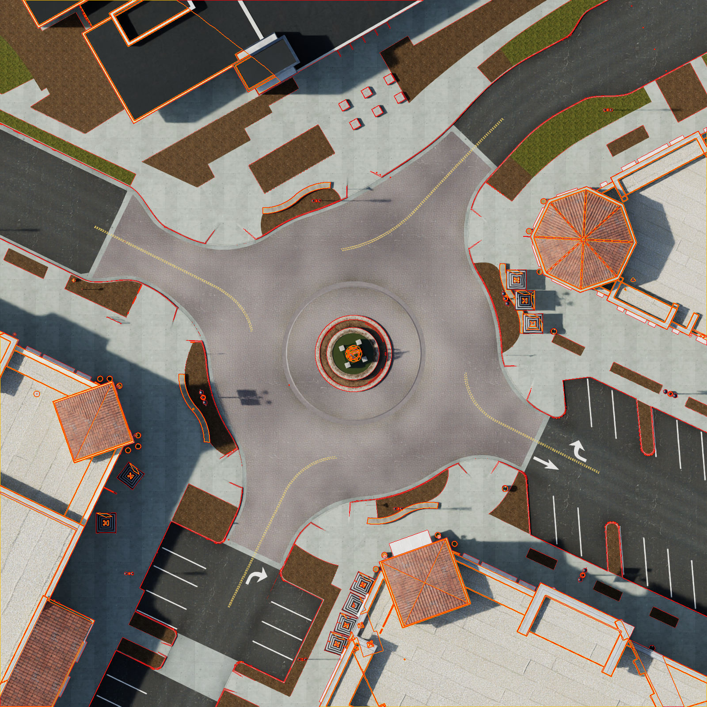
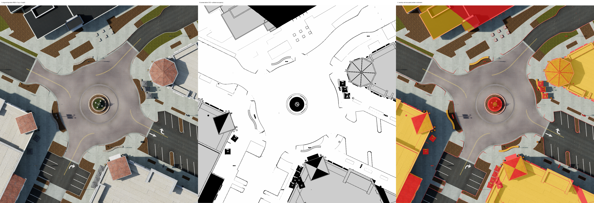
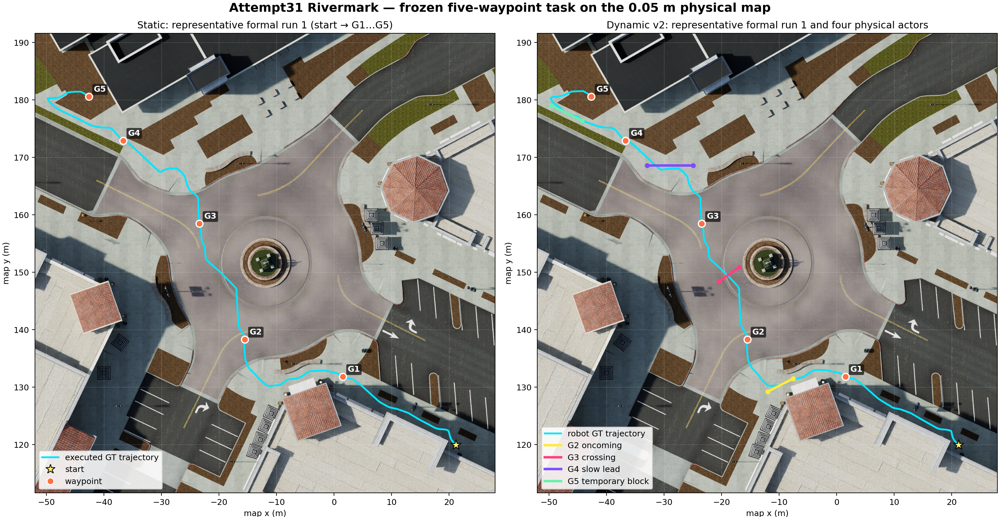

# Bio_Nav Module3：Isaac Sim 6.0.1 + ROS 2 Jazzy 导航

本仓库负责 Bio_Nav 的物理导航主链：场景与传感器、地图与 TF、全局 GVG、
Route Server、Nav2、MPPI、Collision Monitor 和 `/cmd_vel`。当前开发主线是
**Attempt31 Rivermark 室外五航点导航**；酷家乐室内任务仍保留为兼容和历史复现入口。

## 当前状态（2026-08-14）

Attempt31 已在独立 Module3/Integration 工作树完成实现、3×20 正式运行和
fail-closed 资格汇总。60 轮原始 evidence 的冻结代码基线为 Module3
`7ff1cec7...`、Integration `056dd6af6...`；其后的 RViz/交互演示收尾只做回归验证，
不回填或改写资格 evidence。

| 项目 | 当前实现/结果 | 状态 |
| --- | --- | --- |
| 物理地图 | 80 m × 80 m，1600×1600，0.05 m/格 | PASS |
| 地图生成 | top-down RGB/depth + PhysX occupancy + 高度跃迁/路沿 | PASS |
| 导航任务 | `start → G1 → G2 → G3 → G4 → G5`，总参考长度 113.0562 m | PASS |
| 静态实验 | 20/20 严格成功，20/20 无碰撞，最大路径偏差 3.256% | PASS |
| 动态实验 | 18/20 严格成功，20/20 无碰撞，四阶段 actor 合同 20/20 | PASS |
| 外观实验 | 四种光照/颜色 profile 各 5 轮，共 20/20 | PASS |
| 认知分区 | 16×16 cell、1 m/cell；12 m core/stride + 每侧 2 m halo | PASS |
| 分 tile 缓存 | 16 entries、320 hits、16 misses；跨区导航不中断 | PASS |
| Module2 在线消费 | dynamic-v2 20/20 有健康 prior、正 edge delta 和选中路线代价变化 | PASS（非因果声明） |
| 收敛时间 | 20 组 paired case 最小提升 99.473%，要求 ≥20% | PASS |
| A→B 地图更新 | 20 组 paired update 最小提升 30.313%，要求 ≥30% | PASS |
| Module2 四臂因果矩阵 | 不在 Rivermark 运行 | `DEFERRED_TO_V4` |

最终资格报告为：

```text
data/experiment_runs/attempt31_rivermark/formal_20260814_v075_r30_cache/
  qualification_v3/attempt31_rivermark_qualification.json
SHA-256: 8abd0a9a9f98ba0f819035ec1dde91fbdf3c459d7490978b01bfebdd35b9af5a
```

`data/experiment_runs/` 是本地原始 evidence，不提交 Git。仓库中保留可复核的地图、
配置、paired benchmark、图表、脚本和资格汇总代码。dynamic-v1 的 16/20 STOP
保持不可变；dynamic-v2 使用新配置哈希和新 evidence 根，没有删除或替换失败轮。

## 地图与五航点示意

导航地图不是从俯视 RGB 简单阈值化得到的。生成器联合使用深度、PhysX occupancy
和局部高度跃迁；0.03 m 以上的局部路沿会形成占据边界，同时排除无物理碰撞语义的
曲线、点和渲染阴影。启动入口会拒绝任何不是 1600×1600、0.05 m/格的地图。





静态、动态和外观三组使用同一套五航点。下图左侧是正式静态轨迹，右侧是
dynamic-v2 机器人与四个物理 actor 的实测轨迹，不是手绘示意。



## 架构与所有权

```text
Rivermark USD + collision/depth
  → 0.05 m OccupancyGrid（1600×1600）
  → 全局 GVG / nav2_route / CanonicalRoute
  → Smac + MPPI + Collision Monitor
  → /cmd_vel → Isaac Jackal

map pose + current region + CanonicalRoute
  → 16×16 cognitive constraints + route-aligned local goal
  → optional Module2 edge prior
  → 有上界的 edge-cost 增量
```

- Module3 始终拥有物理可达性、edge 合法性、最终路线、局部避障和控制权。
- Integration 负责区域约束、`T_map_canvas`、真实路线上的 lookahead 和 Module2 通信。
- Module2 只能返回有界、非负 edge prior；不能创建边、解除 `BLOCKED`、修改 TF、
  定位、Costmap 主安全链或直接控制机器人。
- prior 超时、不健康、NaN、身份不匹配或覆盖不足时，系统回退 geometry-only。

全场只有一个连续 `map` 和一个全局 GVG。进入新区域时只切换
`cognitive_tile_id`、`T_map_canvas` 和 Module2 短期上下文；不会重启 Isaac/Nav2，
不会重置 `map→odom`，也不会中断当前五航点任务。

## 快速开始

### 1. 准备资产和构建

```bash
cd /home/lyb/Workspace/Bio_Nav/worktrees/module3/attempt31-outdoor-nav
git lfs pull
./scripts/import_assets.sh
./scripts/prepare_rivermark_demo.sh

cd /home/lyb/Workspace/Bio_Nav/worktrees/integration/attempt31-outdoor-nav/ros2_ws
source /opt/ros/jazzy/setup.bash
colcon build --symlink-install

cd /home/lyb/Workspace/Bio_Nav/worktrees/module3/attempt31-outdoor-nav/ros2_ws
source /opt/ros/jazzy/setup.bash
source /home/lyb/Workspace/Bio_Nav/worktrees/integration/attempt31-outdoor-nav/ros2_ws/install/local_setup.bash
colcon build --symlink-install
```

默认源场景为 `/home/lyb/Rivermark/rivermark.usd`；可通过 `RIVERMARK_USD` 指向
同一资产的其他只读位置。

### 2. 单轮可视化

下面四条就是日常演示入口。每条命令都在**当前一个终端**内同时管理 Isaac Sim GUI、
室外专用 RViz、Module2 和 Module3；前三条自动执行 G1→G5，第四条只接收 RViz 手动
目标。按一次 `Ctrl+C` 会清理整套栈。

```bash
cd /home/lyb/Workspace/Bio_Nav/worktrees/module3/attempt31-outdoor-nav

# 静态导航
ROS_DOMAIN_ID=231 ./scripts/run_rivermark_visual.sh static

# 动态导航：G2--G5 四阶段物理移动障碍
ROS_DOMAIN_ID=231 ./scripts/run_rivermark_visual.sh dynamic

# 外观/光照变化导航；默认 bright_warm
ROS_DOMAIN_ID=231 ./scripts/run_rivermark_visual.sh appearance bright_warm

# 手动导航：不预发航点，在 RViz 中使用 2D Goal Pose
env ROS_DOMAIN_ID=231 ./scripts/run_rivermark_manual.sh static
```

外观 profile 还可替换为 `dim_warm`、`dim_cool` 或 `bright_cool`。底层
`run_rivermark_demo.sh` 仍保留给 geometry-only 对照和参数化调试；上面的 visual wrapper
固定启用完整 Module2/Module3/RViz 链路。第一次需要冷启动 12 GB 场景；同一实验组的
后续轮次由 campaign runner 复用运行栈，不会每轮重启 Isaac。静态、动态、外观组之间
可以重启。四种模式的完整逐步操作、就绪标志、退出和故障判断见
[Rivermark 室外演示说明](docs/rivermark_outdoor_demo.md#四种单终端可视化导航)。

无显示器 smoke：

```bash
RIVERMARK_HEADLESS=1 RIVERMARK_MAX_STEPS=3000 \
  ROS_DOMAIN_ID=231 ./scripts/run_rivermark_demo.sh off static
```

### 室外专用 RViz

GUI 单轮默认启动 `robot_description/rviz/rivermark.rviz`；headless campaign 默认不
启动 RViz。可显式覆盖：

```bash
RIVERMARK_RVIZ=1 ROS_DOMAIN_ID=231 ./scripts/run_rivermark_demo.sh module2 static
RIVERMARK_RVIZ=0 ROS_DOMAIN_ID=231 ./scripts/run_rivermark_demo.sh off static
```

专用视图不是室内配置换地图，而是同时展示：

- 室外物理层：0.05 m Occupancy、LiDAR、Global/Local Costmap、Jackal footprint；
- 全局导航层：GVG、CanonicalRoute、Smac、MPPI、实走轨迹、projection/lookahead；
- 分 tile 层：全部 12 m core、当前 16×16 canvas、256 cells、上一 tile、切换箭头；
- Module2 层：place belief/peak、SR、DR、dynamic cost、remap rate 和 edge delta；
- Module3 层：结构图状态、runtime suspect/blocked edge、最终 edge cost 和路线进度；
- 所有权面板：Module2 的 ACTIVE/GUARDED/STALE/OFF，Module3 的物理最终裁决，
  以及实际 applied edge 数量和累计增量。

marker 按更新频率拆成 `/bio_nav/v310/rviz_static`（GVG/tile core/航点，仅图变化时）、
`/bio_nav/v310/rviz_edges`（Module2→Module3 edge handoff，按数据变化）和
`/bio_nav/v310/rviz`（当前 tile/执行状态，2 Hz）。RViz 中仍可按 namespace 独立开关；
切 tile 时不会再 `DELETEALL` 并重建整张 GVG。
Module2 没启动或 prior 超时不会留下“看似仍有效”的绿色状态，而会明确显示
`GEOMETRY-ONLY FALLBACK`。

### 3. 批量实验

```bash
cd /home/lyb/Workspace/Bio_Nav/worktrees/module3/attempt31-outdoor-nav

# 指定 --run-indices 可做 pilot；省略时运行配置中的完整 20 轮
ROS_DOMAIN_ID=232 ./scripts/run_rivermark_campaign.sh static off --run-indices 1
ROS_DOMAIN_ID=232 ./scripts/run_rivermark_campaign.sh dynamic medium
ROS_DOMAIN_ID=232 ./scripts/run_rivermark_campaign.sh appearance medium
```

runner 会持续写逐轮 JSON/CSV/checksum。除非明确使用 `--no-bag`，还会记录 rosbag；
关闭 rosbag 不等于不记录实验数据。一次失败不会自动把整个 20 轮从头重做：已完成轮次
保持不变，runner 只做有上限的断点恢复。正式失败轮必须计入，不能用补跑覆盖。

只读取已完成 evidence 生成资格报告：

```bash
source /opt/ros/jazzy/setup.bash
source ros2_ws/install/local_setup.bash
ros2 run robot_experiments attempt31_rivermark_qualification \
  --static-root data/experiment_runs/attempt31_rivermark/static/off/runs \
  --dynamic-root data/experiment_runs/attempt31_rivermark/dynamic/medium/runs \
  --appearance-root data/experiment_runs/attempt31_rivermark/appearance/medium/runs \
  --contract-summary data/rivermark_demo/benchmarks/module2_contracts/contract_benchmark_summary.json \
  --output data/experiment_runs/attempt31_rivermark/qualification/qualification.json
```

## Module2 与 tile 证据边界

Rivermark 的 Module2 结论分成两类，不能混用：

1. `runtime_consumption_only` 证明 prior 请求真实到达 Route Server，并在有界条件下
   改变选中路线的 cost snapshot。dynamic-v2 的 20 轮均满足该合同。
2. 16×16 `region_22` paired benchmark 证明缓存收敛和 parent-child 增量更新效率。

它们都不能证明 OFF、SR-only、DR-only、SRDR 哪一臂带来因果性能改善。四臂静态
因果矩阵由 V4 单独验证，不在 Rivermark qualification 中运行。

Persistent blockage 入口仅用于工程演示：

```bash
ROS_DOMAIN_ID=231 ./scripts/trigger_rivermark_blockage.sh blocked
ROS_DOMAIN_ID=231 ./scripts/trigger_rivermark_blockage.sh clear
```

该注入用于观察重复确认、关闭边和重路由，不属于传感器因果证据，也不计入正式
避障率。真实动态障碍仍由 LiDAR/RGB-D、Local Costmap、MPPI 和 Collision Monitor 处理。

## 验证

当前 Attempt31 收尾工作树回归结果：

- 仓库级 pytest：807 passed，12 skipped；
- `robot_experiments` 安装态：310 passed；
- ROS 汇总：591 tests，0 errors，0 failures，1 skipped；
- 60 个正式轮次和资格报告 checksum 全部通过。

常规本地检查：

```bash
./scripts/test.sh
git diff --check
```

## 文档入口

| 目标 | 文档 |
| --- | --- |
| Attempt31 完整运行、地图、航点和证据说明 | [Rivermark 室外导航手册](docs/rivermark_outdoor_demo.md) |
| Attempt31 指标、P0–P8 与完成性 | [Rivermark 完成性审计](docs/rivermark_completion_audit.md) |
| 通用 Topic、TF、QoS 与职责 | [接口文档](docs/interfaces.md) |
| Isaac、DDS、RViz、Reset 与 Nav2 排障 | [排障手册](docs/troubleshooting.md) |
| Module2 与 Nav2 历史融合设计 | [Module2 × Nav2 规划/风险融合](docs/module2_nav2_planning_risk_fusion.md) |
| 仓库与远端治理 | [分支与标签目录](docs/branch_governance.md) |

## 历史兼容入口：Kujiale / Attempt21

酷家乐室内 `stable`、`dynamic_avoidance` 和显式 static opt-in 仍保留，不因
Attempt31 改写。历史 4×20、Attempt21 v12/v13/v15/v16、冻结 STOP/PASS 及其 receipt
必须按原文档和原提交解释，不能用 Rivermark 结果回填。

- [酷家乐用户手册](docs/user_manual.md)
- [4×20 外观鲁棒性实验计划](docs/kujiale_4x20_appearance_benchmark_plan.md)
- [4×20 执行复盘](docs/kujiale_4x20_execution_lessons.md)
- [历史验证台账](docs/verification.md)

## 已知边界

- 当前 Rivermark 是 Ideal Odometry 科研 Demo，不代表真实传感器定位或室外泛化。
- 源场景部分 foliage point-instancer 缺少 prototype，首次加载会产生渲染 warning；
  它不参与导航碰撞或栅格生成。
- 少量缺失材质只影响显示，不改变地图、碰撞体或正式任务几何。
