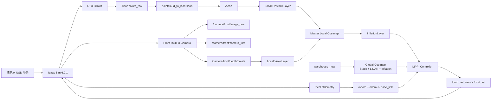
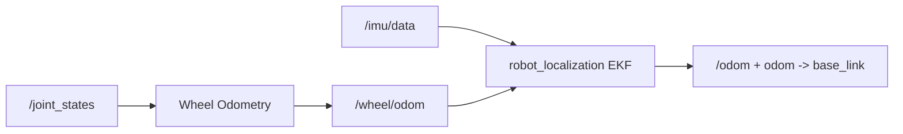

# Isaac Sim + Nav2 RGB-D 局部代价地图融合最终方案

> 文档状态：一期实现完成；低矮障碍的现场端到端验收仍待执行
>
> 一期验收场景：`kujiale_0026_A_to_B_door_open.usd`
>
> 一期里程计：Isaac Sim Ideal Odometry
>
> 导航感知：2D LiDAR + RGB-D Camera
>
> 融合位置：Nav2 局部代价地图
>
> 二期预留：Wheel Odometry + IMU + `robot_localization` EKF

## 1. 结论摘要

一期不改变现有建图、静态地图和 Ideal 定位主链，也不在里程计中融合视觉。系统使用 Isaac Sim Ideal Odometry 唯一发布 `/odom` 和 `odom -> base_link`，使定位误差与轮胎打滑暂时不干扰相机感知链的实现与验收。

局部感知使用两个相互独立的 Nav2 Costmap Layer：

- 2D LiDAR `/scan` 继续进入 `ObstacleLayer`；
- 前向 RGB-D 相机的 `/camera/front/depth/points` 进入新增 `VoxelLayer`；
- 两层通过 `MAX` 方式合入 Local Costmap；
- `InflationLayer` 在融合后统一对激光和相机障碍进行膨胀；
- MPPI 使用最终的二维局部代价地图选择无碰轨迹。

这一方案属于“多传感器局部环境感知融合”，可以明确说明导航已经不是纯激光方案，但不应声称实现了视觉 SLAM、视觉里程计或语义导航。

## 2. 目标与边界

### 2.1 一期目标

1. 在酷家乐场景和 `warehouse_new` 地图上完成 Ideal 里程计导航。
2. 从现有前向 Camera 同时发布 RGB、CameraInfo 和深度点云。
3. 让相机深度点云实际参与 Nav2 Local Costmap 更新。
4. 检测低于 LiDAR 扫描平面、但可与 Jackal 发生碰撞的低矮障碍。
5. 使 MPPI 能基于融合后的局部代价地图绕行或安全停车。
6. 保持现有地图、Reset、Lifecycle、LiDAR 避障和 Ideal 导航功能不回归。

### 2.2 一期不实现

- 不启动 Wheel Odometry 和 EKF；
- 不将 Camera 数据送入 `/odom` 或 `map -> odom`；
- 不实现 Visual Odometry、VIO、RGB-D SLAM 或 RTAB-Map；
- 不实现目标检测、语义分割或语义 Costmap；
- 不将前向相机加入 Global Costmap；
- 不将相机点云加入 Collision Monitor；
- 不建设正式消融实验或统计对比基准。

## 3. 一期系统架构



### 3.1 数据所有权

| 数据或 TF | 一期唯一生产者 | 主要消费者 |
| --- | --- | --- |
| `/odom` | Isaac Ideal Odometry | Nav2、Ideal 定位、实验记录 |
| `odom -> base_link` | Isaac Ideal Odometry | Nav2、RViz |
| `map -> odom` | 现有 Ideal 定位链 | Nav2、RViz |
| `/scan` | `pointcloud_to_laserscan` | SLAM/Localization 诊断、Costmap、Collision Monitor |
| `/camera/front/depth/points` | Isaac Camera Graph | Local `VoxelLayer`、RViz |
| `/map` | `warehouse_new` Map Server | Global Costmap、RViz |
| Ground Truth | Isaac 可选记录器 | Metrics/RViz，不进入控制链 |

## 4. 场景、地图和里程计契约

### 4.1 固定组合

当前 `main` 已合并酷家乐工作流，但 Isaac 默认环境、ROS 默认地图和实验 YAML 仍存在混用。本方案不依赖这些隐式默认值，一期启动必须显式绑定：

| 项目 | 固定值 |
| --- | --- |
| Environment USD | `kujiale_0026_A_to_B_door_open.usd` |
| Map | `data/maps/occupancy/warehouse_new.yaml` |
| Pose Graph Prefix | `data/maps/posegraphs/warehouse_new` |
| Spawn Pose File | `isaac_sim/configs/environments/kujiale_0026_A_to_B_door_open.spawn.yaml` |
| Spawn Pose | `mapping_start` |
| Odometry Mode | `ideal` |
| Structure TF Source | 保持当前 Ideal 经验证配置 |
| Camera Profile | `rgbd_navigation` |

`warehouse_new` 就是当前酷家乐场景的地图 Bundle，其 Manifest 已明确限定为 Ideal Mapping/Navigation。本阶段不允许将该 Bundle 直接用于 Realistic/EKF 定位。

### 4.2 为什么先使用 Ideal Odometry

- 先把“相机点云是否参与避障”与“轮胎打滑和定位漂移”分离；
- 便于判断低矮障碍未被避让时，问题是否真的位于 Camera/VoxelLayer 链路；
- 保持现有 `warehouse_new` 的已标定契约；
- 一期稳定后，二期只替换 `odom` 来源，不需重做相机局部融合。

## 5. RGB-D Camera 设计

### 5.1 新增导航 Profile

在现有 `off/monitoring/standard/high_quality` 基础上新增：

```yaml
rgbd_navigation:
  enabled: true
  width: 320
  height: 180
  publish_rate_hz: 10.0
  depth_points_enabled: true
```

决策理由：

- `320 x 180` 保持现有 16:9 视场比例；
- 10 Hz 与 LiDAR、Local Costmap 和 Controller 更新量级一致；
- 每帧最多 57,600 个深度点，显著低于将 `640 x 360 @ 15 Hz` 直接用于稠密点云；
- 现有 Profile 的语义和已验证性能不发生变化。

### 5.2 Camera Schema 变更

Camera Schema 从 `schema_version: 2` 升级为 `schema_version: 3`，并做以下明确扩展：

1. `CAMERA_PROFILE_NAMES` 新增 `rgbd_navigation`；
2. `CameraProfile` 新增 `depth_points_enabled: bool`；
3. `CameraDefinition` 新增 `depth_points: CameraStream`；
4. `CameraRuntime` 保存 `depth_points` 流配置和 Profile 开关；
5. 已有 `depth` 字段仍代表原始深度图，一期保持关闭；
6. 只有 `rgbd_navigation` 创建深度点云发布器，其他已有 Profile 仍只发布 RGB 和 CameraInfo。

Camera 流增量配置：

```yaml
depth_points:
  enabled: true
  topic_name: depth/points
  qos_profile: camera_sensor_data
  queue_size: 2
```

### 5.3 ROS 话题契约

| Topic | Message | Frame | Rate | QoS | 用途 |
| --- | --- | --- | ---: | --- | --- |
| `/camera/front/image_raw` | `sensor_msgs/msg/Image` | `camera_front_optical_frame` | 10 Hz | Best Effort/Volatile, depth 2 | RViz 和人工观察 |
| `/camera/front/camera_info` | `sensor_msgs/msg/CameraInfo` | `camera_front_optical_frame` | 10 Hz | Best Effort/Volatile, depth 2 | 标定契约 |
| `/camera/front/depth/points` | `sensor_msgs/msg/PointCloud2` | `camera_front_optical_frame` | 10 Hz | Best Effort/Volatile, depth 2 | Local VoxelLayer |

三个流都使用仿真时间。Image/CameraInfo 仍按 Header Stamp 配对；深度点云不依赖每帧 RGB 都被 ROS 订阅端收到。

### 5.4 Isaac Camera Graph

现有一个 Camera 和一个 Render Product 保持不变。当 Profile 为 `rgbd_navigation` 时，Camera Graph 包含：

| Node | 类型 | 关键输入 |
| --- | --- | --- |
| `OnPlaybackTick` | `omni.graph.action.OnPlaybackTick` | 触发三个发布 Helper |
| `PublishRGB` | `isaacsim.ros2.bridge.ROS2CameraHelper` | `type=rgb` |
| `PublishCameraInfo` | `isaacsim.ros2.bridge.ROS2CameraInfoHelper` | 共享 Render Product |
| `PublishDepthPoints` | `isaacsim.ros2.bridge.ROS2CameraHelper` | `type=depth_pcl` |

`PublishDepthPoints` 必须与 RGB 共享 `renderProductPath`，并使用：

```text
frameId=camera_front_optical_frame
nodeNamespace=/camera/front
topicName=depth/points
queueSize=2
useSystemTime=false
resetSimulationTimeOnStop=false
```

关闭顺序仍是先销毁 Camera Graph，排空 Kit 工作，再释放 Render Product 和 Camera Prim。

## 6. Nav2 局部代价地图融合

### 6.1 Layer 拓扑

局部 Costmap 的插件顺序固定为：

```yaml
plugins: [obstacle_layer, depth_voxel_layer, inflation_layer]
```

- `obstacle_layer` 仅处理 LiDAR `/scan`；
- `depth_voxel_layer` 仅处理 Camera `PointCloud2`；
- 两层不得合并成同一个 Observation Source Layer；
- `inflation_layer` 必须位于两个障碍层之后。

使用独立 Layer 的原因是：当低矮障碍低于 LiDAR 平面时，LiDAR 会将同一二维格子视为可通行。如果两种数据混入同一个可清除层，LiDAR 射线可能清掉相机刚标记的障碍。独立 Layer 使各传感器只清除自己的占据，再由 Master Costmap 取最大代价。

### 6.2 相机 VoxelLayer 最终参数

```yaml
local_costmap:
  local_costmap:
    ros__parameters:
      plugins: [obstacle_layer, depth_voxel_layer, inflation_layer]

      # 现有 LiDAR ObstacleLayer 保持原样。
      obstacle_layer:
        plugin: nav2_costmap_2d::ObstacleLayer
        enabled: true
        combination_method: 1
        observation_sources: scan

      depth_voxel_layer:
        plugin: nav2_costmap_2d::VoxelLayer
        enabled: true
        footprint_clearing_enabled: true
        combination_method: 1
        publish_voxel_map: true
        tf_filter_tolerance: 0.10

        origin_z: 0.0
        z_resolution: 0.05
        z_voxels: 16
        unknown_threshold: 15
        mark_threshold: 0
        max_obstacle_height: 0.50

        observation_sources: camera_depth

        camera_depth:
          topic: /camera/front/depth/points
          sensor_frame: camera_front_optical_frame
          data_type: PointCloud2
          transport_type: raw

          marking: true
          clearing: true

          min_obstacle_height: 0.05
          max_obstacle_height: 0.50

          obstacle_min_range: 0.05
          obstacle_max_range: 2.0
          raytrace_min_range: 0.05
          raytrace_max_range: 2.5

          observation_persistence: 0.0
          expected_update_rate: 0.0
          inf_is_valid: false

      # 现有膨胀半径和衰减系数保持不变。
      inflation_layer:
        plugin: nav2_costmap_2d::InflationLayer
        cost_scaling_factor: 8.0
        inflation_radius: 0.40
```

### 6.3 高度和距离选择

- `min_obstacle_height=0.05 m`：排除地面和小幅深度噪声，但保留可阻挡车轮和底盘的低矮障碍；
- `max_obstacle_height=0.50 m`：与当前二维导航的可碰撞高度口径保持一致；
- `z_resolution=0.05 m, z_voxels=16`：内部表示从 0 到 0.8 m 的空间，但只把 0.05–0.50 m 范围内的点标为二维障碍；
- `obstacle_max_range=2.0 m`：与当前 `4 x 4 m` 滚动局部窗口相匹配；
- `raytrace_max_range=2.5 m`：保证障碍移走后能用新的深度射线清除旧体素。

### 6.4 全局规划和安全链保持不变

Global Costmap 仍使用：

```text
StaticLayer + LiDAR ObstacleLayer + InflationLayer
```

不将前向 Camera 加入 Global Costmap，避免将有限视场内的动态障碍扩散为长时间全局信息。Collision Monitor 一期仍仅订阅 `/scan`，保持现有已验证的硬停车链和时延预算。Camera 只通过 Local Costmap 影响 MPPI。

## 7. 相机数据丢失时的行为

`expected_update_rate=0.0` 使 Camera 是附加感知源，不会因一次丢帧直接将整个 Local Costmap 置为不可用。系统行为固定为：

1. 从未收到 Camera 点云时，LiDAR 层仍可工作，但该轮运行不能被验收为 RGB-D 融合导航；
2. Camera 运行中断流时，已标记体素可保守保留，可能使机器人暂停，但不应将未确认空间立即当成自由空间；
3. Camera 恢复后，新的深度射线清除已移走障碍的旧体素；
4. 当 Isaac 启动参数声明 `rgbd_navigation` 时，诊断必须将“深度点云无发布者、频率不足或 VoxelLayer 无订阅”报为失败，防止把实际的纯 LiDAR 运行误认为融合运行。

## 8. RViz 和诊断

Navigation RViz 新增一个 `RGB-D Fusion` 分组：

| Display | Topic | 默认状态 | 用途 |
| --- | --- | --- | --- |
| RGB Image | `/camera/front/image_raw` | 关闭，可手动开启 | 观察前向画面 |
| Depth PointCloud2 | `/camera/front/depth/points` | 关闭，可手动开启 | 青色深度点云，证明低矮障碍被 Camera 观测 |
| Local Costmap | `/local_costmap/costmap` | 开启 | 观察最终融合代价 |
| Marked Voxels (3D) | `/local_costmap/voxel_grid` | 开启 | 浅绿色立方体，检查被 VoxelLayer 标记的三维体素 |

`Depth PointCloud2` 使用 Best Effort QoS、青色 `Flat Squares`、`Decay Time=0.5 s`
和约 `0.05 m` 点尺寸。`/local_costmap/voxel_grid` 的消息类型是
`nav2_msgs/msg/VoxelGrid`，并非 `PointCloud2`；项目的
`robot_rviz_plugins/Voxel Grid` 会只解码其中 `MARKED` 的体素，再用约 `0.08 m`
的立方体渲染。若看不到方块，先确认 Camera 已使 VoxelLayer 标记障碍，而不是把
该 Topic 误加成 RViz 内置 `PointCloud2` Display。

诊断输出至少包含：

- 解析到的 Environment USD、Map Bundle、Spawn File、Odometry Mode 和 Camera Profile；
- `/odom` 发布者数及发布者节点名；
- `/camera/front/depth/points` 发布者数、订阅者数、实测 Hz 和消息年龄；
- `/local_costmap/voxel_grid` 的 `nav2_msgs/msg/VoxelGrid` 发布和 RViz 订阅；
- `camera_front_optical_frame -> odom` TF 是否可用；
- Local Costmap 是否已加载 `depth_voxel_layer`；
- `warehouse_new` 与酷家乐 Spawn Bundle 是否匹配。

## 9. 一期标准启动流程

以下命令都从仓库根目录执行。

### 9.1 终端 A：Isaac Sim

```bash
./scripts/run_isaac.sh \
  --environment-root /home/lyb/kujiale_usd_rooms_20260717 \
  --environment-usd kujiale_0026_A_to_B_door_open.usd \
  --navigation-mode localization \
  --mode ideal \
  --camera-profile rgbd_navigation
```

### 9.2 终端 B：ROS 2 + Nav2

```bash
PROJECT_DIR="$(pwd)"

ISAAC_NAV_SPAWN_POSES="$PROJECT_DIR/isaac_sim/configs/environments/kujiale_0026_A_to_B_door_open.spawn.yaml" \
./scripts/run_ros.sh navigation \
  odometry_mode:=ideal \
  posegraph_file:="$PROJECT_DIR/data/maps/posegraphs/warehouse_new" \
  map_file:="$PROJECT_DIR/data/maps/occupancy/warehouse_new.yaml" \
  spawn_poses_file:="$PROJECT_DIR/isaac_sim/configs/environments/kujiale_0026_A_to_B_door_open.spawn.yaml"
```

### 9.3 启动后必查

```bash
ros2 topic info --verbose /odom
ros2 topic info --verbose /camera/front/depth/points
ros2 topic hz /camera/front/depth/points
ros2 run tf2_ros tf2_echo odom camera_front_optical_frame
```

只有在以下条件都满足后才能从 RViz 发送 Goal：

- `/odom` 只有 Isaac Ideal Odometry 一个发布者；
- 深度点云只有一个发布者；
- Local Costmap 已订阅深度点云；
- 深度点云实测频率不低于 8 Hz；
- `odom -> camera_front_optical_frame` TF 连续可用；
- Nav2 Activation Gate 已报告激活完成。

## 10. 实施修改点

### 10.1 Isaac Camera 子系统

主要修改：

- `isaac_sim/configs/sensors/camera.yaml`：升级 Schema，新增 `rgbd_navigation` 和 `depth_points`；
- `isaac_sim/configs/ros2_bridge/topics.yaml`：新增 `camera_front_depth_points`；
- `isaac_sim/src/sensors/sensor_factory.py`：解析新 Profile/流并将其传入 Runtime；
- `isaac_sim/graphs/camera_graph.py`：条件创建 `PublishDepthPoints`；
- Camera 契约测试：覆盖 Profile、Topic、QoS、Frame、Graph 共享和资源释放。

### 10.2 Nav2 子系统

主要修改：

- `ros2_ws/src/robot_navigation/config/nav2_params.yaml`：局部 Costmap 新增 `depth_voxel_layer`；
- 导航配置测试：将原有“Local Costmap 不得使用 VoxelLayer”的断言改为“只允许 Local Costmap 使用 Camera VoxelLayer”；
- Global Costmap 继续断言无 Camera/VoxelLayer；
- Collision Monitor 继续断言只使用 `/scan`；
- MPPI、Inflation Radius、Footprint 和已验证控制 Profile 不在本轮重调。

### 10.3 RViz、诊断和文档

主要修改：

- Navigation RViz 新增 Depth PointCloud 和 Voxel Grid Display；
- RViz 契约测试检查 Topic 和 Sensor QoS；
- `scripts/diagnose.sh` 增加 RGB-D Fusion 运行检查；
- README/User Manual/Interfaces 增加新 Profile、Topic、标准启动命令和故障处理；
- 更正 README 中“酷家乐只存在独立分支”的过时说明，但不将场景选择重构扩大到本轮融合之外。

## 11. 测试和验收

### 11.1 静态契约测试

1. Camera Schema 仅接受冻结的五个 Profile。
2. `rgbd_navigation` 必须为 `320 x 180 @ 10 Hz`，并启用 Depth Points。
3. 其他 Profile 不得意外发布 Depth Points。
4. RGB、CameraInfo 和 Depth Points 共享同一 Render Product。
5. Depth Points 必须使用 `depth_pcl`、仿真时间、光学 Frame 和 Camera Sensor QoS。
6. Local Costmap 插件顺序必须为 LiDAR、Camera Voxel、Inflation。
7. Camera 只能进入 Local Costmap，不得出现在 Global Costmap 或 Collision Monitor。
8. Ideal 模式不启动 Wheel Odometry/EKF。

### 11.2 运行时接口验收

| 检查项 | 通过条件 |
| --- | --- |
| `/odom` 所有权 | 只有一个 Isaac Ideal 发布者 |
| Odom TF | `odom -> base_link` 只有一个动态所有者 |
| Depth PointCloud | 1 个发布者，实测 `>= 8 Hz` |
| PointCloud Frame | `camera_front_optical_frame` |
| PointCloud 数值 | XYZ 存在有限有效点，无整帧 NaN/Inf |
| TF | 点云时间戳可转换到 `odom` |
| Costmap 订阅 | Local Costmap 有且只有一个深度点云订阅端 |
| 时间 | 使用 `/clock`，无时间戳回退或持续 future stamp |
| Reset | Reset 后 Odom、Camera、TF 和 Costmap 恢复 |

### 11.3 低矮障碍功能验收

在酷家乐 `mapping_start` 前方设置一个立方体：

| 参数 | 值 |
| --- | --- |
| 尺寸 | `0.30 x 0.30 x 0.16 m` |
| Map 中心 | 约 `[0.80, 0.25]` |
| USD 中心 | 约 `[2.10, -0.45, 0.08]` |
| 导航 Goal | Map 约 `[1.50, 0.00, 0°]` |

该障碍顶部高度低于 LiDAR 的 `0.333 m` 扫描平面，但应位于高度 `0.218 m` 前置 Camera 的下半视场内。位置可根据现场可视空间做小幅调整，但必须保持“LiDAR 不命中、Camera 命中、底盘可碰撞”的验收特性。

通过条件：

1. RGB 画面可见障碍；
2. Depth PointCloud 在障碍表面存在稳定有效点；
3. `/scan` 在障碍对应方向不应产生同距离命中；
4. Local Costmap 在障碍位置产生 Lethal/Inflated Cost；
5. MPPI 选择绕行轨迹，或在无安全通路时停车；
6. `/simulation/collision` 不得进入碰撞状态；
7. 移走障碍后，新深度帧应清除旧代价，机器人可继续导航。

这是一次功能验收，不要求激光单模态对比跑数、多种子统计或学术消融报告。

### 11.4 现有回归验收

- 无新障碍时，现有酷家乐 Ideal Navigation 仍能完成；
- 普通墙面和高障碍仍由 LiDAR 正常标记和清除；
- Global Costmap 不出现 Camera 动态残影；
- MPPI、Velocity Smoother 和 Collision Monitor 的现有契约通过；
- Mapping/Localization/Navigation RViz 可正常加载；
- 有相机和无相机 Profile 都能干净退出；
- 全部静态测试和相关 ROS 包测试通过。

## 12. 二期 EKF 融合路线

二期才将 Odom 主链替换为：



二期继续保持：

- `/camera/front/depth/points` Topic、Frame 和 QoS 不变；
- Local `depth_voxel_layer` 参数不变；
- RGB-D 点云不直接进入 EKF；
- `/odom` 仍只允许一个发布者和一个 TF 所有者。

从 Ideal 切换到 EKF 前必须完成：

1. 使用启用扫描匹配和回环的 Realistic 模式重建或重新验证酷家乐 Pose Graph；
2. 重做酷家乐 Spawn Pose 的至少三次冷启动标定；
3. 发布新的 Map Manifest/Bundle Hash，不得复用 Ideal `warehouse_new` 标定声明；
4. 确认 Isaac Ideal Odom 已关闭；
5. 确认 Wheel Odom 不发布 TF，仅 EKF 发布 `/odom` 和 `odom -> base_link`；
6. 单独完成 EKF 定位、Reset 和导航验收。

二期不能只将启动参数从 `ideal` 改为 `realistic`；当前仓库也会阻止将 `warehouse_new` 直接用于 Realistic/Pose Graph 定位。

## 13. 风险与处理

| 风险 | 表现 | 处理 |
| --- | --- | --- |
| 场景与地图混配 | Robot/Scan 与地图完全不对齐 | 使用第 9 节显式命令，诊断校验 USD/Map/Spawn |
| Depth Cloud 轴向错误 | 点云翻转、地面变墙面 | 检查 REP-103 Optical Frame 和 Camera Prim 固定旋转 |
| 地面进入 Costmap | 机器人周围长期致命代价 | 检查 TF，保持 `min_obstacle_height=0.05` |
| 机器人自身进入点云 | 前方持续近距离障碍 | 检查 Camera 安装位置，必要时再增加自身 ROI，不先臆测裁剪 |
| Depth PCL 负载过高 | RTF 下降、Controller 超期 | 固定 `320 x 180 @ 10 Hz`，先不启用更高分辨率 |
| 障碍移走后残留 | Local Costmap 仍不可通行 | 检查 `clearing`、TF、射线距离和新帧是否到达 |
| Camera 未实际参与 | 导航可运行，但无 PointCloud 订阅 | 融合模式诊断直接判定失败 |
| 误把 Ideal 当真实传感器融合 | 答辩口径失真 | 明确声明一期 Ideal 只是隔离变量，EKF 在二期 |

## 14. 实施顺序

1. 冻结酷家乐 + `warehouse_new` + Ideal 基线，记录当前可正常导航状态。
2. 扩展 Camera Schema 和单元测试，但尚不连接 Nav2。
3. 在 Isaac Camera Graph 发布 Depth PointCloud，完成 Topic、QoS、Frame、Hz 和时间戳验证。
4. 在 RViz 中检查 PointCloud 方向、地面高度和低矮障碍可见性。
5. 将 Camera VoxelLayer 加入 Local Costmap，完成标记和清除验证。
6. 运行低矮障碍功能验收，确认 MPPI 避障且无碰撞。
7. 运行现有 Ideal Navigation、Reset、RViz 和有序退出回归。
8. 更新诊断、接口文档和标准启动命令。

## 15. 最终完成定义

只有同时满足以下条件，一期才能标记完成：

- 酷家乐场景、`warehouse_new`、出生点和 Ideal 里程计明确配对；
- Isaac 是 `/odom` 和 `odom -> base_link` 的唯一所有者；
- `rgbd_navigation` 稳定发布 RGB、CameraInfo 和 Depth PointCloud；
- Camera PointCloud 实际被 Local VoxelLayer 订阅和处理；
- 低矮 LiDAR 盲区障碍被加入 Local Costmap；
- MPPI 根据融合 Costmap 绕行或停车，无物理碰撞；
- 障碍移走后局部代价可清除；
- Global Costmap、Collision Monitor 和定位链没有误接入 Camera；
- 现有 Ideal Navigation 与 Reset/Lifecycle 回归通过；
- 文档明确说明一期使用 Ideal Odometry，EKF 为二期工作。

## 16. 答辩推荐表述

> 本系统一期使用 Isaac Sim Ideal Odometry，以隔离轮胎打滑和定位漂移对感知链验证的干扰。导航感知不再是纯激光：2D LiDAR 负责 360° 基础障碍感知，前向 RGB-D Camera 生成三维深度点云，两者分别进入 Nav2 Local ObstacleLayer 和 VoxelLayer，再融合为 MPPI 使用的局部代价地图。该设计能检测低于激光扫描平面的障碍。待相机感知链稳定后，二期再将 Ideal Odometry 替换为 Wheel Odometry + IMU + EKF，而无需重做 RGB-D 局部融合。
