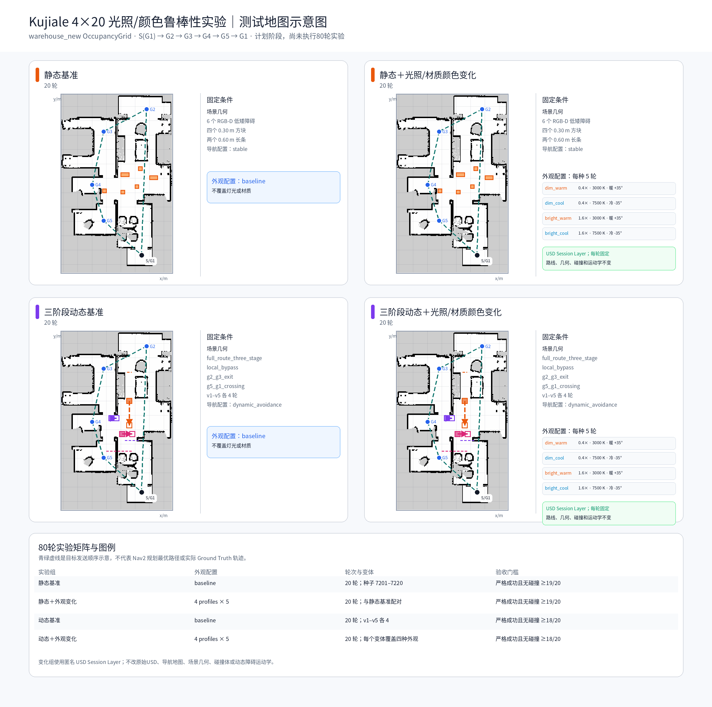
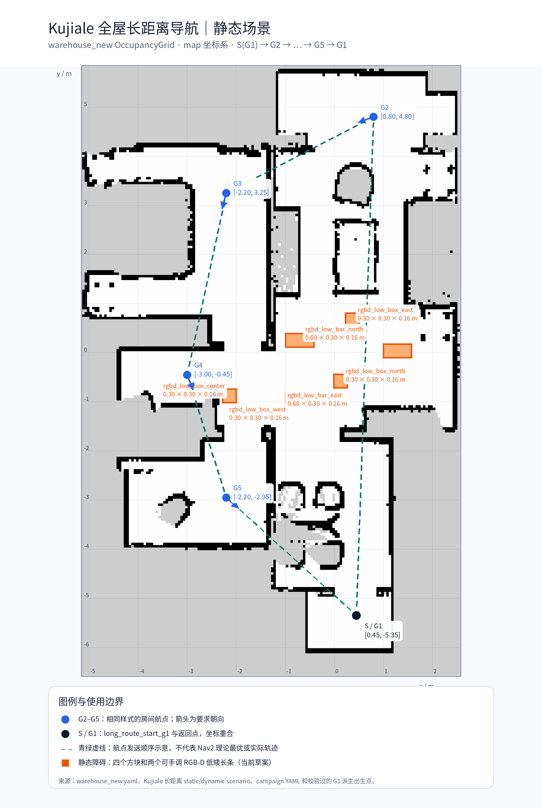
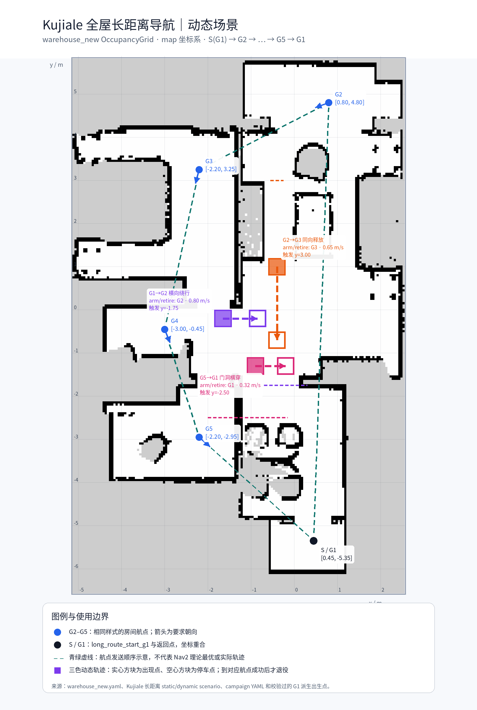
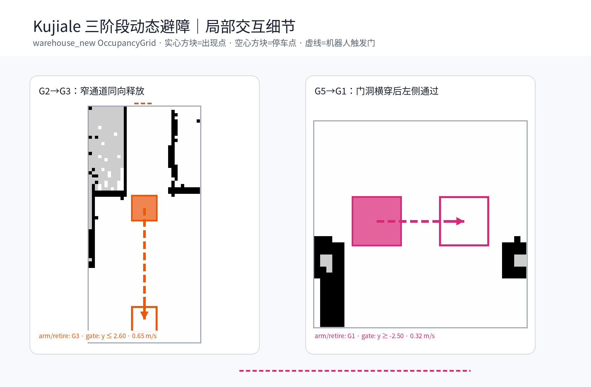

# Kujiale 4×20 光照/颜色鲁棒性实验计划

> 基线：`codex/dynamic-obstacle-benchmark-redesign` 的
> `f9cf7cbe45f8a260f5535a4c9689b6fc783451c8`
>
> 实施分支：`codex/kujiale-4x20-appearance-benchmark`
>
> 当前状态：4×20 调度、匿名 USD Session Layer、预检、证据采集和报告器均已实现并通过离线验证；尚未启动 Isaac/ROS，尚未执行本轮 80 个正式实验。

## 1. 目标与实验矩阵

在 Kujiale USD、`warehouse_new`、Ideal 定位、`long_route_start_g1` 和固定闭环
`G1 → G2 → G3 → G4 → G5 → G1` 下，重新运行四组各20轮的实验，不复用历史结果。

| 组别 | 场景 | 外观 | 轮数 | 通过门槛 |
| --- | --- | --- | ---: | --- |
| 静态基准 | 6个低矮RGB-D障碍 | `baseline` | 20 | 严格成功且无碰撞 `≥19/20` |
| 静态＋外观变化 | 同一静态几何 | 4种配置各5轮 | 20 | 严格成功且无碰撞 `≥19/20` |
| 动态基准 | `full_route_three_stage` | `baseline` | 20 | 严格成功且无碰撞 `≥18/20` |
| 动态＋外观变化 | 同一动态运动学 | 4种配置各5轮 | 20 | 严格成功且无碰撞 `≥18/20` |

静态成功轮次的 Ground Truth 路径偏差还必须不超过 `20%`。动态轮次若发生碰撞、
动态交互无效、保护中止或证据缺失，均计为失败。成功率按组独立判定，不能用80轮总平均掩盖单组失败。

## 2. 测试地图示意图

下图由 `scripts/generate_kujiale_long_route_maps.py` 直接读取 `warehouse_new`、出生点、
静态/动态场景和campaign YAML生成。生成器会拒绝静态与动态路线、航点ID或出生点约定不一致的输入。



四个面板使用同一张 OccupancyGrid、同一条目标发送顺序和同一套航点；青绿色虚线只表示
`S(G1) → G2 → G3 → G4 → G5 → G1` 的发送顺序，不代表 Nav2 实际规划或GT轨迹。
外观变化面板特意不改绘地图或障碍：变化仅通过每轮固定的 USD Session Layer 生效，路线、
几何、碰撞体和动态障碍运动学均保持不变。

### 2.1 静态与动态细节图







静态图中的6个低矮障碍由RGB-D链路识别。动态图保留三个顺序交互：`local_bypass`、
`g2_g3_exit` 与 `g5_g1_crossing`；任一时刻最多一个actor可见且可碰撞。

重新生成所有地图：

```bash
cd /home/lyb/Workspace/Isaac_Sim_ROS2_Nav
python3 scripts/generate_kujiale_long_route_maps.py
```

## 3. 外观变化定义

外观变化使用匿名 USD Session Layer，绝不写回原始USD，不改变场景几何、碰撞、导航地图或actor运动学。
每轮开始前应用一次，并在整轮内保持固定。

| ID | 灯光强度 | 色温 | 材质颜色偏移 |
| --- | ---: | ---: | --- |
| `baseline` | 不覆盖 | 不覆盖 | 不覆盖 |
| `dim_warm` | `0.4×` | `3000 K` | 暖色 `+35°` |
| `dim_cool` | `0.4×` | `7500 K` | 冷色 `-35°` |
| `bright_warm` | `1.6×` | `3000 K` | 暖色 `+35°` |
| `bright_cool` | `1.6×` | `7500 K` | 冷色 `-35°` |

每个外观变化组中，四个非基准配置各出现5次。每轮须记录外观配置、配置哈希、场景对象清单摘要，
并在发送首个目标前保存RGB快照；运行时发布 `/experiment/appearance/state`。

> 导航当前消费 `/scan` 和 `/camera/front/depth/points`。本实验验证外观改变下的任务稳定执行，
> 不宣称导航算法依赖RGB颜色完成导航。

## 4. 调度、证据和运行接口

- 静态两组使用 `stable` Nav2 配置；动态两组使用 `dynamic_avoidance` 配置。
- 基准和变化轮次使用相同seed配对，并按AB/BA交替顺序执行。
- 动态组使用现有5个变体，每个变体4次；动态＋外观变化组让每个动态变体分别覆盖四种外观配置。
- 支持 `--resume`：仅跳过证据和校验均完整的轮次；不完整目录隔离保留，不自动删除。
- 启动前校验ROS环境、地图/场景哈希、话题、TF、Nav2配置及可用空间；小于`120 GiB`时拒绝开始。
- 静态阶段与动态阶段之间必须重启 Isaac/Nav2；正式80轮期间禁止调参。

以下是推荐的实际运行入口。单命令监督器会重新构建ROS工作区、启动静态 Isaac/Nav2、
完成静态 pilot 和40轮后立即生成并保留静态 `2×20` 报告、先关闭 Nav2 再关闭 Isaac、启动新的动态栈、
完成动态 pilot 和40轮并生成动态 `2×20` 报告，最后才生成同一批次的总 `4×20` 报告；不需要另开终端或手动切换：

```bash
cd /home/lyb/Workspace/Isaac_Sim_ROS2_Nav
./scripts/run_kujiale_4x20_all.sh
```

省略 ID 时脚本自动创建 `YYYYMMDD-HHMMSS`。要固定 ID：

```bash
./scripts/run_kujiale_4x20_all.sh 20260725-120000
```

每个阶段会等待 `preflight` 校验磁盘、地图/场景哈希、ROS话题、TF和实际 Nav2 profile；
Isaac 或 Nav2 在启动超时（默认900秒）前退出时，监督器会失败并指出对应日志。日志保存在
`data/experiment_runs/kujiale_4x20_<campaign_id>/orchestrator/`。每种模式的 `pilot` 都运行矩阵中
首个外观变化轮次；pilot 仅验证环境和证据，所有正式报告自动排除它。静态/动态子报告各只统计对应的40轮，
总报告只统计同一批次的80轮。

中断后，保留同一 ID 运行：

```bash
./scripts/run_kujiale_4x20_all.sh 20260725-120000 --resume
```

完整且校验通过的正式轮次会跳过，不完整目录仍隔离保留。`pilot` 是正式40轮的前置门：若先前
pilot 已完整写入但结果失败，`--resume` 会将该 pilot 目录隔离为带 `.incomplete-<UTC>` 后缀的保留证据，
然后用当前配置重新执行它；不会静默复用失败 pilot，也不会改写正式轮次。已经生成报告的 ID 不允许覆盖，请使用新 ID。
如果刚完成构建，可加 `--skip-build`；必要时可用 `--startup-timeout-sec 1200` 调整每阶段启动等待上限。

### 4.1 动态问题后的独立复测（不重跑静态）

静态 40 轮已完成并生成 `static_2x20` 报告后，动态出现问题时不要用 `--resume` 混入使用旧配置的
已完成动态正式轮次。使用新的 campaign ID，只启动动态栈、运行动态 pilot 与40轮、并生成独立的
`dynamic_2x20` 报告：

```bash
./scripts/run_kujiale_4x20_all.sh --dynamic-only
# 已构建工作区时：
./scripts/run_kujiale_4x20_all.sh --dynamic-only --skip-build
```

该模式不启动静态 Isaac/Nav2，也不改写或覆盖已有静态报告。它只验证 `dynamic_baseline` 和
`dynamic_appearance` 两组各20轮；动态子报告不能自动同其他 campaign 的静态子报告合成为完整4×20结论。
为已经完成静态阶段、但尚未产生静态报告的现有 campaign 补报时，执行：

```bash
./scripts/run_kujiale_4x20.sh static-report <已有CAMPAIGN_ID>
```

当前批次静态阶段完成后可使用：

```bash
./scripts/run_kujiale_4x20.sh static-report 20260725-210035
```

`run_kujiale_4x20_isaac.sh`、`run_ros.sh` 和 `run_kujiale_4x20.sh` 的分开调用仍可用于人工观察或单阶段
调试，但不再是正式批次的推荐入口。

### 4.2 单轮 GUI/RViz 诊断（不计入4×20）

四组正式实验之外，可单独观察共同路线 `G2 → G3 → G4 → G5 → G1`。静态自动 GUI/RViz
使用 `run_visual_route.sh static`；动态自动 GUI/RViz 使用
`run_kujiale_three_stage_visual.sh full --variant 1 --seed 7501`，后者会自动触发三阶段 actor。
完整可复制终端命令和目标坐标见
[`user_manual.md` 第8节](user_manual.md#8-可视化单轮全屋长距离测试isaac-gui--rviz)。

这些 GUI 诊断不生成正式 80 轮证据或结论；不能与 `data/experiment_runs/kujiale_4x20_*` 的报告混用。

## 5. 自动报告与校验

完整 campaign 在 `data/reports/kujiale_4x20_<campaign_id>/` 生成总 `index.html`、`report.pdf`、`report.md`、
`benchmark.json/csv`、`data_dictionary.md`、`evidence_index.json`、校验和及PNG图；不复制完整MCAP。静态阶段
完成后立即写入 `static_2x20/`，动态阶段完成后写入 `dynamic_2x20/`，从而动态失败不会丢失静态报告。每份报告首页
嵌入本文件的测试地图，支持按实验组、seed、外观配置、动态变体和结果筛选。每个有
`ground_truth.csv.gz` 证据的正式轮次都会生成 `warehouse_new` OccupancyGrid 叠加的实际 GT 路径图；
HTML 的“逐轮实际 GT 路径”选择器随上述筛选联动，绿点为起点、红点为终点。
静态轮次的路径图还会从正式 `kujiale_long_range_static.yaml` 读取六个静态 RGB-D 障碍物的位置和尺寸，
以橙色矩形叠加；因此它们不会因未写入 OccupancyGrid 而在图中缺失。
静态/动态 2×20 子报告只显示本范围的两张条件地图，完整4×20总报告才显示四组矩阵图。

报告展示四组成功率和置信区间、耗时分布、路径长度、静态偏差、恢复次数、碰撞、动态交互有效性和失败原因，
并保留基准/外观变化的同seed配对记录。即使未达到门槛也必须生成报告；验收通过返回0，批次完成但门槛或证据失败返回2。
`static_2x20` 与 `dynamic_2x20` 是各自独立的验收报告，不会自动将不同 campaign 的结果拼接成完整4×20报告。
若报告器升级后需要仅重绘既有报告（不改变原始证据），使用 `--replace`：

```bash
./scripts/run_kujiale_4x20.sh static-report <CAMPAIGN_ID> --replace
```

自动化测试覆盖：80轮矩阵完整性、外观分配、路线一致性、Session Layer应用与恢复、
断点续跑、证据校验、门槛判定，以及HTML/PDF/PNG报告生成。

## 6. 本阶段边界

代码已实现但本仓库没有自动启动 Isaac/ROS，也没有代替操作者执行pilot或80轮正式实验。每轮输出仍由你在本机的独占Isaac/Nav2会话生成；本分支只包含运行器、报告器、配置、地图和文档。
