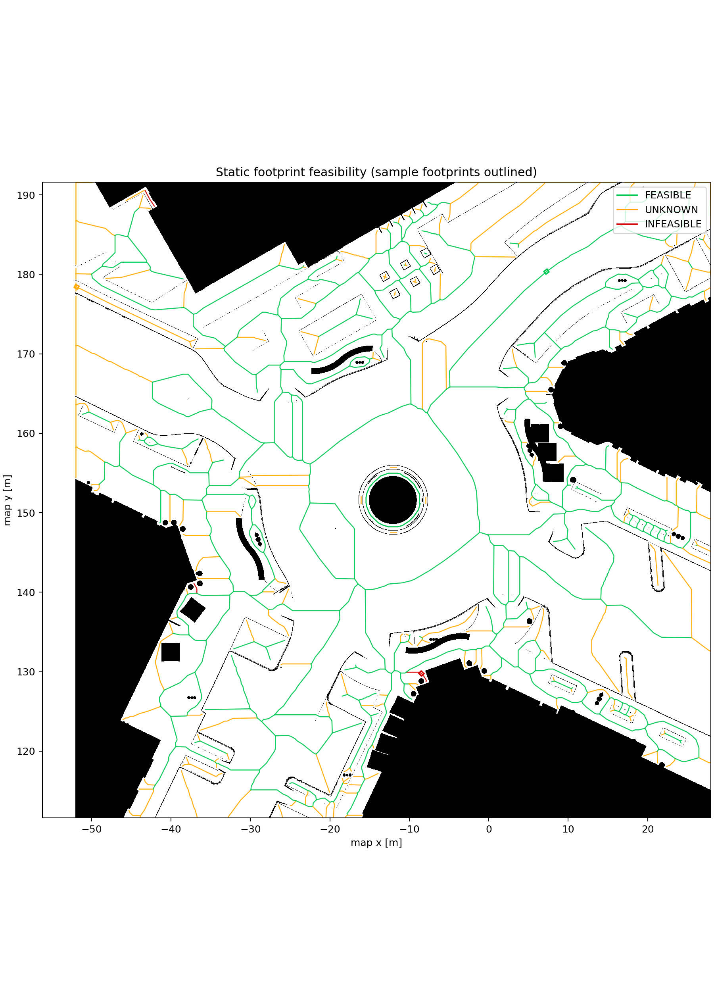
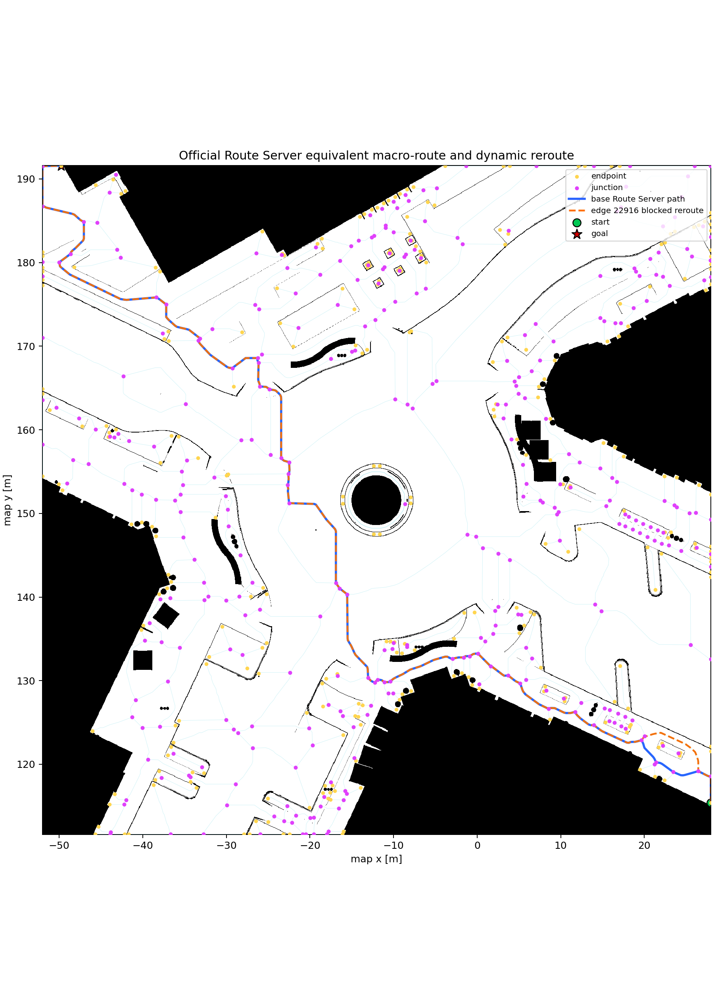

# Rivermark 室外导航：Final 收口与 Attempt31 历史基线

## 当前结论

当前可写开发工作树为
`/home/lyb/Workspace/Bio_Nav/worktrees/module3/final-outdoor-navigation`，分支为
`codex/final-outdoor-navigation`。Final clean-revision 不修改 Attempt31 的冻结轮次，
新增 4 个静态物理障碍、强化四阶段动态 actor，并把正式口径改成每组 20/20、
post-dispatch fail-stop。Final 静态、动态、外观各 20 轮已完成，三组均 20/20 成功且
无碰撞，Final 状态为 `FORMAL_QUALIFICATION_PASS`。历史 Attempt31 轮次和 STOP 证据
保持独立、未改写。

Final 静态配置是 `final_rivermark_static_obstacles.yaml`：四个 0.70 m × 0.70 m
stationary box 分别切入旧路线的四个区段，同时其完整外接矩形已逐格验证在自由地图内。
Final 动态配置是 `final_rivermark_dynamic.yaml`：迎面、横穿、同向和临时阻塞 actor
峰值分别为 0.60、0.55、0.45、0.50 m/s。有效动态交互不再只凭“actor 出现且进入
1.5 m”判定，而要求每个 actor 同时通过峰值速度、至少 90% 轨迹进度、相对闭合速度、
TTC、2.5 m 内暴露时长、最近距离、manager clearance 和物理无碰撞门控。

Final 命令：

```bash
cd /home/lyb/Workspace/Bio_Nav/worktrees/module3/final-outdoor-navigation

# 以下命令用于新 revision 的复核；任一 dispatch 后失败都会停止并保留 evidence
ROS_DOMAIN_ID=232 ./scripts/run_final_rivermark_campaign.sh static off --run-indices 1 \
  --output data/experiment_runs/final_rivermark/pilots/rev1/static_off
ROS_DOMAIN_ID=232 ./scripts/run_final_rivermark_campaign.sh dynamic medium --run-indices 1 \
  --output data/experiment_runs/final_rivermark/pilots/rev1/dynamic_medium
ROS_DOMAIN_ID=232 ./scripts/run_final_rivermark_campaign.sh appearance medium --run-indices 1 \
  --output data/experiment_runs/final_rivermark/pilots/rev1/appearance_medium
```

新的正式 campaign 仍必须在三个 pilot、配置哈希冻结且工作树干净后才可去掉
`--run-indices 1`。已完成 Final 批次的资格报告入口为 `final_rivermark_qualification`，指标合同为
`data/rivermark_demo/final_rivermark_metric_contract.yaml`。每个 pilot 结束后先运行
`final_rivermark_pilot_check`；该入口会重新计算逐文件 checksum，并验证
`TRIAL_DISPATCHED.json`、G1–G5、碰撞、证据和该组的 Final metric gate。

Attempt31 在独立 Module3/Integration worktree 中打通 Rivermark 室外科研原型，不修改 A21 工作树，也不改变 A21 室内默认入口。当前选择中央环岛与道路区域（Candidate A），保留完整 **80 m × 80 m** 地图；唯一导航栅格为 **1600 × 1600、0.05 m/格**，不再裁成 48 m × 48 m。

该入口最初作为工程科研原型建立连续全局坐标、物理 Jackal、全局 GVG、Nav2 Route Server、Smac/MPPI、逻辑认知区域切换和可选 Module2 edge prior 的真实调用链。2026-08-14 已在独立 evidence 目录完成正式核心 3×20 qualification；工程原型与正式结果的证据边界见下节。

## 2026-08-14 正式资格结果

最终 fail-closed 报告为 `formal_20260814_v075_r30_cache/qualification_v3/attempt31_rivermark_qualification.json`，报告 SHA-256 为 `8abd0a9a9f98ba0f819035ec1dde91fbdf3c459d7490978b01bfebdd35b9af5a`，状态 **PASS**。v3 在不改动 60 轮原始 evidence 的前提下，增加了 Module2 运行时消费审计；先前 v2 派生报告仍原样保留：

| 组别 | 严格成功 | 物理无碰撞 | 关键附加门禁 |
| --- | ---: | ---: | --- |
| static/off | 20/20 | 20/20 | 静态路径偏差最大 3.256%，要求 ≤20% |
| dynamic/v2 medium | 18/20 | 20/20 | 四 actor close-pairing 20/20；完整交互 18/20，要求 ≥90% |
| appearance/medium | 20/20 | 20/20 | 4 个 profile 各 5 轮，20/20 实际应用 |

最终报告索引 60 个互不重复的 `run_summary.json`，每组 20 个；所有逐轮 `checksums.sha256` 和报告 checksum 均复验通过。动态 v2 的物理配置 SHA-256 为 `3be82e12da0a8048911c77906e608c286547b1038bc2b11d541020d8579fb253`。

动态 v1（配置 SHA-256 `de40eebc36e99f2c1399e2fa2f084654dae0c0e69815edcff39fbc578f33b8f2`）先完成了不可变的 20 轮，结果为 16/20 严格成功、20/20 无碰撞，原报告 `formal_20260814_v075_r30_cache/qualification/attempt31_rivermark_qualification.json` 保持 **STOP**。v2 没有改写 v1 行或放宽 1.5 m 门槛；它在新配置哈希和新 evidence 根下前移 crossing/temporary-block 的预注册触发时序，并以独立 20 轮重新评价。v2 两个失败轮仍原样计入，未补跑替换。

16×16 `region_22` 原始 paired benchmark 各有 20 行且质量检查全通过：在线适配计算耗时最小改进 99.473%，地图连续更新最小改进 30.313%。前者不是训练时间或端到端导航提速。Module2 四臂静态因果矩阵不在 Rivermark 运行，不参与本次 PASS；后续 V4 三组已完成并得到场景依赖的混合工程结论。

Module2 是否真正进入室外调用链由独立的 `runtime_consumption_only` 门禁证明，
不采用四臂因果推断：dynamic-v2 的 20/20 轮都有健康 V3.10 prior、跨越至少
13 个 cognitive region、产生并应用正 edge delta，且至少 2 个实际选中路线的
cost snapshot 被 Module2 增量改变。全部请求/代价 snapshot 对齐，最终代价满足
`structural + runtime + applied_module2_delta`，没有突破 Module3 的 requested-delta
上界；20 轮累计应用增量为 527.932 m。该证据只证明“请求被 Route Server 有界
消费并进入选中路线代价”，不证明 SR/DR/SRDR 哪一臂带来因果性能提升。V4 后续结果
显示不同 query/arm 的效果不一致，不能据此宣称普遍因果收益。

## 地图与物理语义

- 源场景：`/home/lyb/Rivermark/rivermark.usd`，源文件只读。
- 地图原点：`(-52.0182, 111.603, 0)`；范围为 x `[-52.0182, 27.9818)`、y `[111.603, 191.603)`。
- 生成器使用 top-down RGB/depth、PhysX Occupancy 和局部高度跃迁共同判定。
- 路沿阈值为 0.03 m：即便抬高的人行道能从远处坡道到达，局部路沿的较高侧仍标为占据边界。
- USD 道路网格拼接使用独立的 terrain connection tolerance，避免把正常的抬高道路整片误判成黑色障碍。
- 非物理 `BasisCurves`、`NurbsCurves` 和 `Points` 不参与碰撞体补全，也不参与导航障碍判定。
- 生成时只在匿名 session layer 为可见实体网格补碰撞，不回写源 USD。

除自研 top-down 管线外，也可经 Integration final 分支的
`./scripts/run_final_outdoor_mapping.sh` 一条命令调用 Isaac 内置 Occupancy Map
Generator（底层为 `isaac_sim/tools/rivermark_occupancy_generate.py`）对原
80 m × 80 m candidate A 窗口生成 0.05 m/格占用图（与生产地图同一配方，不做全场景
体素化），产物写 workspace `runs/operator_maps/<version>/`；该入口为
工程/操作员工具而非资格证据，`rivermark_prepare.py` 保持为对照实现。

实物对齐图：


三联验证图：


## 路线与区域架构

整张地图只有一个全局 `map` 坐标系和一个全局 GVG。当前 GVG 有 642 个节点、674 条物理边、63 个环、31 个连通分量；Demo 起终点位于同一个可行分量。骨架最小间隙约 0.224 m，略高于当前带 padding 的内切半径 0.215 m。

每个 Module2 cognitive canvas 始终是 **16 × 16 cell、1 m/cell**，即覆盖 16 m × 16 m。逻辑区域的 12 m × 12 m 只是不重叠的 core 与区域中心步长；每个 canvas 在 core 四周各多 2 m halo，因此相邻 canvas 重叠 4 m。这是认知上下文分区，不是独立的 Occupancy 地图。区域切换只更新 `cognitive_tile_id` 与 `T_map_canvas`，不重置 `map→odom`、Nav2 action、全局 Route 或机器人任务。Integration 的 Module2 recurrent context 可在区域边界重置，但 Module3 持续持有物理可达性与最终 Route。

数据流如下：

```text
Rivermark USD + collision/depth
  -> 0.05 m OccupancyGrid (1600 x 1600)
  -> global GVG / nav2_route
  -> CanonicalRoute + route progress
  -> Smac planner + MPPI + Collision Monitor
  -> /cmd_vel -> Isaac Jackal

map pose + current region + CanonicalRoute
  -> 16 x 16 cognitive constraints / route-aligned local goal
  -> optional Module2 edge priors
  -> bounded edge-cost adjustment only
```

GVG footprint 与路线预览：





## 五航点任务与三类场景

静态、动态、光照/颜色变化三组实验使用完全相同的五航点任务，不以单一终点或临时 steer 点替代完整任务。Route coordinator 只有在最近一次 GoalUpdater 已发送当前航点的原始最终 pose，并且 ground-truth 进入资格实验统一的 0.25 m 航点门槛后，才发布该段完成；到达中间 lookahead 后继续沿同一 CanonicalRoute 推进。

| 航点 | map x (m) | map y (m) | yaw (deg) |
| --- | ---: | ---: | ---: |
| G1 | 1.521014 | 131.813786 | 135.0000 |
| G2 | -15.524852 | 138.328084 | 90.5258 |
| G3 | -23.443200 | 158.463820 | 90.0000 |
| G4 | -36.675295 | 172.938296 | 138.1799 |
| G5 | -42.643200 | 180.578000 | -98.1300 |

五航点与动态 actor 的实物俯视叠加图如下。左图使用正式静态第 1 轮的
ground-truth 轨迹；右图使用正式 dynamic-v2 第 1 轮的机器人轨迹与四个
物理 actor 的实测轨迹，因此不是手绘直线示意：


该图可从冻结 evidence 重新生成：

```bash
python3 scripts/render_rivermark_scenarios.py
```

每组 20 轮，整轮均执行 `start -> G1 -> G2 -> G3 -> G4 -> G5`：

- 静态：20 个固定 seed；成功率和无碰撞率门槛均为 95%，并要求真实轨迹相对冻结最短路的偏差不超过 20%。
- 动态：20 轮均选择 `full_route_four_stage`，每轮依次包含 G2 迎面、G3 横穿、G4 同向慢行、G5 临时阻塞；5 种 variant 各重复 4 次。成功率门槛 90%，不套用静态路径偏差约束。
- 光照/颜色：`dim_warm`、`dim_cool`、`bright_warm`、`bright_cool` 各 5 轮，成功率和无碰撞率门槛均为 90%。外观 profile 不改变地图、碰撞体、航点或动态运动学。

动态 actor 为 0.8 m × 0.6 m × 1.0 m 的物理可见 box。四条轨迹的完整 XY 外接矩形均以 0.05 m 分辨率逐格检查，不允许起点、终点或扫掠路径压入路沿占据格。运行时另外保留 0.45 m kinematic guard：危险接近时 actor 可见且有碰撞地停止让行，不会推动车辆或瞬间消失。每轮四个 actor 都必须完成触发、运动、退场和传感器证据闭环，并且各自相对机器人 footprint 的最近净间距不大于 1.5 m；只启动但远离机器人通过的 actor 不计为有效动态交互。

静态组的冻结参考使用未知格不可通行、0.34 m 安全膨胀的八邻域 A*。五段 0.05 m 总长为 113.0562 m；在保守细分到 0.025 m 后为 112.9665 m，差异 0.0794%，低于 1% 收敛门槛。生成器和地图、场景、spawn、图像 SHA 一并写入 `rivermark_optimal_reference.json`。

## Module2 验证边界

Rivermark 正式范围为静态、动态、外观三组各 20 轮，不运行 Module2 四臂静态因果矩阵。Module2 的 Baseline、SR-only、DR-only、SRDR matched-arm 因果验证已由 V4 的 Q36_04、Q14_45、Q36_51 独立执行，不能从 Rivermark 的单一 `medium` 配置推断四臂结论。V4 共 60/60 完成且无碰撞，但结果具有 query/arm 依赖性，不支持普遍提升。Rivermark 仅保存 Module2 在线请求、响应、cost delta、模型 ID、健康状态、CanonicalRoute 和真实轨迹，用于证明室外链路确实消费了 Module2 输出；这些运行证据不替代 V4 因果验证。

Rivermark 启用 tile-local edge projection：覆盖率只在 canonical edge 落入当前 16×16 canvas 的真实采样段上计算，至少需要 3 个局部样本，请求增量再按局部段占整条 edge 的比例缩放。不在当前 tile、物理不可达或覆盖不足的 edge 均保持零增量；该机制不切割/新建 GVG edge，也不改变 Module3 的可达性与最终 cost cap。

16×16 cognitive tile 的收敛/连续更新指标使用真实 Rivermark `region_22` A/B 对：

- 相同数值质量下，缓存 `M_SR @ goal` / `M_DR @ dynamic_cost` 的旧相对数值为最小 99.47%、中位 99.53%。Final 将它重命名为 **adaptation compute latency reduction**：classic p50/p95 为 4.587/4.661 ms，cached p50/p95 为 0.022/0.023 ms，中位 speedup 211.16×，最大质量误差 `1.69e-8`。计时明确排除 ROS、Isaac、启动和渲染，因此不再作为导航成功率、避障率或端到端加速来表述，也不参与 Final 导航资格门控。
- A 到局部持久障碍 B 的 20 次 parent-full / child-delta paired update，最小改进 30.31%，中位 37.18%，门槛为不低于 30%。父状态 hash 保持不变，child delta 删除 6 条 transition，物理支持映射不变。

上述两个计算基准只证明认知计算合同；不能单独替代真实五航点导航和避障证据，也不能替代已独立完成的 V4 四臂因果验证。

历史 Attempt31 批量复核入口（只用于复现冻结结果，不是 Final 新 campaign）：

```bash
cd /home/lyb/Workspace/Bio_Nav/worktrees/module3/final-outdoor-navigation

# 静态 Baseline；正式批量省略 --run-indices
ROS_DOMAIN_ID=232 ./scripts/run_rivermark_campaign.sh \
  static off --run-indices 1 --output data/experiment_runs/attempt31_rivermark/pilots/static_off

# 异构四阶段动态与外观变化
ROS_DOMAIN_ID=232 ./scripts/run_rivermark_campaign.sh dynamic medium
ROS_DOMAIN_ID=232 ./scripts/run_rivermark_campaign.sh appearance medium

# 只读取已完成 evidence，生成统一 fail-closed 资格结果
source /opt/ros/jazzy/setup.bash
source ros2_ws/install/local_setup.bash
ros2 run robot_experiments attempt31_rivermark_qualification \
  --static-root data/experiment_runs/attempt31_rivermark/static/off/runs \
  --dynamic-root data/experiment_runs/attempt31_rivermark/dynamic/medium/runs \
  --appearance-root data/experiment_runs/attempt31_rivermark/appearance/medium/runs \
  --contract-summary data/rivermark_demo/benchmarks/module2_contracts/contract_benchmark_summary.json \
  --output data/experiment_runs/attempt31_rivermark/qualification/qualification.json
```

一次只运行一个 Isaac 实例。pilot 的航点、碰撞、证据完整性、动态交互或路径偏差失败时不得授权正式批次；正式批次中的失败轮必须原样计入，不能删除、覆盖或用补跑轮替换。配置修复必须使用新哈希、新 evidence 根和独立报告，历史 STOP 保持不可变。

## 准备与启动

首次运行先导入本 worktree 的 Jackal 本地资产并构建两个工作区：

```bash
cd /home/lyb/Workspace/Bio_Nav/worktrees/module3/attempt31-outdoor-nav
./scripts/import_assets.sh
./scripts/prepare_rivermark_demo.sh

cd /home/lyb/Workspace/Bio_Nav/worktrees/integration/final-indoor-outdoor-navigation/ros2_ws
colcon build --symlink-install

cd /home/lyb/Workspace/Bio_Nav/worktrees/module3/final-outdoor-navigation/ros2_ws
colcon build --symlink-install
```

## 四种单终端可视化导航

四个入口都由一个前台脚本管理 Module2、Module3、Isaac Sim GUI、ROS 2/Nav2 和室外专用
RViz，不需要预先 `source` ROS 环境，也不需要再开终端启动其他组件。它们的区别仅在于
场景扰动和目标来源。Final 工作树默认使用增强静态/动态配置；只有复现 Attempt31
历史视觉行为时才显式设置 `RIVERMARK_VISUAL_REVISION=attempt31`：

| 模式 | 目标来源 | 场景 | 正常完成/就绪标志 |
| --- | --- | --- | --- |
| 静态 | 自动 G1→G5 | baseline，无移动 actor | `Rivermark five-waypoint visual navigation completed` |
| 动态 | 自动 G1→G5 | G2→G5 分别触发迎面、横穿、同向慢车、临时阻塞 | `Rivermark five-waypoint visual navigation completed` |
| 外观 | 自动 G1→G5 | 改变灯光强度、色温和材质色相，物理几何不变 | `Rivermark five-waypoint visual navigation completed` |
| 手动 | RViz `2D Goal Pose` | baseline，无预发航点 | `Rivermark manual navigation ready` |

### 1. 静态五航点导航

从任意目录复制下面完整的一行：

```bash
cd /home/lyb/Workspace/Bio_Nav/worktrees/module3/final-outdoor-navigation && env ROS_DOMAIN_ID=231 ./scripts/run_rivermark_visual.sh static
```

脚本等待 Isaac 发布真实 `/clock`、`/odom` 和 `/lidar/points_raw`，再启动 Nav2 与 RViz。
看到 `dispatching G1 (1/5)` 后，机器人会依次导航至 G1、G2、G3、G4、G5。观察重点是
0.05 m 物理 Occupancy、静态路沿/建筑物、16×16 当前 tile、tile 切换、Module2 bounded
prior、Module3 最终路线、Smac plan、MPPI 轨迹、Local Costmap 和安全 footprint。

### 2. 动态五航点导航

```bash
cd /home/lyb/Workspace/Bio_Nav/worktrees/module3/final-outdoor-navigation && env ROS_DOMAIN_ID=231 ./scripts/run_rivermark_visual.sh dynamic
```

仍自动执行 G1→G5，但使用固定的 `full_route_four_stage` / `v3` 动态场景：G2 触发迎面
小车，G3 触发横穿小车，G4 触发同向慢车，G5 触发进入、短暂停留并驶离的临时阻塞。
actor 由对应航段的空间门控激活，不是在场景加载后立即一起运动。RViz 中应同时看到
`Rivermark Physical Dynamic Actors`、Local Costmap/LiDAR 障碍、MPPI 局部避障以及
Module2 dynamic cost；最终碰撞安全和 `/cmd_vel` 仍由 Module3/Nav2 持有。

### 3. 外观/光照变化五航点导航

默认使用 `bright_warm`：

```bash
cd /home/lyb/Workspace/Bio_Nav/worktrees/module3/final-outdoor-navigation && env ROS_DOMAIN_ID=231 ./scripts/run_rivermark_visual.sh appearance bright_warm
```

最后一个参数可替换为以下四个 profile 之一：

| profile | 灯光强度 | 色温 | 材质色相偏移 |
| --- | ---: | ---: | ---: |
| `dim_warm` | 0.4× | 3000 K | +35° |
| `dim_cool` | 0.4× | 7500 K | −35° |
| `bright_warm` | 1.6× | 3000 K | +35° |
| `bright_cool` | 1.6× | 7500 K | −35° |

该模式仍自动执行同一 G1→G5，且不改变碰撞几何、Occupancy 或 GVG，也不启用动态
actor。Isaac 画面用于确认颜色/光照变化，RViz 用于确认定位、tile、Module2/Module3 和导航链没有因
外观扰动而失效。若不显式提供 profile，visual launcher 默认采用 `bright_warm`。

### 4. RViz 手动目标导航

```bash
cd /home/lyb/Workspace/Bio_Nav/worktrees/module3/final-outdoor-navigation && env ROS_DOMAIN_ID=231 ./scripts/run_rivermark_manual.sh static
```

该入口不会启动 G1→G5 runner，也不会提前发布任何目标。按以下顺序操作：

1. 等终端明确出现 `Rivermark manual navigation ready; use RViz 2D Goal Pose on the map`；
2. 在 RViz 顶部点击 `2D Goal Pose`；
3. 在 0.05 m 物理地图的可通行道路上按住鼠标左键，并拖出目标朝向后松开；
4. 观察终端的 Route Coordinator/Route Server 接收信息，以及 RViz 中新生成的
   CanonicalRoute、Smac plan、MPPI trajectory 和执行轨迹；
5. 到达后可继续点击下一个目标；导航过程中点击新目标会取消当前目标并重新路由。

RViz 工具固定发布 `/bio_nav/route_goal`，因此手动目标仍依次经过 Module3 GVG/Route
Server、Module2 bounded prior、Smac 和 MPPI，并没有绕过 Route Coordinator 直接向
Nav2 发目标。目标应放在真实道路内部；路沿、建筑物、喷泉或图外区域可能因 footprint
不可行而被拒绝，这属于正确的物理约束。

### 通用启动、退出与故障判断

1. 四条命令每次只能运行一条；不要在同一 GPU 上并行启动第二个 Rivermark Isaac。
2. 冷启动 12 GB 场景时，Isaac 窗口先出现而 RViz 尚未出现属于正常状态。等待终端从
   `Waiting for Rivermark Isaac sensor readiness` 进入
   `Rivermark Isaac sensors ready; starting Nav2 and RViz`，不要在加载期重复执行命令。
3. 自动三种模式用 `dispatching G1 (1/5)` 判断导航已经开始；每一段会依次输出
   `completed G1` 到 `completed G5`。完成后栈仍保留供观察，需按一次 `Ctrl+C` 退出。
4. 手动模式必须等 `Rivermark manual navigation ready` 后再点击目标。
5. 退出时只按一次 `Ctrl+C`，supervisor 按依赖逆序有界清理（每组件 INT 3 s → TERM 2 s
   → KILL，全程通常 ≤50 s），清理末尾还会按 ROS domain 做 graceful 残留清扫（Module2
   server 链等逃逸进程组的子进程也会被回收）；清理期间再按一次 `Ctrl+C` 会立即强杀
   所有组件并做残留清扫，保证无残留进程。等终端重新出现 shell 提示符、且
   `ROS_DOMAIN_ID=231 ros2 node list` 为空后再启动下一模式。
6. 若提示 Isaac single-instance lock，说明已有实例仍在运行；先回到原终端正常
   `Ctrl+C`，不要直接再启动一份。运行日志位于
   `/run/user/1000/bionav-rivermark-231/isaac-console.log`。
7. 复制命令时不要连同 `lyb@...$` shell 提示符一起复制，也不要在变量名前加 `~`。
   如果终端出现字面量 `^[[200~`，按 `Ctrl+C` 后手动重新输入以 `env ROS_DOMAIN_ID=231`
   开头的命令部分。
8. 这些 visual/manual 入口用于交互演示和工程检查，不启动正式 campaign recorder，也不
   产生可用于资格结论的 20 轮证据。正式采集仍使用后文的 campaign 入口。

需要 geometry-only 对照时再直接调用底层 `./scripts/run_rivermark_demo.sh off static`。

可视化入口按依赖顺序启动：先让 Module2 建立独立 socket，再加载 Isaac；收到 Isaac
真实 `/clock`、`/odom` 和 `/lidar/points_raw` 后才打开 Nav2/RViz。因此冷启动期间只看到
Isaac 加载是正常的，RViz 不会再提前显示缺 TF、缺 Costmap、缺 Marker 的半初始化界面。
脚本会清理同一 runtime 下已失联且 socket 路径不存在的旧 Module2，并为 Module2、
Isaac、Nav2/RViz、Bridge 分配独立进程组；启动失败或 `Ctrl+C` 都会按组回收，避免只剩
Isaac 的假死窗口。静态/外观场景仍会发布空的动态 actor MarkerArray，表示该图层健康但
当前没有 actor，而不是显示 `No messages received`。原始 USD 的重复 Hydra curve/foliage
警告不会再刷满交互终端，而是写入当前 runtime 的 `isaac-console.log`；若 Isaac 真正退出，
启动脚本会把最近的异常栈摘要打印到终端。

无显示器 smoke 可附加：

```bash
RIVERMARK_HEADLESS=1 RIVERMARK_MAX_STEPS=3000 \
  ROS_DOMAIN_ID=231 ./scripts/run_rivermark_demo.sh off static
```

启动脚本会拒绝不是 0.05 m/格或不是 1600×1600 的地图，并只加载 Attempt31 Integration/Module3 的 `local_setup.bash`，防止历史 ROS overlay 混入。

## Persistent blockage 工程演示

在路线运行时，另一个终端可注入同一 edge 的重复 blocked/clear 观测：

```bash
ROS_DOMAIN_ID=231 ./scripts/trigger_rivermark_blockage.sh blocked
ROS_DOMAIN_ID=231 ./scripts/trigger_rivermark_blockage.sh clear
```

这是明确标注的 **ENGINEERING INJECTION**，用于演示 `RuntimeEdgeState` 的持久确认、关闭边与重路由；它不是传感器推断结果，也不能作为避障率或 qualification 证据。真实动态障碍仍由 LiDAR/RGB-D、Local Costmap、MPPI 与 Collision Monitor 处理。

## 室外 RViz 分层语义

非 headless 的 `run_rivermark_demo.sh` 默认启动 Attempt31 专用
`rivermark.rviz`。该视图把静态拓扑、低频 edge handoff 和 2 Hz live tile 分到
`/bio_nav/v310/rviz_static`、`/bio_nav/v310/rviz_edges`、`/bio_nav/v310/rviz`，并继续
使用 namespace 分离语义，避免把 Module2 的认知建议和 Module3 的物理执行画成同一种
含义，也避免切 tile 时清空并重建 1.5 万条 GVG edge：

| 层 | RViz namespace | 含义 |
| --- | --- | --- |
| 全部分区 | `outdoor_tile_cores` | 12 m core/stride 的逻辑区域网格 |
| 当前 tile | `active_tile_canvas_16x16`、`active_tile_cells` | 真实 16×16、1 m/cell Module2 canvas |
| tile 切换 | `previous_tile_switch`、`tile_switch_direction`、`tile_switch_event` | 上一 tile、切换方向、ID 与累计次数 |
| Module2 认知 | `module2_p_corr`、`module2_place_peak`、`module2_sr`、`module2_dr` | 位置置信、峰值、SR 与 DR |
| Module2 风险/更新 | `module2_dynamic_cost`、`module2_remap` | 动态代价与 A→B remap rate |
| Module2→edge | `bridge_sr`、`bridge_dr`、`bridge_module2` | 在真实 GVG edge 上请求的有界增量 |
| Module3 物理图 | `module3_gvg_edges`、`module3_runtime_blocked` | 可行 GVG 与 runtime 关闭边 |
| Module3 最终路线 | `selected_canonical_route`、`smac_plan`、`moving_lookahead` | 最终路线、规划和在线执行目标 |
| 权限状态 | `ownership_module2`、`ownership_module3`、`ownership_handoff` | prior 健康/回退、物理裁决权和实际 applied delta |

Module2 面板会显示 model、tile、tile/graph revision、healthy、trusted、prior age、
entropy 和 context uncertainty。超过 stale 门槛、unhealthy、OFF 或未通过 write gate
时使用橙色 `GEOMETRY-ONLY FALLBACK`；只有新鲜且健康可信时显示绿色
`ACTIVE / BOUNDED`。Module3 面板始终明确标注为 physical/final route authority。

`Module3 Global Costmap` 是 `StaticLayer + ObstacleLayer + InflationLayer` 的合成结果，
其中墙体周围整圈青/紫色梯度是正常的 inflation cost，并不是历史 LiDAR 点。为避免把
该梯度误读成全局地图污染，Attempt31 的 RViz 默认只显示 0.05 m 物理 Occupancy 和
Local Costmap；Global Costmap 保留在 Displays 中但默认关闭，需要诊断最终规划代价时
可手动勾选。`Outdoor LiDAR Obstacles` 只显示最新一帧，不再累计 0.15 s 的视觉拖影。

真实扫描残留由参数合同处理，而不是靠隐藏图层：Rivermark 的 Local/Global
ObstacleLayer 均为 `observation_persistence=0`、`clearing=true`、`inf_is_valid=true`，
障碍只标记到 24 m、自由射线清除到 25 m，并开启 footprint clearing。全局层不加载
RGB-D Voxel/STVL，因此移动 actor 离开后不会留下另一个不可清除的深度层轨迹；启动时
仍由现有生命周期流程完整清除 Local/Global Costmap 一次。

tile 首次进入仍需生成 16×16 footprint/transition 约束，但实现仅栅格化 footprint 的
局部包围盒。Rivermark `region_43` 的同输入 benchmark 从 5.24 s 降至 0.46 s，reachable
mask 和 308 条 verified transition 不变；RViz live stream 同时从约 684 KB/帧降至约
29 KB/帧。当前已运行的进程不会热替换 Python 代码，更新后需 `Ctrl+C` 并重新执行入口。

正式 headless 批量默认 `RIVERMARK_RVIZ=0`，不让渲染 UI 影响采集性能；需要调试
headless 运行时也可以显式设置 `RIVERMARK_RVIZ=1`。RViz 是工程可解释性界面，
不替代逐轮 evidence、checksum 或 qualification 门禁。

## 已知边界

- Rivermark 原始场景部分 foliage point-instancer 缺少 prototype，Isaac 首次加载会输出大量渲染 warning；它不进入导航碰撞或栅格生成，但会使 12 GB 场景冷启动约需几十秒。
- 原始场景有少量缺失材质纹理，仅影响显示，不改变几何/碰撞。
- 当前是 Ideal Odometry 科研 Demo；没有宣称真实传感器定位或室外泛化。
- `module2` 模式失败时按现有 timeout 回退 geometry-only；Module2 从不拥有物理可达性或最终 Route。
