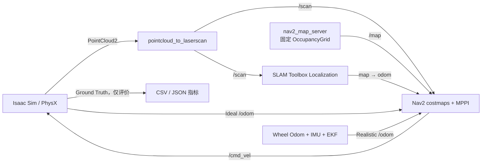

# 仓库使用手册

本文面向第一次接触本项目的使用者，目标是让你能够从一个干净的 clone 开始，依次完成环境检查、构建、启动仿真、定位、导航、建图和自动实验。

如果你想了解“某个文件究竟负责什么”，请配合阅读 [`repository_index.md`](repository_index.md)。如果你要修改算法参数，再阅读 [`interfaces.md`](interfaces.md) 和 [`calibration.md`](calibration.md)。

## 1. 先理解系统如何运行

本项目不是一个单进程程序。正常运行时至少有两个进程：

1. Isaac Sim 进程负责物理世界、Jackal、传感器、控制、Reset 和 Ground Truth；
2. ROS 2 进程负责点云投影、SLAM、里程计融合、Nav2 和实验管理。

导航数据流如下：



必须始终遵守以下约束：

- ROS 主 TF 树是 `map → odom → base_link`，没有 ROS `world` frame；
- Mapping 和 Localization 不能同时运行，它们都会发布 `map → odom`；
- Ideal 模式由 Isaac 发布 `/odom`；Realistic 模式由 EKF 发布 `/odom`；
- Navigation 中 `/map` 只能由 `map_server` 发布；SLAM 的诊断地图位于 `/slam_toolbox/map`；
- Ground Truth 只能用于评价，不能接入 SLAM、EKF、Nav2 或控制器；
- Isaac 与 ROS 两端必须选择相同的里程计模式和结构 TF 所有者。

## 2. 推荐阅读顺序

第一次使用时按这个顺序阅读：

1. 本文：实际怎么运行；
2. [`README.md`](../README.md)：项目状态与常用入口；
3. [`repository_index.md`](repository_index.md)：每个文件的用途；
4. [`interfaces.md`](interfaces.md)：Topic、TF、QoS、Reset 和模式契约；
5. [`calibration.md`](calibration.md)：地图与 USD 坐标如何对齐；
6. [`verification.md`](verification.md)：哪些能力已验证、哪些还没有；
7. [`plan.md`](../plan.md)：最完整的设计背景和最终验收目标。

## 3. 环境与目录约定

远程仓库名中的 `Issac` 是现有 GitHub 仓库名。为避免它与项目内统一使用的
`Isaac` 目录名混淆，第一次下载时建议显式指定本地目录：

```bash
git clone git@github.com:AoiOTA/Issac_Sim_ROS2_Nav.git Isaac_Sim_ROS2_Nav
cd Isaac_Sim_ROS2_Nav
export PROJECT_ROOT="$PWD"
```

如果已经下载了仓库，进入实际仓库根目录后再设置变量；不要直接照抄一个不存在
的绝对路径：

```bash
cd /你的实际路径/Isaac_Sim_ROS2_Nav
export PROJECT_ROOT="$PWD"
```

环境变量只对当前 shell 生效，因此每打开一个新终端都要重新执行上面两行。

`run_isaac.sh` 和 `run_ros.sh` 会自行准备环境；如果终端直接执行 `ros2 topic`、`ros2 action` 或 `ros2 launch robot_experiments`，还要先执行：

```bash
cd /你的实际路径/Isaac_Sim_ROS2_Nav
export PROJECT_ROOT="$PWD"
source /opt/ros/jazzy/setup.bash
source "$PROJECT_ROOT/ros2_ws/install/setup.bash"
```

脚本默认使用：

```text
Isaac Python: /home/lyb/miniconda3/envs/isaacsim/bin/python
Isaac assets: /home/lyb/isaacsim_assets/Assets/Isaac/6.0
ROS setup:    /opt/ros/jazzy/setup.bash
ROS domain:   42
RMW:          rmw_fastrtps_cpp
```

路径不同可以在运行前覆盖：

```bash
export ISAAC_PYTHON=/path/to/isaacsim/bin/python
export ISAAC_ASSET_ROOT=/path/to/Assets/Isaac/6.0
export ROS_SETUP=/opt/ros/jazzy/setup.bash
export ROS_DOMAIN_ID=42
export RMW_IMPLEMENTATION=rmw_fastrtps_cpp
```

所有同时运行的终端必须使用相同的 `ROS_DOMAIN_ID` 和 `RMW_IMPLEMENTATION`。

## 4. 第一次 clone 后的准备

### 4.1 拉取 Git LFS 地图

`warehouse_v1.posegraph` 使用 Git LFS。没有拉取它时，文件只是一个很小的指针，Localization 无法启动。

```bash
cd "$PROJECT_ROOT"
git lfs install
git lfs pull
```

### 4.2 环境预检

```bash
./scripts/preflight.sh
```

成功时最后应看到：

```text
map baseline: warehouse_v1 (integrity verified)
preflight: PASS
```

预检会检查：

- Isaac Sim 版本是否为 `6.0.1.0`；
- 官方 Warehouse/Jackal 资产是否存在；
- ROS Jazzy、Nav2、SLAM Toolbox 等包是否存在；
- NVIDIA GPU 是否可见；
- `warehouse_v1` 四个地图文件的大小和 SHA256 是否匹配 manifest；
- Git LFS 文件是否已经真正下载。

### 4.3 导入 Jackal 本地依赖

```bash
./scripts/import_assets.sh
```

该命令从本机 Isaac 资产目录复制项目运行所需的 Jackal 文件，并校验 SHA256。它不会修改官方资产，也不会把 NVIDIA 原始资产提交到 Git。

### 4.4 构建 ROS 工作区

```bash
./scripts/build_ros2.sh
```

成功时应显示 `8 packages finished`。构建产物位于 `ros2_ws/build/`、`install/`、`log/`，这些目录不会进入 Git。

### 4.5 运行测试

```bash
./scripts/test.sh --with-isaac
```

当前基线应通过纯 Python、ROS package 和 Isaac/USD 测试。精确计数记录在 [`verification.md`](verification.md)。

## 5. 最快完成一次 Ideal 导航

仓库已经包含可用的 `warehouse_v1` OccupancyGrid 和 Pose Graph，因此不需要先重新建图。

### 5.1 终端 A：启动 Isaac

```bash
cd "$PROJECT_ROOT"
./scripts/run_isaac.sh \
  --navigation-mode localization \
  --mode ideal
```

无显示器或不需要 GUI 时加 `--headless`：

```bash
./scripts/run_isaac.sh --headless \
  --navigation-mode localization \
  --mode ideal
```

等待日志出现：

```text
Isaac navigation simulation ready
```

### 5.2 终端 B：启动 ROS 导航栈

```bash
cd "$PROJECT_ROOT"
./scripts/run_ros.sh navigation \
  odometry_mode:=ideal \
  posegraph_file:="$PROJECT_ROOT/data/maps/posegraphs/warehouse_v1"
```

脚本会按 Pose Graph 基名自动推导：

```text
data/maps/occupancy/warehouse_v1.yaml
```

等待日志出现：

```text
Nav2 lifecycle activation completed
```

不要在该日志出现前发送导航目标。Activation Gate 正在等待 `/map`、`/clock`、`/scan`、`/odom` 和稳定的 `map → odom`。

### 5.3 终端 C：发送目标

```bash
cd /你的实际路径/Isaac_Sim_ROS2_Nav
export PROJECT_ROOT="$PWD"
source /opt/ros/jazzy/setup.bash
source "$PROJECT_ROOT/ros2_ws/install/setup.bash"

ros2 action send_goal /navigate_to_pose \
  nav2_msgs/action/NavigateToPose \
  "{pose: {header: {frame_id: map}, pose: {position: {x: 1.0, y: 0.0}, orientation: {w: 1.0}}}}" \
  --feedback
```

成功标准：Action 最终状态为 `SUCCEEDED`。Nav2 goal checker 的位置容差是
`0.20 m`，所以机器人不会精确停在数学意义上的 `x=1.000`。自动实验另用
Ground Truth 检查 `0.25 m` 的成功阈值；这是评价门槛，不是 Nav2 的 goal
checker 配置。

### 5.4 停止系统

先在终端 B 按 `Ctrl+C` 停 ROS，再在终端 A 按 `Ctrl+C` 停 Isaac。不要直接关闭终端窗口，否则可能留下 ROS/Isaac 子进程。

## 6. 仅启动 Localization

如果只想查看定位、地图和 TF，不需要 Nav2：

```bash
# 终端 A
./scripts/run_isaac.sh --navigation-mode localization --mode ideal

# 终端 B
./scripts/run_ros.sh localization \
  odometry_mode:=ideal \
  posegraph_file:="$PROJECT_ROOT/data/maps/posegraphs/warehouse_v1"
```

检查关键接口：

```bash
ros2 topic info /map -v
ros2 topic info /slam_toolbox/map -v
ros2 run tf2_ros tf2_echo map odom
ros2 run tf2_ros tf2_echo odom base_link
```

期望结果：

- `/map` 有且只有一个 `map_server` publisher；
- `/slam_toolbox/map` 的 publisher 是 `slam_toolbox`；
- `map → odom → base_link` 连续可用；
- `/odom` 只有一个 publisher。

## 7. Realistic 里程计与导航

Realistic 模式不使用 Isaac Ideal Odom。轮关节状态先生成 `/wheel/odom`，再与 IMU 进入 EKF，最终由 `ekf_filter_node` 唯一发布 `/odom` 和 `odom → base_link`。

```bash
# 终端 A
./scripts/run_isaac.sh \
  --navigation-mode localization \
  --mode realistic

# 终端 B
./scripts/run_ros.sh navigation \
  odometry_mode:=realistic \
  posegraph_file:="$PROJECT_ROOT/data/maps/posegraphs/warehouse_v1"
```

检查唯一所有权：

```bash
ros2 topic info /wheel/odom -v
ros2 topic info /odom -v
```

`/odom` 的 publisher 必须只有 `ekf_filter_node`。如果同时看到 Isaac publisher，说明两端模式不一致，应立即停止并重新启动。

### 7.1 可选的 RSP 结构 TF

默认结构 TF 仍由 Isaac 发布。只有 Realistic 模式允许改为 Robot State Publisher：

```bash
# 终端 A
./scripts/run_isaac.sh \
  --navigation-mode localization \
  --mode realistic \
  --structure-tf-source rsp

# 终端 B
./scripts/run_ros.sh navigation \
  odometry_mode:=realistic \
  structure_tf_source:=rsp \
  posegraph_file:="$PROJECT_ROOT/data/maps/posegraphs/warehouse_v1"
```

两端必须同时选择 `rsp`。`ideal + rsp` 会被配置检查拒绝。

## 8. 从头建图

只有在你修改了环境、传感器、机器人或想制作新地图时才需要重新建图。

### 8.1 启动 Mapping

```bash
# 终端 A
cd "$PROJECT_ROOT"
./scripts/run_isaac.sh --navigation-mode mapping --mode ideal

# 终端 B
cd "$PROJECT_ROOT"
./scripts/run_ros.sh mapping odometry_mode:=ideal
```

Mapping 中 SLAM Toolbox 自己发布 `/map`，不会启动 `map_server`。

终端 A/B 会被前台进程占用。另开终端 C 启动仓库预置的 RViz：

```bash
cd /你的实际路径/Isaac_Sim_ROS2_Nav
export PROJECT_ROOT="$PWD"
source /opt/ros/jazzy/setup.bash
source "$PROJECT_ROOT/ros2_ws/install/setup.bash"
rviz2 -d "$PROJECT_ROOT/ros2_ws/src/robot_description/rviz/navigation.rviz"
```

### 8.2 手动控制机器人

可以使用已安装的 teleop，也可以直接发布速度。下面命令会持续前进，按 `Ctrl+C` 停止：

在新的终端 D 先准备环境；本节的控制命令和保存命令都在终端 D 执行：

```bash
cd /你的实际路径/Isaac_Sim_ROS2_Nav
export PROJECT_ROOT="$PWD"
source /opt/ros/jazzy/setup.bash
source "$PROJECT_ROOT/ros2_ws/install/setup.bash"
```

```bash
ros2 topic pub --rate 10 /cmd_vel geometry_msgs/msg/Twist \
  "{linear: {x: 0.20}, angular: {z: 0.0}}"
```

缓慢原地旋转：

```bash
ros2 topic pub --rate 10 /cmd_vel geometry_msgs/msg/Twist \
  "{linear: {x: 0.0}, angular: {z: 0.35}}"
```

立即发送零速度：

```bash
ros2 topic pub --once /cmd_vel geometry_msgs/msg/Twist \
  "{linear: {x: 0.0}, angular: {z: 0.0}}"
```

建图时应缓慢覆盖走廊、货架两侧和转弯区域，并完成至少一次闭环。观察 RViz 中是否出现墙体重影、撕裂或错误闭环。

### 8.3 保存地图

使用新的版本名，脚本拒绝覆盖已有文件：

```bash
./scripts/save_map.sh warehouse_v2
```

会生成四个不可拆分的文件：

```text
data/maps/occupancy/warehouse_v2.yaml
data/maps/occupancy/warehouse_v2.pgm
data/maps/posegraphs/warehouse_v2.posegraph
data/maps/posegraphs/warehouse_v2.data
```

新地图不能直接沿用旧 Map Pose。请按照 [`calibration.md`](calibration.md) 重新测量 `spawn_poses.yaml` 中的 Map Pose，再把 `calibrated` 设为 `true`。

## 9. 确定性 Reset

Isaac 运行时提供 `/simulation/reset`：

```bash
ros2 param set /isaac_navigation_sim reset_seed 4242
ros2 param set /isaac_navigation_sim reset_pose_name mapping_start
ros2 service call /simulation/reset std_srvs/srv/Trigger '{}'
```

Reset 会清零控制和轮速、恢复 USD Pose、重置里程计/GT/碰撞/动态障碍并请求清 Costmap。

服务返回 `success: true` 不代表定位已经恢复。Localization 模式下还要等待：

1. Reset 后的新 `/scan`；
2. `/initialpose` 已发布，并收到 Reset 后的 `/simulation/localization_seeded` 事件；
3. Reset 后的新鲜 `/odom`；
4. 更新且稳定的 `map → odom`。

自动实验 runner 会自动执行这些门控；启用 Ground Truth 的实验还会额外等待
Reset 后的新鲜 GT。普通手工导航默认不启用 GT，不需要等待 GT 话题。手工操作时
不要在 Reset 返回后立刻发送目标。

## 10. 运行静态自动实验

实验必须显式打开 Ground Truth。

```bash
# 终端 A
ISAAC_NAV__GROUND_TRUTH__ENABLED=true \
  ./scripts/run_isaac.sh --headless \
  --navigation-mode localization \
  --mode ideal

# 终端 B
./scripts/run_ros.sh navigation \
  odometry_mode:=ideal \
  posegraph_file:="$PROJECT_ROOT/data/maps/posegraphs/warehouse_v1"
```

等待 Nav2 激活，然后在终端 C 运行：

```bash
cd /你的实际路径/Isaac_Sim_ROS2_Nav
export PROJECT_ROOT="$PWD"
source /opt/ros/jazzy/setup.bash
source "$PROJECT_ROOT/ros2_ws/install/setup.bash"

ros2 launch robot_experiments experiment.launch.py \
  scenario_file:="$PROJECT_ROOT/ros2_ws/src/robot_experiments/config/static.yaml" \
  spawn_poses_file:="$PROJECT_ROOT/isaac_sim/configs/spawn_poses.yaml" \
  output_directory:="$PROJECT_ROOT/data/experiment_runs/static_run"
```

当前 `static.yaml` 会在同一固定仓库中运行 4 个 seed。它是 Reset/导航 smoke，不是 200 次多布局统计。

结果目录中每轮都有：

- `.json`：完整结构化 manifest、指标、观测状态和失败原因；
- `.csv`：同一结果的表格版本，方便导入 Excel/Pandas。

## 11. 运行动态障碍实验

动态模式必须在 Isaac 端增加 `--dynamic-obstacles`：

```bash
# 终端 A
ISAAC_NAV__GROUND_TRUTH__ENABLED=true \
  ./scripts/run_isaac.sh --headless \
  --navigation-mode localization \
  --mode ideal \
  --dynamic-obstacles

# 终端 B
./scripts/run_ros.sh navigation \
  odometry_mode:=ideal \
  posegraph_file:="$PROJECT_ROOT/data/maps/posegraphs/warehouse_v1"

# 终端 C，等待 Nav2 激活后
cd /你的实际路径/Isaac_Sim_ROS2_Nav
export PROJECT_ROOT="$PWD"
source /opt/ros/jazzy/setup.bash
source "$PROJECT_ROOT/ros2_ws/install/setup.bash"

ros2 launch robot_experiments experiment.launch.py \
  scenario_file:="$PROJECT_ROOT/ros2_ws/src/robot_experiments/config/dynamic.yaml" \
  spawn_poses_file:="$PROJECT_ROOT/isaac_sim/configs/spawn_poses.yaml" \
  output_directory:="$PROJECT_ROOT/data/experiment_runs/dynamic_run"
```

runner 会在第一轮 Reset 前严格比较 Isaac 与 ROS 两侧的：

- enabled 状态、配置 SHA256 和障碍物 ID；
- shape、XY 尺寸；
- USD→Map 变换后的起终点；
- 运动时长和 `repeat`。

任一不一致都会 fail fast。修改动态障碍时，必须同时修改：

```text
isaac_sim/configs/experiments/dynamic.yaml
ros2_ws/src/robot_experiments/config/dynamic.yaml
```

## 12. 长距离 smoke

使用与静态实验相同的 Isaac/ROS 启动方式，只替换场景文件：

```bash
ros2 launch robot_experiments experiment.launch.py \
  scenario_file:="$PROJECT_ROOT/ros2_ws/src/robot_experiments/config/static_long_range.yaml" \
  spawn_poses_file:="$PROJECT_ROOT/isaac_sim/configs/spawn_poses.yaml" \
  output_directory:="$PROJECT_ROOT/data/experiment_runs/static_long_run"
```

当前目标为 Map 坐标 `[3.0, 0.0]`，用于覆盖比 1 m smoke 更长的规划和控制链。

## 13. 增量建图与离线比较

### 13.1 加载基线继续建图

```bash
# 终端 A
./scripts/run_isaac.sh --navigation-mode mapping --mode ideal

# 终端 B
./scripts/run_ros.sh incremental_mapping \
  odometry_mode:=ideal \
  posegraph_file:="$PROJECT_ROOT/data/maps/posegraphs/warehouse_v1"
```

遍历真实变化区域后，用新名称保存：

```bash
./scripts/save_map.sh warehouse_v2_incremental
```

还需要在相同变化环境中从零完成一次完整重建，例如 `warehouse_v2_full`。两次计时必须使用相同的开始/结束定义。

### 13.2 比较三张地图

```bash
cp ros2_ws/src/robot_experiments/config/incremental_comparison.example.yaml \
  data/reports/incremental_comparison.yaml
```

编辑副本，填写：

- baseline、full remap、incremental 三个 Map Server YAML；
- 完整建图和增量建图耗时；
- 真实变化区域的 Map 坐标矩形。

然后运行：

```bash
ros2 run robot_experiments incremental_map_compare \
  --spec "$PROJECT_ROOT/data/reports/incremental_comparison.yaml" \
  --output "$PROJECT_ROOT/data/reports/incremental_comparison.json"
```

返回码：

- `0`：保存地图比较通过；
- `2`：输入有效，但一个或多个阈值未通过；
- `1`：配置、路径或地图格式无效。

比较通过也只代表地图和耗时指标通过，仍需使用新地图重新运行 Localization 和 Nav2。

## 14. 自定义机器人迁移

不要直接把占位值改成“看起来合理”的数字。仓库中的 custom profile 故意使用 `null`，缺少真实测量时必须启动失败。

完整步骤见 [`isaac_sim/assets/robots/custom_robot/README.md`](../isaac_sim/assets/robots/custom_robot/README.md)。基本入口是：

```bash
export ISAAC_NAV_PROJECT_CONFIG="$PROJECT_ROOT/isaac_sim/configs/custom_robot.project.yaml"
export CUSTOM_ROBOT_USD=/path/to/custom_robot.usda
export CUSTOM_ROBOT_DEFAULT_PRIM=custom_robot
export CUSTOM_ROBOT_LIDAR_CONFIG=/path/to/custom_lidar.yaml
export CUSTOM_ROBOT_IMU_CONFIG=/path/to/custom_imu.yaml
export CUSTOM_ROBOT_CAMERA_CONFIG=/path/to/custom_camera.yaml

./scripts/run_isaac.sh --validate-only
```

ROS 侧可替换 Xacro、Wheel Odom 和 Nav2 参数：

```bash
./scripts/run_ros.sh navigation \
  odometry_mode:=realistic \
  structure_tf_source:=rsp \
  posegraph_file:=/path/to/custom_map \
  map_file:=/path/to/custom_map.yaml \
  robot_description_file:=/path/to/custom_robot.urdf.xacro \
  wheel_odometry_params_file:=/path/to/custom_wheel_odometry.yaml \
  nav2_params_file:=/path/to/custom_nav2.yaml
```

必须重新测量质量/惯量、轮径、有效轮距、Footprint、传感器外参、出生点和 Map Pose，并重新验证 Ideal、Realistic、GT、Reset、Localization 和 Nav2。

## 15. 数据和结果在哪里

| 路径 | 内容 | 是否提交 Git |
| --- | --- | --- |
| `data/maps/occupancy/` | OccupancyGrid YAML/PGM | 只有精选基线 |
| `data/maps/posegraphs/` | SLAM Toolbox `.posegraph/.data` | 大文件需 Git LFS |
| `data/maps/manifests/` | 地图版本、大小、SHA256、标定记录 | 可以提交 |
| `data/experiment_runs/` | 每轮 CSV/JSON | 默认忽略 |
| `data/bags/` | rosbag | 默认忽略 |
| `data/metrics/` | 聚合指标 | 默认忽略 |
| `data/reports/` | 对比报告和图表 | 默认忽略 |
| `data/trajectories/` | 估计/GT 轨迹 | 默认忽略 |

不要把 `build/`、`install/`、`log/`、Kit 日志、批量实验结果或官方资产直接提交到普通 Git 历史。

## 16. 常用运行检查

```bash
ros2 topic hz /clock
ros2 topic hz /lidar/points_raw
ros2 topic hz /scan
ros2 topic hz /odom

ros2 topic info /map -v
ros2 topic info /slam_toolbox/map -v
ros2 topic info /odom -v
ros2 topic info /tf -v
ros2 topic info /tf_static -v

ros2 lifecycle get /map_server
ros2 run tf2_ros tf2_echo map odom
ros2 run tf2_ros tf2_echo odom base_link
ros2 run tf2_tools view_frames
```

正常基线大致为：

- `/clock` 约 60 Hz；
- `/lidar/points_raw` 和 `/scan` 约 10 Hz；
- Realistic `/wheel/odom`、`/odom` 约 45 Hz；
- `/odom`、`/map` 均只有一个模式正确的 publisher。

## 17. 常见问题

### 17.1 `Git LFS artifact is not hydrated`

```bash
git lfs pull
./scripts/preflight.sh
```

### 17.2 ROS 看不到 Isaac Topic

在所有终端检查：

```bash
echo "$ROS_DOMAIN_ID"
echo "$RMW_IMPLEMENTATION"
```

它们应分别一致为 `42` 和 `rmw_fastrtps_cpp`。

### 17.3 Navigation 一直不激活

检查：

```bash
ros2 topic echo /clock --once
ros2 topic echo /scan --once
ros2 topic echo /odom --once
ros2 topic echo /map --once --field info
ros2 run tf2_ros tf2_echo map odom
```

Activation Gate 日志会明确写出正在等待的条件。不要通过关闭 gate 绕过问题。

### 17.4 `/odom` 有两个 publisher

Ideal/Realistic 模式不一致。停止两端，按同一种模式重新启动。不要让 Isaac Ideal Odom 与 EKF 同时发布。

### 17.5 `/map` 有两个 publisher

Mapping 与 Localization/Navigation 被同时启动，或 SLAM map 未正确重映射。停止重复栈。Navigation 中 `/map` 只能属于 `map_server`。

### 17.6 Reset 成功后目标仍失败

不要只看 Trigger 返回。等待 `/simulation/localization_seeded` 和新的稳定 TF；自动实验 runner 已实现这套门控。

### 17.7 SmacPlanner2D 打印 inflation `ERROR`

Nav2 Jazzy 1.3.12 对当前 2D radius 模式会打印已知误诊。只要版本、Footprint、插件和 `0.55 m` inflation 配置未改变，并且随后正常完成规划，可按 [`verification.md`](verification.md#nav2-1312-smac-inflation-diagnostic) 的说明处理。其他 planner 或参数变化后必须重新调查。

### 17.8 机器人不动或持续运动

- 确认 `/cmd_vel` 有新消息；
- 确认左右轮 joint 名称没有变化；
- 检查 Collision Monitor 是否处于 Stop 状态；
- 停止手工 `ros2 topic pub --rate` 进程；
- 发送一次零速度；
- 必要时调用 Reset。

## 18. 修改配置时应该改哪里

| 需求 | 优先修改 |
| --- | --- |
| 改 LiDAR 型号/频率/Prim | `isaac_sim/configs/sensors/lidar_3d.yaml` |
| 改点云投影高度和角度 | `ros2_ws/src/robot_perception/config/pointcloud_to_laserscan.yaml` |
| 改轮径/轮距 | Isaac robot YAML 与 `ros2_ws/src/robot_odometry/config/wheel_odometry.yaml` 同步修改 |
| 改 Footprint/速度/代价地图 | `ros2_ws/src/robot_navigation/config/nav2_params.yaml` |
| 改出生点 | `isaac_sim/configs/spawn_poses.yaml`，随后重做标定 |
| 改动态障碍 | Isaac 与 ROS 两个 `dynamic.yaml` 同步修改 |
| 改实验目标和 seed | `ros2_ws/src/robot_experiments/config/*.yaml` |
| 改 SLAM 参数 | `ros2_ws/src/robot_mapping/config/slam_*.yaml` |
| 改 EKF | `ros2_ws/src/robot_localization_config/config/ekf.yaml` |
| 换机器人 | custom project/robot YAML、Xacro、Wheel Odom、Nav2 参数和地图全部重新标定 |

修改前先通过 [`repository_index.md`](repository_index.md) 确认文件职责，避免在错误层修改同一个概念。

## 19. Git 工作建议

```bash
git status -sb
git log --oneline --decorate --graph
```

建议一个 commit 只表达一个能力，例如：

```text
feat(perception): tune scan projection height
fix(reset): wait for post-reset localization seed
docs: clarify realistic navigation workflow
```

地图、代码和标定之间有版本依赖。修改地图或出生点时，应在同一个变更说明中写清楚：地图版本、Pose Graph、USD Pose、Map Pose 和验证结果。

## 20. 当前能力边界

仓库当前已经完成并运行验证了 Ideal/Realistic 导航、固定地图定位、动态双障碍基线、多轮 Reset 和实验报告，但下面内容仍需要真实实验或外部资产：

- 计划中的 200 次多起终点/多布局静态统计；
- 多类型动态障碍总体成功率；
- 真实 changed-region 的增量建图 30% 改善证明；
- 长时间 soak；
- 真实自定义机器人 USD 与完整标定。

不要把小规模 smoke 的 4/4 描述成通用 100% 成功率。最新证据和剩余项以 [`verification.md`](verification.md) 为准。
