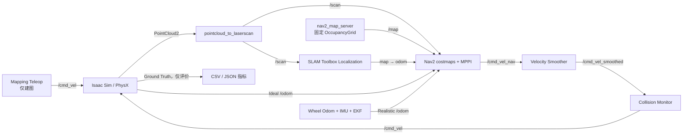

# 仓库使用手册

本文面向第一次接触本项目的使用者，目标是让你从一个干净的 clone 开始，依次完成依赖安装、环境检查、构建、启动仿真、Camera/RViz 观察、定位/导航、安全建图、Reset、底盘运动诊断、性能采样和自动实验。

日常操作只需要两个终端：终端 A 运行 Isaac Sim，终端 B 运行 ROS 栈。终端 B 默认会自动打开与当前模式匹配的 RViz；Mapping/Incremental Mapping 还会自动打开独立键盘控制窗口。不要把旧教程里的手工 `rviz2`、持续 `ros2 topic pub /cmd_vel` 或 CLI 目标发送当作默认工作流。

如果你想了解“某个文件究竟负责什么”，请配合阅读 [`repository_index.md`](repository_index.md)。如果你要修改算法参数，再阅读 [`interfaces.md`](interfaces.md) 和 [`calibration.md`](calibration.md)。

## 1. 先理解系统如何运行

本项目不是一个单进程程序。正常运行时至少有两个主进程，交互模式还会受管启动 RViz 和可选 Teleop：

1. Isaac Sim 进程负责物理世界、Jackal、传感器、控制、Reset 和 Ground Truth；
2. ROS 2 进程负责点云投影、SLAM、里程计融合、Nav2、RViz 和实验管理；
3. Mapping 专用 Teleop 只在 Mapping/Incremental Mapping 中拥有 `/cmd_vel`，Navigation 中由 Collision Monitor 唯一输出 `/cmd_vel`。

导航数据流如下：



必须始终遵守以下约束：

- ROS 主 TF 树是 `map → odom → base_link`，没有 ROS `world` frame；
- Mapping 和 Localization 不能同时运行，它们都会发布 `map → odom`；
- Ideal 模式由 Isaac 发布 `/odom`；Realistic 模式由 EKF 发布 `/odom`；
- Navigation 中 `/map` 只能由 `map_server` 发布；SLAM 的诊断地图位于 `/slam_toolbox/map`；
- Ground Truth 只能用于评价，不能接入 SLAM、EKF、Nav2 或控制器；
- Isaac 与 ROS 两端必须选择相同的里程计模式和结构 TF 所有者。
- `run_ros.sh` 对每个组件实行单实例管理；不要绕过脚本重复启动 ROS 栈、RViz 或 Teleop。

## 2. 推荐阅读顺序

第一次使用时按这个顺序阅读：

1. 本文：实际怎么运行；
2. [`README.md`](../README.md)：项目状态与常用入口；
3. [`repository_index.md`](repository_index.md)：每个文件的用途；
4. [`interfaces.md`](interfaces.md)：Topic、TF、QoS、Reset 和模式契约；
5. [`calibration.md`](calibration.md)：地图与 USD 坐标如何对齐；
6. [`troubleshooting.md`](troubleshooting.md)：按症状排查启动、QoS、TF、Reset 和性能问题；
7. [`verification.md`](verification.md)：哪些能力已验证、哪些还没有；
8. [`navigation_quality_and_simulation_fidelity_upgrade_plan.md`](navigation_quality_and_simulation_fidelity_upgrade_plan.md)：当前正在执行的导航质量、仿真保真度与 Warehouse V2 验收顺序；
9. [`plan.md`](../plan.md)：最完整的设计背景和最终验收目标。

## 3. 环境与目录约定

GitHub canonical 仓库名与项目目录统一使用 `Isaac`。第一次下载时执行：

```bash
git clone git@github.com:AoiOTA/Isaac_Sim_ROS2_Nav.git Isaac_Sim_ROS2_Nav
cd Isaac_Sim_ROS2_Nav
export PROJECT_ROOT="$PWD"
```

如果尚未配置 GitHub SSH Key，改用 HTTPS：

```bash
git clone https://github.com/AoiOTA/Isaac_Sim_ROS2_Nav.git Isaac_Sim_ROS2_Nav
cd Isaac_Sim_ROS2_Nav
export PROJECT_ROOT="$PWD"
```

如果已经下载了仓库，进入实际仓库根目录后再设置变量；不要直接照抄一个不存在
的绝对路径：

```bash
cd /你的实际路径/Isaac_Sim_ROS2_Nav
export PROJECT_ROOT="$PWD"
```

环境变量只对当前 shell 生效，因此每打开一个新终端都要重新执行上面两行。

`run_isaac.sh` 和 `run_ros.sh` 会自行准备环境；如果终端直接执行 `ros2 topic`、`ros2 action` 或 `ros2 launch robot_experiments`，构建完成后使用统一入口：

```bash
cd /你的实际路径/Isaac_Sim_ROS2_Nav
source ./scripts/setup_ros_env.sh
```

它会校验仓库根目录、ROS Jazzy、Domain `42`、Fast DDS 和本工作区；如果 ROS CLI daemon 缓存了旧 Domain/图状态，可显式执行 `source ./scripts/setup_ros_env.sh --restart-daemon`。不要在多个终端里手工拼出互相不同的 ROS 环境。

脚本默认使用：

```text
Isaac Python: /home/lyb/miniconda3/envs/isaacsim/bin/python
Isaac assets: /home/lyb/isaacsim_assets/Assets/Isaac/6.0
ROS setup:    /opt/ros/jazzy/setup.bash
ROS domain:   42
RMW:          rmw_fastrtps_cpp
```

路径不同可以在运行前覆盖：

```bash
export ISAAC_PYTHON=/path/to/isaacsim/bin/python
export ISAAC_ASSET_ROOT=/path/to/Assets/Isaac/6.0
export ROS_SETUP=/opt/ros/jazzy/setup.bash
export ROS_DOMAIN_ID=42
export RMW_IMPLEMENTATION=rmw_fastrtps_cpp
```

所有同时运行的终端必须使用相同的 `ROS_DOMAIN_ID` 和 `RMW_IMPLEMENTATION`。

## 4. 第一次 clone 后的准备

### 4.1 安装外部依赖

仓库不包含 Isaac Sim、NVIDIA 官方资产或 ROS 二进制包。开始前至少需要：

| 依赖 | 本项目要求/用途 |
| --- | --- |
| NVIDIA GPU 与兼容驱动 | 运行 Isaac Sim RTX 传感器；用 `nvidia-smi` 验证。 |
| Isaac Sim Python `6.0.1.0` | 默认路径为 `/home/lyb/miniconda3/envs/isaacsim/bin/python`。 |
| Isaac 6.0 资产 | 必须包含 Warehouse 与 Clearpath Jackal，默认根目录见上节。 |
| ROS 2 Jazzy | 默认安装到 `/opt/ros/jazzy`。 |
| Git LFS | 下载仓库中的大 Pose Graph。 |
| `jq`、`ripgrep` | 阅读 JSON 证据和按路径/关键字检索源码、日志。 |
| `ros-dev-tools`（含 `colcon`、`rosdep`） | 解析 ROS 依赖和构建十一个工作区包。 |
| Python 3.12、PyYAML、pytest、jsonschema | 运行配置解析、单元测试和实验报告。 |
| `gnome-terminal`、`xterm` 或 `konsole` | 可选；自动弹出 Mapping Teleop 终端需要其中一个。 |

先按 ROS 官方流程配置 Jazzy 的 APT 软件源并安装 ROS 与 Isaac Sim，再安装完整开发工具，
然后让 `rosdep` 根据当前 `package.xml` 安装 ROS/C++ 依赖；它会包含 Nav2、SLAM
Toolbox、robot_localization、Ceres、RViz 和消息包。全新机器还要且只要初始化一次
系统级 rosdep source：

```bash
sudo apt update
sudo apt install ros-dev-tools git-lfs jq ripgrep python3-venv
source /opt/ros/jazzy/setup.bash

if [ ! -f /etc/ros/rosdep/sources.list.d/20-default.list ]; then
  sudo rosdep init
fi
rosdep update
rosdep install --from-paths ros2_ws/src --ignore-src -r -y
```

仓库级 Python 开发依赖定义在 `pyproject.toml`。Ubuntu 24.04 的系统 Python 受
PEP 668 保护，不要直接向它执行 `pip install`。在仓库根目录创建被 `.gitignore`
排除的虚拟环境，并允许它读取系统安装的 ROS Python 包：

```bash
cd "$PROJECT_ROOT"
python3 -m venv --system-site-packages .venv
source .venv/bin/activate
python -m pip install --upgrade pip
python -m pip install -e '.[dev]'
```

以后在新的开发终端运行 Python 测试前先执行 `source "$PROJECT_ROOT/.venv/bin/activate"`。
Isaac Sim 的 Python 环境不必另装 pytest；`scripts/test.sh --with-isaac` 会优先复用其
USD/Isaac 模块。不要在虚拟环境中用 `pip` 安装或替换 ROS 自带的 `rclpy`。

### 4.2 拉取 Git LFS 地图

仓库中的大 `.posegraph` 使用 Git LFS。没有拉取时，文件只是一个很小的指针，Localization 无法读取对应 Pose Graph。

```bash
cd "$PROJECT_ROOT"
git lfs install
git lfs pull
```

### 4.3 导入 Jackal 本地依赖

```bash
./scripts/import_assets.sh
```

该命令从本机 Isaac 资产目录复制项目运行所需的 Jackal 文件，并校验 SHA256。它不会修改官方资产，也不会把 NVIDIA 原始资产提交到 Git。

### 4.4 构建 ROS 工作区

```bash
./scripts/build_ros2.sh
```

成功时应显示工作区中的十一个包全部 `finished` 且没有 `failed`，其中包括项目自己的 `robot_slam_solver` Ceres 插件和提供安全关闭 Nav2 面板的 `robot_rviz_plugins`。构建产物位于 `ros2_ws/build/`、`ros2_ws/install/`、`ros2_ws/log/`，这些目录不会进入 Git。

### 4.5 环境预检

第一次 clone 必须先完成上面的构建，因为 `preflight.sh` 会 source `ros2_ws/install/setup.bash` 并检查本仓库安装出的 ROS package：

```bash
./scripts/preflight.sh
```

成功时应看到地图校验和最终结果：

```text
map manifest verified: warehouse_v1 bundle=88b91be7fb0afe4364851c59dc3466f560017df5acc5405f3ab590729ded9bac
preflight: PASS
```

预检会检查：

- Isaac Sim 版本是否为 `6.0.1.0`；
- 官方 Warehouse/Jackal 资产是否存在；
- ROS Jazzy、Nav2、SLAM Toolbox 和本仓库十一个 package 是否可见；
- 安全关闭 Nav2 面板、RViz 配置和运行脚本是否已安装；
- NVIDIA GPU 是否可见；
- `warehouse_v1` 四个地图文件的大小和 SHA256 是否匹配 manifest；
- Git LFS 文件是否已经真正下载；
- 受管 runtime lock、重复 ROS 节点和 Fast DDS SHM 是否存在明显冲突。

### 4.6 运行测试

```bash
./scripts/test.sh --with-isaac
```

当前基线应通过纯 Python、ROS package 和 Isaac/USD 测试。精确计数记录在 [`verification.md`](verification.md)。

### 4.7 四种操作一眼看懂

| 操作 | Isaac 参数 | ROS 默认界面 | 主要用途 |
| --- | --- | --- | --- |
| `mapping` | `--navigation-mode mapping` | Mapping RViz + 安全 Teleop | 从零建立新地图。 |
| `incremental_mapping` | `--navigation-mode mapping` | Mapping RViz + 安全 Teleop | 加载旧 Pose Graph 后继续更新。 |
| `localization` | `--navigation-mode localization` | Localization RViz | 只验证固定地图定位和 TF。 |
| `navigation` | `--navigation-mode localization` | Navigation RViz + Nav2 面板 | 点击目标并完成规划、控制和避障。 |

Isaac 的 `--mode ideal|realistic` 必须与 ROS 的 `odometry_mode:=ideal|realistic` 相同。Mapping 两种模式绝不能与 Localization/Navigation 同时运行。

### 4.8 仓库内两套 Warehouse 地图怎么选

当前 Git 中有 `warehouse_v1` 与 `warehouse_v2` 两套四工件地图。它们的状态不同，不能只看文件名中的数字判断谁“更新、所以更好”：

| 地图 | 当前状态 | 应该怎么用 |
| --- | --- | --- |
| `warehouse_v1` | Manifest、出生点 Map Pose 和运行基线已经绑定 | 第一次启动、自动初始位姿、日常 Localization/Navigation 都使用它。 |
| `warehouse_v2` | 四工件已恢复并由 Manifest 校验，但原始建图日志缺失，`runtime_alignment_verified: false`、`calibrated: false` | 只作为待校准候选；可用 `initial_pose_source:=rviz` 做人工定位检查，不能用于 `auto`、增量建图或正式统计结论。 |

检查任一 bundle 的完整性：

```bash
source "$PROJECT_ROOT/scripts/setup_ros_env.sh"
ros2 run robot_bringup map_manifest verify \
  --project-root "$PROJECT_ROOT" \
  --manifest "$PROJECT_ROOT/data/maps/manifests/warehouse_v1.yaml"

ros2 run robot_bringup map_manifest verify \
  --project-root "$PROJECT_ROOT" \
  --manifest "$PROJECT_ROOT/data/maps/manifests/warehouse_v2.yaml"
```

`verify` 通过只说明工件没有缺失或混版，不等于地图已和当前 Stage、出生点对齐。若要检查 v2，使用下面的人工播种命令，在 RViz 中点击 **2D Pose Estimate**；完成 [`calibration.md`](calibration.md) 的重复冷启动标定前，不要修改 Manifest 把它伪装成已标定地图。

```bash
# 终端 A：先启动相同物理环境
./scripts/run_isaac.sh \
  --navigation-mode localization \
  --mode ideal

# 终端 B：候选地图必须人工给初始位姿
./scripts/run_ros.sh localization \
  odometry_mode:=ideal \
  initial_pose_source:=rviz \
  posegraph_file:="$PROJECT_ROOT/data/maps/posegraphs/warehouse_v2"
```

## 5. 最快完成一次 Ideal 导航

仓库已经包含可用的 `warehouse_v1` OccupancyGrid 和 Pose Graph，因此不需要先重新建图。

### 5.1 终端 A：启动 Isaac

```bash
cd "$PROJECT_ROOT"
./scripts/run_isaac.sh \
  --navigation-mode localization \
  --mode ideal
```

无显示器或不需要 GUI 时加 `--headless`：

```bash
./scripts/run_isaac.sh --headless \
  --navigation-mode localization \
  --mode ideal
```

仿真默认采用 `--pacing-mode realtime --target-rtf 1.0`，即物理/渲染配置保持 60 Hz，同时按墙钟节流，目标是 1 秒仿真时间约等于 1 秒真实时间。为了让 benchmark 命令可复现，建议显式写出：

```bash
./scripts/run_isaac.sh --headless \
  --navigation-mode localization \
  --mode ideal \
  --pacing-mode realtime \
  --target-rtf 1.0
```

`--pacing-mode unbounded` 只用于明确的吞吐/极限测试，会取消墙钟节流，不能和 realtime 结果直接比较，也不应作为日常导航默认值。实际 RTF 必须由第 17.3 节 Profiler 的 `/clock` 与稳态墙钟采样得出，不能用配置目标值代替测量值。

headless 启动会关闭 SimulationApp 的默认 viewport 更新，以避免无人观看的视窗持续占用 RTX resource descriptor。这不会关闭 LiDAR 或显式启用 Camera profile 各自的 RenderProduct；GUI 模式则保持 viewport 正常更新。clean `65ae923` 上的 Warehouse/Camera-off/realtime 实测在 8.000 s 稳态窗内收到 77 帧 `/lidar/points_raw`，墙钟频率 `9.603 Hz`；这证明关闭默认 viewport 后 RTX LiDAR 仍正常输出，不代表长时 soak 已完成。

等待日志出现：

```text
Isaac navigation simulation ready
```

### 5.2 终端 B：启动 ROS 导航栈

```bash
cd "$PROJECT_ROOT"
./scripts/run_ros.sh navigation \
  odometry_mode:=ideal \
  posegraph_file:="$PROJECT_ROOT/data/maps/posegraphs/warehouse_v1"
```

脚本会按 Pose Graph 基名自动推导：

```text
data/maps/occupancy/warehouse_v1.yaml
```

等待日志出现：

```text
Nav2 lifecycle activation completed
```

启动命令会自动打开 `navigation.rviz`。不要在上述日志出现前发送导航目标；Activation Gate 正在等待 `/map`、`/clock`、`/scan`、`/odom` 和稳定的 `map → odom`。RViz 左侧应能看到静态地图、LaserScan、机器人、全局/局部 Costmap、全局/局部路径、Footprint 和 Collision Monitor 区域，右侧应有 **Navigation 2** 面板。目标工具仍使用 Nav2 官方 `GoalTool`；面板由本仓库的 `robot_rviz_plugins/Navigation 2 Safe` 提供，功能与当前工作流一致，并在退出时先停止其线程和异步 future。

默认使用 `nav2_profile:=stable`：控制频率 `10 Hz`、MPPI `batch_size=750`、`20 × 0.10 s = 2 s` 预测窗。需要在同一台机器上做更高 MPPI 采样量对照时，选择仍保持 `10 Hz/2 s`、但 `batch_size=1000` 的性能 profile：

```bash
./scripts/run_ros.sh navigation \
  odometry_mode:=ideal \
  nav2_profile:=performance \
  posegraph_file:="$PROJECT_ROOT/data/maps/posegraphs/warehouse_v1"
```

`nav2_profile_params_file:=/absolute/path/overlay.yaml` 是矩阵测试/自定义 overlay 入口，日常运行不要随意替换基线。overlay 必须提供正数 `controller_frequency`、`model_dt`，以及正整数 `time_steps`、`batch_size`；还必须满足 `1 / controller_frequency <= model_dt`。例如 `model_dt=0.10 s` 时 8 Hz 会在创建 ROS 节点前被拒绝，而不是等 `controller_server` 运行后崩溃。

SLAM Ceres 默认请求 `ceres_num_threads:=12`；可在启动命令中显式覆盖。插件会拒绝小于 1 的值；请求值超过机器硬件并发数时会明确告警、自动降到可用线程数，并把节点参数回写为实际值。修改这两项后应使用第 17 节的 Profiler 重新采样，不能只凭“感觉更快”判断。

### 5.3 在 RViz 中发送目标

1. 确认 RViz 顶部 Fixed Frame 是 `map`；
2. 确认 **Navigation 2** 面板显示 Nav2 已激活；
3. 点击工具栏中的 Nav2 Goal 工具（绿色箭头）；
4. 在地图可通行区域按住鼠标左键，从目标位置拖出朝向后松开；
5. 观察青色全局路径、粉色局部路径和 Costmap，等待面板显示完成。

该 RViz 配置使用官方 `nav2_rviz_plugins/GoalTool` 和仓库自带的安全关闭 Navigation 2 面板，目标直接进入 Nav2 Action；没有额外的 `/goal_pose` 转换节点，也不需要第三个终端。

成功标准：面板最终状态成功，机器人停车，局部/全局路径没有持续振荡。Nav2 goal checker 的位置容差是 `0.20 m`，所以机器人不会精确停在数学坐标点。自动实验另用 Ground Truth 检查 `0.25 m` 的成功阈值；这是评价门槛，不是 Nav2 的 goal checker 配置。

CLI 仍可用于自动化或无显示器测试，但不作为日常入口：

```bash
source "$PROJECT_ROOT/scripts/setup_ros_env.sh"
ros2 action send_goal /navigate_to_pose \
  nav2_msgs/action/NavigateToPose \
  "{pose: {header: {frame_id: map}, pose: {position: {x: 1.0, y: 0.0}, orientation: {w: 1.0}}}}" \
  --feedback
```

### 5.4 看懂 Local Plan

发送目标后，RViz 中默认启用的粉色 **Local Plan** 不是全局路径的别名，而是 MPPI 当前选中的真实局部最优轨迹：

```text
/plan                    全局规划器输出的全局路径
/optimal_trajectory      MPPI 选中的局部最优轨迹，RViz 默认显示
/transformed_global_plan MPPI 使用的局部参考路径，RViz 默认关闭
/trajectories            MPPI 候选轨迹 MarkerArray，RViz 默认关闭
```

稳定和性能 profile 都使用 `20 × 0.10 s` 的预测窗，因此一次正常的 `/optimal_trajectory` 消息应包含 20 个 pose，frame 为 `odom`。这个 topic 只在控制器处理活动目标时持续更新；没有目标时 `ros2 topic hz` 等不到消息是正常现象。

在发送目标后检查：

```bash
source "$PROJECT_ROOT/scripts/setup_ros_env.sh"
ros2 topic info /optimal_trajectory --verbose
ros2 topic echo /optimal_trajectory --once
ros2 topic hz /optimal_trajectory
```

做性能采样时保持 **MPPI Candidate Trajectories** 关闭。`/trajectories` 是更重的候选集合，可在短时调试时手工打开，但会改变订阅关系和运行负载，不能把打开前后的 profile 当作同一条件。若只看到橙色参考路径而没有粉色 Local Plan，先确认订阅的是 `/optimal_trajectory`，再检查目标是否仍处于执行状态和 `controller_server` 是否 Active。

### 5.5 自动位姿与 RViz 手动位姿

默认 `initial_pose_source:=auto`：系统从 `spawn_poses.yaml` 读取已标定 Map Pose，等新鲜 `/scan` 和 TF 后自动发布 `/initialpose`。这是固定出生点的推荐方式。

需要人工指定初始位置时，在终端 B 增加：

```bash
./scripts/run_ros.sh navigation \
  odometry_mode:=ideal \
  initial_pose_source:=rviz \
  posegraph_file:="$PROJECT_ROOT/data/maps/posegraphs/warehouse_v1"
```

然后在 RViz 点击 **2D Pose Estimate**，在地图上拖出机器人实际朝向。该模式不会被自动标定位姿覆盖；每次 `/simulation/reset` 后，Activation Gate 会暂停 Nav2，并等待你重新在 RViz 给出位姿后再恢复。

### 5.6 安全停止系统

先在终端 B 对 `run_ros.sh` 按一次 `Ctrl+C`，等待终端完整返回，再在终端 A 对 `run_isaac.sh` 按一次 `Ctrl+C`。不要直接关闭终端窗口，也不要用 `pkill` 绕开脚本。

`run_ros.sh` 不是简单地把信号直接广播给所有 ROS 进程。顶层监督器用会话元数据认证自己创建的 ROS launch、RViz、Teleop 和 Lifecycle helper 独立进程组；收到退出信号后先保持 ROS context 可用，按操作执行 Lifecycle 关闭：Navigation 先关闭 navigation manager，再关闭 localization manager；Localization 只关闭 localization manager；Mapping/Incremental Mapping 依次对 SLAM Toolbox 执行 deactivate、cleanup、shutdown。完整流程共用 20 秒总期限，随后对仍存活的已认证进程组执行有界 INT→TERM→KILL 升级并清理本会话元数据。正常只按一次并等待；只有确认流程卡住时才按第二次请求 TERM，第三次才立即 KILL 本会话已认证的全部进程组，不会按名字误伤其他项目会话。

正常关闭时应看到类似：

```text
[INFO] requesting ordered navigation lifecycle shutdown
ordered shutdown: navigation lifecycle manager: PASS (...)
ordered shutdown: localization lifecycle manager: PASS (...)
[INFO] stopping ROS launch process group ... with SIGINT
```

若任一步显示 `WARN`，或日志仍出现 `process has died`、`exit code -6`、`context not valid`、`QThread: Destroyed while thread is still running`，这一轮不能记为“干净关闭通过”。先保存日志并用下面的诊断/清理入口确认残留；不要因为导航目标此前成功就忽略退出失败。

若终端意外关闭或下次启动提示已有实例，执行：

```bash
./scripts/diagnose.sh
./scripts/clean_runtime.sh --dry-run
./scripts/clean_runtime.sh --dds-shm
```

清理脚本只会停止具有本仓库 PID 元数据且命令身份匹配的进程；`--dds-shm` 只有在确认没有 Fast DDS 使用者时才删除当前用户的残留共享内存。

`clean_runtime.sh` 只对 PID/PGID、leader start ticks、boot ID、UID、项目根、leader 命令以及组成员项目身份都与已记录受管元数据匹配的进程组操作；每个阶段都重新认证，依次发送 `SIGINT`、超时后 `SIGTERM`，最后才对仍存活且身份未变化的同一组发送 `SIGKILL`。进程组真正消失前不会删除元数据。如果身份不匹配而拒绝操作，先人工检查 `diagnose.sh` 输出，不要删除元数据后盲目 `pkill`。

## 6. 仅启动 Localization

如果只想查看定位、地图和 TF，不需要 Nav2：

```bash
# 终端 A
./scripts/run_isaac.sh --navigation-mode localization --mode ideal

# 终端 B
./scripts/run_ros.sh localization \
  odometry_mode:=ideal \
  posegraph_file:="$PROJECT_ROOT/data/maps/posegraphs/warehouse_v1"
```

`localization.rviz` 会自动打开：`/map` 是 Map Server 的固定地图，`/slam_toolbox/map` 是默认关闭的定位诊断层，不能把两者混为一谈。默认仍由已标定出生点自动提供初始位姿。

若要练习人工重定位，加入 `initial_pose_source:=rviz`，然后在 RViz 用 **2D Pose Estimate** 在地图上拖出位置和朝向：

```bash
./scripts/run_ros.sh localization \
  odometry_mode:=ideal \
  initial_pose_source:=rviz \
  posegraph_file:="$PROJECT_ROOT/data/maps/posegraphs/warehouse_v1"
```

检查关键接口：

```bash
ros2 topic info /map -v
ros2 topic info /slam_toolbox/map -v
ros2 run tf2_ros tf2_echo map odom
ros2 run tf2_ros tf2_echo odom base_link
```

期望结果：

- `/map` 有且只有一个 `map_server` publisher；
- `/slam_toolbox/map` 的 publisher 是 `slam_toolbox`；
- `map → odom → base_link` 连续可用；
- `/odom` 只有一个 publisher。

Localization 不启动 Nav2，也不会打开 Mapping Teleop；它只用于观察和校验定位结果。

## 7. Realistic 里程计与导航

Realistic 模式不使用 Isaac Ideal Odom。轮关节状态先生成 `/wheel/odom`，再与 IMU 进入 EKF，最终由 `ekf_filter_node` 唯一发布 `/odom` 和 `odom → base_link`。

先启动终端 A，并等待日志明确出现 `Isaac navigation simulation ready:`；看到这行后
才能启动终端 B。不要让两个命令同时冷启动：Wheel Odom 的 provenance 握手只等待
10 秒，而 Isaac 首次加载通常更久，超时会按设计关闭整套 Realistic ROS launch。

```bash
# 终端 A
./scripts/run_isaac.sh \
  --navigation-mode localization \
  --mode realistic

# 等终端 A 出现 "Isaac navigation simulation ready:" 后，再在终端 B 执行
./scripts/run_ros.sh navigation \
  odometry_mode:=realistic \
  posegraph_file:="$PROJECT_ROOT/data/maps/posegraphs/warehouse_v1"
```

两端默认都选择
`isaac_sim/configs/robots/jackal.yaml`。ROS 在创建 Wheel Odom 的 Topic、Reset
service 和 timer 前，会读取 `/isaac_navigation_sim` 的只读 provenance v6 参数，
并逐项比对 robot 文件的规范路径、原始字节 SHA256、profile、lifecycle、轮径、
轮宽、几何轮距、有效轮距和 controller 校验标志，同时要求运行态 schema 精确为
v6，避免连接仍发布旧合同的 Isaac。Wheel Odom 不重复实现完整
topology/contact/reset-strategy 报告校验；Isaac producer 已 fresh 读取并验证当前
Stage，motion runner 验证 topology/contact/reset-strategy 三对 JSON/SHA，并调用
report validator，离线 validator 负责报告内的解码结构。
Isaac 尚未就绪、参数服务超时或
任一值不一致时，Wheel Odom 非零退出并让当前 Realistic ROS launch 受管关闭；此时
没有 `/wheel/odom` 是正确门禁，不是再启动一个手工 publisher 或单独重启 EKF 的
理由。

实验 robot YAML 必须在两端显式选择同一绝对路径。例如：

仓库已提供两个只用于第三阶段 A/B 的候选：

| 文件 | 有效轮距 | 来源与状态 |
| --- | ---: | --- |
| `isaac_sim/configs/robots/experimental/jackal_etw_0p989_v1.yaml` | `0.989 m` | clean 接触矩阵 Warehouse 候选均值的三位舍入；未验收 |
| `isaac_sim/configs/robots/experimental/jackal_etw_1p012_v1.yaml` | `1.012 m` | clean 接触矩阵两环境等权均值的三位舍入；接近历史多速度拟合，未验收 |

它们的 `lifecycle` 都是 `experimental_candidate`。不要把文件名中的数值理解成已经
标定，也不要原地修改 v1；若实验产生新候选，应复制为新 profile ID 和 v2 文件，
让旧报告中的路径/SHA256 仍可回溯。

```bash
CANDIDATE="$PROJECT_ROOT/isaac_sim/configs/robots/experimental/jackal_etw_0p989_v1.yaml"

# 终端 A
ISAAC_NAV__FILES__ROBOT="$CANDIDATE" \
  ./scripts/run_isaac.sh --navigation-mode localization --mode realistic

# 等终端 A 出现 "Isaac navigation simulation ready:" 后，再在终端 B 执行
./scripts/run_ros.sh navigation \
  odometry_mode:=realistic \
  robot_config_file:="$CANDIDATE" \
  posegraph_file:="$PROJECT_ROOT/data/maps/posegraphs/warehouse_v1"
```

不要只改 Wheel Odom 参数文件：它现在只保存发布频率、积分间隔、frame 和协方差，
不再复制轮径、轮距或 joint 名。

当前 ROS Xacro 保留的是 Jackal 已验证惯量张量，因此实验有效轮距可以独立变化且不会
改动 URDF；若同时改变轮径、轮宽、底盘质量或轮质量，Description 会明确拒绝启动，
直到为新机器人提供与几何/质量一致的惯量模型。不要通过删除这个门让一个 Jackal
惯量冒充自定义机器人。

检查唯一所有权：

```bash
ros2 topic info /wheel/odom -v
ros2 topic info /odom -v
```

`/odom` 的 publisher 必须只有 `ekf_filter_node`。如果同时看到 Isaac publisher，说明两端模式不一致，应立即停止并重新启动。

### 7.1 可选的 RSP 结构 TF

默认结构 TF 仍由 Isaac 发布。只有 Realistic 模式允许改为 Robot State Publisher：

```bash
# 终端 A
./scripts/run_isaac.sh \
  --navigation-mode localization \
  --mode realistic \
  --structure-tf-source rsp

# 终端 B
./scripts/run_ros.sh navigation \
  odometry_mode:=realistic \
  structure_tf_source:=rsp \
  posegraph_file:="$PROJECT_ROOT/data/maps/posegraphs/warehouse_v1"
```

两端必须同时选择 `rsp`。`ideal + rsp` 会被配置检查拒绝。

### 7.2 交互、无头和自定义 RViz 选项

四个 ROS 操作都接受同一组交互参数：

| 参数 | 默认值 | 作用 |
| --- | --- | --- |
| `interactive` | `true` | 设为 `false` 时同时禁用 RViz 和 Teleop，适合 CI/自动实验。 |
| `use_rviz` | `true` | 只控制 RViz。 |
| `rviz_config` | `auto` | 自动选择当前模式配置，或传入自定义 `.rviz` 绝对路径。 |
| `use_teleop` | `auto` | Mapping 两种模式自动开启，其余模式自动关闭；Navigation 显式设 `true` 也会被拒绝。 |

常见用法：

```bash
# 完全无交互，适合 headless Isaac 与自动实验
./scripts/run_ros.sh navigation \
  interactive:=false \
  odometry_mode:=ideal \
  posegraph_file:="$PROJECT_ROOT/data/maps/posegraphs/warehouse_v1"

# Mapping 保留 RViz，但不打开键盘终端
./scripts/run_ros.sh mapping \
  odometry_mode:=ideal \
  use_teleop:=false

# 使用自己的 RViz 配置
./scripts/run_ros.sh localization \
  odometry_mode:=ideal \
  rviz_config:=/absolute/path/custom.rviz \
  posegraph_file:="$PROJECT_ROOT/data/maps/posegraphs/warehouse_v1"
```

若只想在一个已运行的栈旁重新打开受管 RViz，可执行 `./scripts/run_rviz.sh navigation`（也支持其他三个操作）；已有 RViz 实例存在时脚本会拒绝重复启动。

## 8. Camera profiles 与 Camera-only RViz

前置 RGB Camera 由 Isaac 直接发布，ROS 侧只负责显示、诊断和记录，不会把图像接入当前二维 Nav2 控制链。所有启用的 profile 都发布同一组接口：

```text
/camera/front/image_raw   sensor_msgs/msg/Image       rgb8
/camera/front/camera_info sensor_msgs/msg/CameraInfo
camera_front_optical_frame
```

Image 与 CameraInfo 使用传感器数据语义的 Best Effort/Volatile QoS、队列深度 2，并共享仿真时间戳。可选 profile 定义在 `isaac_sim/configs/sensors/camera.yaml`：

| Profile | 配置分辨率 | 配置发布率 | 适用场景 |
| --- | ---: | ---: | --- |
| `off` | 无 | 0 | 最大化仿真/导航性能；不创建 Camera publisher。 |
| `monitoring` | 640×360 | 15 Hz | GUI 默认值，日常监看与导航。 |
| `standard` | 640×480 | 20 Hz | 更高纵向视野/常规录制。 |
| `high_quality` | 1280×720 | 30 Hz | 图像质量验收；GPU/CPU/带宽负载最高。 |

Camera schema v3 把两个过去容易混淆的 `f_stop` 分开：
`optics.f_stop=0.0` 是 USD Camera 的机器视觉针孔默认值，用于关闭光学景深；
`exposure.f_stop` 只参与手动曝光计算。前置 Camera 还在自己的
RenderProduct 上显式选择 RTXAA，并关闭 Motion Blur 与 DoF；自动曝光则在
Camera Prim 上显式关闭。这些都是 **CameraFront 单个 RenderProduct/Camera 的
局部设置**，不会改动 Isaac UI viewport 的全局渲染设置。配置契约能防止已知的
失焦、拖影和 DLSS 上采样来源，但是否达到“货架边缘清晰”的标准仍须启动真实
Isaac、抓取图像并做视觉验收。

表中的发布率是配置目标，不是对任意机器的实测保证。Camera 的墙钟 Hz 会同时受 GPU、渲染负载和 RTF 影响；尤其 `high_quality` 不能只因配置写着 30 Hz 就在报告中声称实测达到 30 Hz。用本节末尾的 topic 检查做快速观察，用第 17.3 节 Profiler 的稳态窗口记录结论。

不传 `--camera-profile` 时，GUI Isaac 默认 `monitoring`，`--headless` 默认 `off`。因此 headless 下想看图像必须显式启用；反之做纯导航性能基线时应显式写 `off`，让运行命令本身可回溯：

```bash
# GUI 日常监看
./scripts/run_isaac.sh \
  --navigation-mode localization \
  --mode ideal \
  --camera-profile monitoring

# headless 仍发布 640x480 Camera
./scripts/run_isaac.sh --headless \
  --navigation-mode localization \
  --mode ideal \
  --camera-profile standard

# 明确的无 Camera 性能基线
./scripts/run_isaac.sh --headless \
  --navigation-mode localization \
  --mode ideal \
  --camera-profile off
```

Camera profile 是 Isaac 启动期选择，不能热切换；更改时先正常停止 Isaac，再用新 profile 重启。Mapping、Localization 和 Navigation 的默认 RViz 都有右侧 **Robot Front Camera** dock；当 profile 为 `off` 时该 dock 空白是正常现象。

只想看前置画面时，避免与模式 RViz 的单实例锁冲突：让 ROS 栈不启动 RViz，再开专用 Camera 配置。若只验证 Isaac Camera/TF，也可以不启动算法栈，但仍须先构建并 source ROS 工作区。

```bash
# 终端 B：已有 Isaac 在运行；可选地启动无 RViz Localization
./scripts/run_ros.sh localization \
  odometry_mode:=ideal \
  use_rviz:=false \
  posegraph_file:="$PROJECT_ROOT/data/maps/posegraphs/warehouse_v1"

# 终端 C
./scripts/run_camera_view.sh
```

Camera-only 配置把 Fixed Frame 设为 `camera_front_optical_frame`，使用 raw transport、Best Effort QoS，并显示相机 TF。快速检查：

```bash
ros2 topic info /camera/front/image_raw --verbose
ros2 topic info /camera/front/camera_info --verbose
ros2 topic hz /camera/front/image_raw
ros2 topic echo /camera/front/camera_info --once
```

需要验证 Image/CameraInfo 时间戳配对、图像消息年龄和实际吞吐时，运行第 17.3 节的 Profiler。画面方向、遮挡、曝光和光学外参属于视觉验收，不能只用 topic 存在代替人工查看。

## 9. 从头建图

只有在你修改了环境、传感器、机器人或想制作新地图时才需要重新建图。

### 9.1 启动 Mapping

```bash
# 终端 A
cd "$PROJECT_ROOT"
./scripts/run_isaac.sh --navigation-mode mapping --mode ideal

# 终端 B
cd "$PROJECT_ROOT"
./scripts/run_ros.sh mapping odometry_mode:=ideal
```

Mapping 中 SLAM Toolbox 自己发布 `/map`，不会启动 `map_server`。

终端 B 会自动打开 `mapping.rviz` 和一个标题为 **Isaac Nav Mapping Teleop** 的独立终端。RViz 默认显示实时 `/map`、`/scan`、RobotModel、TF 和 `/odom`；原始 PointCloud2 与 Ground Truth 默认关闭，需要时在 Displays 中勾选。

### 9.2 手动控制机器人

先点击 Teleop 终端使其获得键盘焦点：

| 按键 | 动作 |
| --- | --- |
| `W` / `↑` | 以当前线速度前进，默认 `0.50 m/s`。 |
| `S` / `↓` | 以当前线速度后退，默认 `0.50 m/s`。 |
| `A` / `←` | 以当前角速度左转，默认 `0.80 rad/s`。 |
| `D` / `→` | 以当前角速度右转，默认 `0.80 rad/s`。 |
| `Space` | 立即停车 |
| `+` / `=`、`-` | 同时提高/降低线速度和角速度。 |
| `]` / `[` | 只提高/降低线速度，步长 `0.05 m/s`。 |
| `.` / `,` | 只提高/降低角速度，步长 `0.10 rad/s`。 |
| `0` | 恢复本次启动的默认目标速度。 |
| `H` / `?` | 重印帮助和当前目标速度。 |
| `Q`、`Ctrl+C`、`Ctrl+D` | 发布最终零速度并退出 Teleop |

这是“按住/重复按键才运动”的 deadman 控制：超过 `0.18 s` 没有新按键就自动发布零速度。它使用稳态墙钟，不会因 `/clock` 暂停或回退而失效。动态调速始终限制在线速度 `0.10–1.00 m/s`、角速度 `0.20–1.50 rad/s` 内；到达边界时终端会明确提示。

启动前也可以覆盖初值/步长/边界。例如降低复杂区域的默认速度：

```bash
./scripts/run_ros.sh mapping \
  odometry_mode:=ideal \
  teleop_linear_speed:=0.30 \
  teleop_angular_speed:=0.60 \
  teleop_max_linear_speed:=0.60
```

这些参数只影响本次受管 Teleop，不会改写 `teleop.yaml`。独立运行 `scripts/run_teleop.sh` 时使用对应的 `linear_speed:=...` 参数名。

Teleop 只能在 Mapping/Incremental Mapping 使用。脚本会拒绝在 Localization/Navigation 节点存在时启动它，也会拒绝在 Teleop 尚未退出时启动 Navigation。不要另开 `ros2 topic pub --rate /cmd_vel` 绕过安全门。

建图时应缓慢覆盖走廊、货架两侧和转弯区域，并完成至少一次闭环。观察 RViz 中是否出现墙体重影、撕裂或错误闭环。

### 9.3 保存地图

保持 Mapping/Incremental Mapping 正在运行，在另一个已配置 ROS 环境的终端使用新的版本名；版本名只允许字母、数字、点、下划线和连字符，脚本拒绝覆盖任何同名工件：

```bash
cd "$PROJECT_ROOT"
MAP_VERSION="warehouse_mapping_$(date -u +%Y%m%dT%H%M%SZ)"
./scripts/save_map.sh "$MAP_VERSION"
```

保存前记下 `MAP_VERSION`，后面的校验、人工定位和标定都使用同一个值。脚本的
no-clobber 契约会拒绝仓库中已经存在的 `warehouse_v1`/`warehouse_v2`，也会拒绝
再次使用任何已有版本名；这是防止覆盖地图证据，不是保存故障。

`save_map.sh` 会自行加载统一的 ROS 环境和工作区；后面直接使用 `ros2` 命令时才需要在该终端 source `setup_ros_env.sh`。

保存过程是事务式的：先在 `data/maps/.staging/` 调用 Map Saver 和 SLAM Toolbox 序列化，确认四个非空工件后创建 manifest；随后发布四个工件、按暂存 manifest 重新校验，最后才原子发布 manifest。manifest 是这次地图保存的 commit marker；任一步失败或被中断时，脚本会删除本轮的暂存/部分目标，不留下看似完整的版本。

成功后会生成五个同版本文件：

```text
data/maps/occupancy/${MAP_VERSION}.yaml
data/maps/occupancy/${MAP_VERSION}.pgm
data/maps/posegraphs/${MAP_VERSION}.posegraph
data/maps/posegraphs/${MAP_VERSION}.data
data/maps/manifests/${MAP_VERSION}.yaml
```

立即独立复核一次：

```bash
source "$PROJECT_ROOT/scripts/setup_ros_env.sh"
ros2 run robot_bringup map_manifest verify \
  --project-root "$PROJECT_ROOT" \
  --manifest "$PROJECT_ROOT/data/maps/manifests/${MAP_VERSION}.yaml"
```

校验器会检查 manifest 固定路径和 schema、拒绝纯点版本名和任意父级符号链接、核对四个工件的固定相对路径/大小/SHA256、bundle SHA256、Git LFS 指针和路径逃逸、Occupancy YAML 对 PGM 的绑定，以及 PGM 尺寸、正数 resolution 和 origin 的一致性。任一文件被替换、缺失或与版本混用都会让 saved-map 模式在创建 ROS 节点前失败。

`save_map.sh` 创建的 manifest 故意是 `calibration.calibrated: false`。它已经是完整可校验的地图版本，但还不是可自动播种初始位姿的发布基线。要先人工检查定位，可使用：

```bash
./scripts/run_ros.sh localization \
  odometry_mode:=ideal \
  initial_pose_source:=rviz \
  posegraph_file:="$PROJECT_ROOT/data/maps/posegraphs/${MAP_VERSION}"
```

`run_ros.sh` 会从 Pose Graph 基名自动推导 `${MAP_VERSION}.yaml` 的 Occupancy map 和 manifest；也可用 `map_file:=...`、`map_manifest_file:=...` 显式指定，但三者版本必须完全匹配。若换了终端，先把 `MAP_VERSION` 重新设成保存时的实际值。进入 RViz 后用 **2D Pose Estimate** 给出真实初始位姿。

新地图不能直接沿用旧 Map Pose。`initial_pose_source:=auto` 会检查 manifest 是否已标定、标定的 spawn profile、manifest bundle SHA256、`spawn_poses.yaml` 中的 `map_version`/`map_bundle_sha256`，以及两边 USD position/yaw、Map position/yaw、位置/航向标准差的逐值一致性；只保留旧 hash 却修改坐标也会被拒绝。Incremental Mapping 又要求 `initial_pose_source:=auto`，因此也必须先完成标定，不能拿未标定的新版本直接继续增量建图。

请按照 [`calibration.md`](calibration.md) 重新测量 `spawn_poses.yaml` 中 USD Pose 对应的 Map X/Y/yaw，完成至少三次冷启动重复性检查后，再同步更新 manifest 的 calibration 字段和 `spawn_poses.yaml` 中同名 pose 的 Map 绑定。完成后重新运行上面的 `map_manifest verify`，再分别冷启动 Localization/Navigation 验证 auto。大型 `.posegraph` 应通过 Git LFS 管理；`warehouse_v1` 是当前 `preflight.sh` 自动校验的仓库发布基线。

## 10. 确定性 Reset

Isaac 运行时提供 `/simulation/reset`：

```bash
ros2 param set /isaac_navigation_sim reset_seed 4242
ros2 param set /isaac_navigation_sim reset_pose_name mapping_start
ros2 service call /simulation/reset std_srvs/srv/Trigger '{}'
```

Localization 的 `reset_pose_name` 已在启动时绑定到当前 Manifest 的
`spawn_pose_profile`，只能保持该值；运行中切换到另一个地图的 pose 会在移动机器人
前被拒绝。Mapping 没有自动 Map 初始位姿发布，仍可选择其配置中已有的 USD pose。

Reset 是一个异步事务，但 Trigger 只有在物理复位以及所有已排队的 Wheel Odom、EKF、Costmap 清理请求完成后才返回 `success: true`。Isaac 会在 Articulation 初始化时保存完整 DOF position；每次事务先恢复这份有限值快照，把 DOF velocity、velocity target 和 effort 清零并即时读回验证，再恢复 USD 根 Pose 和底盘速度。它不会假设自定义机器人的每个关节默认都为零。随后事务重置里程计/GT/碰撞/动态障碍，最后发布带代次语义的 `/simulation/reset_event`；重叠 Reset 请求会被拒绝。

当前 Reset strategy schema v1 定义了两个可审计策略：

| 策略 ID | 物理操作 | 当前地位 |
| --- | --- | --- |
| `pose_restore_v1` | 在原始出生点恢复完整关节状态、底盘零速与根 Pose，然后执行 1 个 recontact physics step。 | A；Warehouse 与 SimplePlane 项目默认值。 |
| `separate_recontact_0p20m_1step_v1` | 先在出生点上方 `0.20 m` 恢复，执行 1 个不渲染 physics step，再用 PhysX contact tensor 确认四轮对当前 topology 精确 ground target 全部无接触；通过后在原始出生点重做完整恢复，再执行 1 个 recontact step。 | B；实验策略，未晋级。 |

两个策略都在 runtime provenance v6 中锁定 ID、抬升距离、分离/recontact step 数，以及四轮和 topology target 的 contact-probe 定义。根 Pose 是所有关节与速度恢复之后的最后一步：它通过 `base_link` 的 USD backend 写入，随后 flush 到 PhysX 并调用 articulation kinematic synchronization，再读回 Pose/速度。分离步仍有 wheel-ground contact、根 Pose 写入/同步失败或同步物理恢复 hook 抛异常时，Trigger 返回失败且仿真保持 paused；不会在未知物理状态下继续导航。物理路径成功并恢复播放之后，如果已提交的 Wheel Odom、EKF 或 Costmap 异步 future 失败/超时，Trigger 同样返回失败且不会发布 reset event，但实现不会因此重新暂停仿真；此时应按事务错误继续诊断，不能只凭 `success: false` 推断 Timeline 状态。

clean `65ae923` 已在固定 `SimplePlane` / `simple_plane_only1_v1` / `threshold_corr_0p00025_offset_0p04` / `jackal_etw_0p989_v1` 输入上，对 A/B 各做 10 次独立 Isaac 冷进程。20/20 run、120/120 segment 与聚合证据都成功，但物理门两组都为 FAIL：A 有 5/10 repeat 失败，B 有 6/10 repeat 失败，失败叶均仅为 `rotation_center_drift_asymmetry_ratio`；每组的其他检查都是 10/10 通过。因此 B 没有证明比 A 更好，不晋级；项目继续以 A `pose_restore_v1` 为默认。`batch_summary.result="success"` 在这里只表示证据链闭合，不是物理 PASS。

Trigger 成功表示“复位事务已提交完成”，仍不表示定位已经重新稳定。Localization 模式下还要等待：

1. Reset 后的新 `/scan`；
2. `/initialpose` 已发布，并收到 Reset 后的 `/simulation/localization_seeded` 事件；
3. Reset 后的新鲜 `/odom`；
4. 更新且稳定的 `map → odom`；
5. Navigation 的 Lifecycle Gate 按 `PAUSE → clear costmaps → reseed/wait RViz pose → readiness → RESUME` 完成恢复。

默认 `initial_pose_source:=auto` 会在 Reset 后自动重播标定位姿；`rviz` 模式会保留人工所有权并等待新的 **2D Pose Estimate**。Lifecycle 操作由唯一的 Activation Gate 管理，失败会有限退避重试，旧异步回调不能跨 Reset 代次污染新状态。

自动实验 runner 会自动执行这些门控；启用 Ground Truth 的实验还会额外等待 Reset 后的新鲜 GT。普通手工导航默认不启用 GT，不需要等待 GT 话题。手工操作时以 `Nav2 lifecycle recovery completed`（或等价恢复完成日志）为准，不要在 Trigger 返回后立刻发送目标。

### 10.1 用 `/scan_fault` 验证 Collision Monitor

`scan_fault_bridge` 是只供安全测试使用的 opt-in 工具。默认导航仍让 Collision Monitor 直接订阅 `/scan`；只启动 bridge、只向 control topic 发命令，都不会改变默认导航。完整测试必须同时完成两件事：启动 `/scan → /scan_fault` bridge，并让本轮 Navigation 的 Collision Monitor 改订 `/scan_fault`。

先准备一个临时 Nav2 overlay。不要修改仓库默认参数；复制稳定 profile：

```bash
cp "$PROJECT_ROOT/ros2_ws/src/robot_navigation/config/nav2_stable.yaml" \
  /tmp/isaac_nav_scan_fault.yaml
```

用编辑器在文件末尾追加以下顶层配置（保留原有 `controller_server` 内容）：

```yaml
collision_monitor:
  ros__parameters:
    scan:
      topic: /scan_fault
```

然后按下面的终端顺序运行：

```bash
# 终端 A：正常启动 Isaac
cd "$PROJECT_ROOT"
./scripts/run_isaac.sh --headless \
  --navigation-mode localization \
  --mode ideal \
  --camera-profile off

# 终端 B：先启动故障桥
source "$PROJECT_ROOT/scripts/setup_ros_env.sh"
ros2 launch robot_experiments scan_fault_bridge.launch.py

# 终端 C：让本轮 Collision Monitor 消费故障桥输出
cd "$PROJECT_ROOT"
./scripts/run_ros.sh navigation \
  interactive:=false \
  odometry_mode:=ideal \
  posegraph_file:="$PROJECT_ROOT/data/maps/posegraphs/warehouse_v1" \
  nav2_profile_params_file:=/tmp/isaac_nav_scan_fault.yaml
```

等待 Navigation 激活后，在已 source 的终端 D 先确认接线和状态：

```bash
ros2 param get /collision_monitor scan.topic
ros2 topic info /scan_fault --verbose
ros2 topic echo /scan_fault/status --once
```

第一条必须返回 `/scan_fault`。状态是带 Transient Local 的 JSON 字符串，`state.epoch` 表示当前 Reset 代次。可使用以下命令逐项注入；一次只激活一种故障：

```bash
# 丢掉接下来的 1 帧；计数归零后自动恢复 normal
ros2 topic pub --once /scan_fault/control std_msgs/msg/String \
  "data: '{\"command\":\"drop_next\",\"count\":1,\"epoch\":0}'"

# 暂停转发 0.3 秒；时间到后自动恢复 normal
ros2 topic pub --once /scan_fault/control std_msgs/msg/String \
  "data: '{\"command\":\"pause_for\",\"seconds\":0.3,\"epoch\":0}'"

# 持续丢弃，直到 resume 或 Reset
ros2 topic pub --once /scan_fault/control std_msgs/msg/String \
  "data: '{\"command\":\"drop_all\",\"epoch\":0}'"

# 恢复正常转发；normal 与 resume 等价
ros2 topic pub --once /scan_fault/control std_msgs/msg/String \
  "data: '{\"command\":\"resume\",\"epoch\":0}'"

# 保留 Scan 但替换为不存在的 TF frame，直到 resume 或 Reset
ros2 topic pub --once /scan_fault/control std_msgs/msg/String \
  "data: '{\"command\":\"replace_frame_id\",\"frame_id\":\"missing_scan_frame\",\"epoch\":0}'"
```

在活动导航目标期间，单帧/短暂停顿用于观察系统能否容忍有限缺帧；`drop_all` 或无效 frame 持续超过 Collision Monitor 的 `source_timeout=0.40 s` 后，应让其把命令链降为零速。测试时在机器人周围留出安全空间，并同时观察终端日志、`/collision_monitor_state` 和 `/cmd_vel`；不要只凭 RViz 动画像素判断是否停车。执行 `resume` 后，新的有效 Scan 应恢复正常来源状态。

上例的 `0` 只适用于刚启动且尚未 Reset 的 bridge；每条命令都必须把刚从 status 读出的当前 `epoch` 放入命令，例如 `{"command":"drop_all","epoch":2}`。Reset 前排队、Reset 后才送达的旧 epoch 命令会被拒绝。任何 `/simulation/reset_event` 或 Scan 时间戳回退都会开启新 epoch、清除活动故障并恢复 `normal`：

```bash
ros2 service call /simulation/reset std_srvs/srv/Trigger '{}'
ros2 topic echo /scan_fault/status --once
```

确认 `state.mode` 为 `normal` 且 epoch 已增加。测试结束先对终端 C 的 `run_ros.sh` 按一次 `Ctrl+C` 并等待有序关闭，再对终端 B 的独立 bridge 按 `Ctrl+C`，最后停止 Isaac。bridge 不属于 `run_ros.sh` 的受管进程组，不能忘记单独退出。

## 11. 运行静态自动实验

实验必须显式打开 Ground Truth。

```bash
# 终端 A
ISAAC_NAV__GROUND_TRUTH__ENABLED=true \
  ./scripts/run_isaac.sh --headless \
  --navigation-mode localization \
  --mode ideal

# 终端 B
./scripts/run_ros.sh navigation \
  odometry_mode:=ideal \
  posegraph_file:="$PROJECT_ROOT/data/maps/posegraphs/warehouse_v1"
```

等待 Nav2 激活，然后在终端 C 运行：

```bash
cd /你的实际路径/Isaac_Sim_ROS2_Nav
source ./scripts/setup_ros_env.sh

ros2 launch robot_experiments experiment.launch.py \
  scenario_file:="$PROJECT_ROOT/ros2_ws/src/robot_experiments/config/static.yaml" \
  spawn_poses_file:="$PROJECT_ROOT/isaac_sim/configs/spawn_poses.yaml" \
  output_directory:="$PROJECT_ROOT/data/experiment_runs/static_run"
```

当前 `static.yaml` 是 `warehouse_v1`、固定 1 m 目标、4 seed 的 Reset/导航
smoke，只用于检查自动实验链路，不得计入 N20。正式 N20 必须先完成
`warehouse_v2` 运行时对齐与 Map Pose 标定，建立 WS01–WS08 长距离静态场景并冻结
参数，再在全新输出批次中完成不少于 100 次独立运行。

结果目录中每轮都有：

- `.json`：完整结构化 manifest、指标、观测状态和失败原因；
- `.csv`：同一结果的表格版本，方便导入 Excel/Pandas。

## 12. 运行动态障碍实验

动态模式必须在 Isaac 端增加 `--dynamic-obstacles`：

```bash
# 终端 A
ISAAC_NAV__GROUND_TRUTH__ENABLED=true \
  ./scripts/run_isaac.sh --headless \
  --navigation-mode localization \
  --mode ideal \
  --dynamic-obstacles

# 终端 B
./scripts/run_ros.sh navigation \
  odometry_mode:=ideal \
  posegraph_file:="$PROJECT_ROOT/data/maps/posegraphs/warehouse_v1"

# 终端 C，等待 Nav2 激活后
cd /你的实际路径/Isaac_Sim_ROS2_Nav
source ./scripts/setup_ros_env.sh

ros2 launch robot_experiments experiment.launch.py \
  scenario_file:="$PROJECT_ROOT/ros2_ws/src/robot_experiments/config/dynamic.yaml" \
  spawn_poses_file:="$PROJECT_ROOT/isaac_sim/configs/spawn_poses.yaml" \
  output_directory:="$PROJECT_ROOT/data/experiment_runs/dynamic_run"
```

runner 会在第一轮 Reset 前严格比较 Isaac 与 ROS 两侧的：

- enabled 状态、配置 SHA256 和障碍物 ID；
- shape、XY 尺寸；
- USD→Map 变换后的起终点；
- 运动时长和 `repeat`。

任一不一致都会 fail fast。修改动态障碍时，必须同时修改：

```text
isaac_sim/configs/experiments/dynamic.yaml
ros2_ws/src/robot_experiments/config/dynamic.yaml
```

当前 `dynamic.yaml` 同样只是 `warehouse_v1` 的 4-seed crossing/oncoming 基线，
不得计入 N21。正式 N21 必须在已标定的 `warehouse_v2` 上覆盖 WD01–WD10 动态
场景，并完成不少于 100 次独立运行。

## 13. 长距离 smoke

使用与静态实验相同的 Isaac/ROS 启动方式，只替换场景文件：

```bash
ros2 launch robot_experiments experiment.launch.py \
  scenario_file:="$PROJECT_ROOT/ros2_ws/src/robot_experiments/config/static_long_range.yaml" \
  spawn_poses_file:="$PROJECT_ROOT/isaac_sim/configs/spawn_poses.yaml" \
  output_directory:="$PROJECT_ROOT/data/experiment_runs/static_long_run"
```

当前目标为 Map 坐标 `[3.0, 0.0]`，用于覆盖比 1 m smoke 更长的规划和控制链。
该文件仍是 `warehouse_v1`、单 seed 的链路 smoke，不是 Warehouse V2 的 15–30 m
长距离路线，也不得计入 N20/N21。

## 14. 增量建图与离线比较

### 14.1 加载基线继续建图

```bash
# 终端 A
./scripts/run_isaac.sh --navigation-mode mapping --mode ideal

# 终端 B
./scripts/run_ros.sh incremental_mapping \
  odometry_mode:=ideal \
  posegraph_file:="$PROJECT_ROOT/data/maps/posegraphs/warehouse_v1"
```

该模式同样自动打开 `mapping.rviz` 和安全 Teleop，但会先加载旧 Pose Graph，并且只允许 `initial_pose_source:=auto`。等待旧图和标定位姿就绪后再移动机器人。

遍历真实变化区域后，用新名称保存：

```bash
INCREMENTAL_VERSION="warehouse_incremental_$(date -u +%Y%m%dT%H%M%SZ)"
./scripts/save_map.sh "$INCREMENTAL_VERSION"
```

还需要在相同变化环境中从零完成一次完整重建，并使用另一个从未出现过的时间戳版本名。两次计时必须使用相同的开始/结束定义；不要覆盖或借用仓库中的 `warehouse_v2` 候选 bundle。

### 14.2 比较三张地图

```bash
cp ros2_ws/src/robot_experiments/config/incremental_comparison.example.yaml \
  data/reports/incremental_comparison.yaml
```

编辑副本，填写：

- baseline、full remap、incremental 三个 Map Server YAML；
- 完整建图和增量建图耗时；
- 真实变化区域的 Map 坐标矩形。

然后运行：

```bash
ros2 run robot_experiments incremental_map_compare \
  --spec "$PROJECT_ROOT/data/reports/incremental_comparison.yaml" \
  --output "$PROJECT_ROOT/data/reports/incremental_comparison.json"
```

返回码：

- `0`：保存地图比较通过；
- `2`：输入有效，但一个或多个阈值未通过；
- `1`：配置、路径或地图格式无效。

比较通过也只代表地图和耗时指标通过，仍需使用新地图重新运行 Localization 和 Nav2。

## 15. 自定义机器人迁移

不要直接把占位值改成“看起来合理”的数字。仓库中的 custom profile 故意使用 `null`，缺少真实测量时必须启动失败。

完整步骤见 [`isaac_sim/assets/robots/custom_robot/README.md`](../isaac_sim/assets/robots/custom_robot/README.md)。基本入口是：

```bash
export ISAAC_NAV_PROJECT_CONFIG="$PROJECT_ROOT/isaac_sim/configs/custom_robot.project.yaml"
export CUSTOM_ROBOT_USD=/path/to/custom_robot.usda
export CUSTOM_ROBOT_DEFAULT_PRIM=custom_robot
export CUSTOM_ROBOT_LIDAR_CONFIG=/path/to/custom_lidar.yaml
export CUSTOM_ROBOT_IMU_CONFIG=/path/to/custom_imu.yaml
export CUSTOM_ROBOT_CAMERA_CONFIG=/path/to/custom_camera.yaml

./scripts/run_isaac.sh --validate-only
```

ROS 侧可替换 Xacro、Wheel Odom 和 Nav2 参数。地图不能直接引用任意外部前缀；
必须先把同版本四工件放入 `data/maps/occupancy/`、`data/maps/posegraphs/`，生成
`data/maps/manifests/<version>.yaml`，并按自定义机器人出生点完成 Manifest/Map Pose
标定。下面假设已经登记并标定 `custom_robot_v1`：

```bash
CUSTOM_MAP_VERSION=custom_robot_v1
./scripts/run_ros.sh navigation \
  odometry_mode:=realistic \
  structure_tf_source:=rsp \
  posegraph_file:="$PROJECT_ROOT/data/maps/posegraphs/${CUSTOM_MAP_VERSION}" \
  map_file:="$PROJECT_ROOT/data/maps/occupancy/${CUSTOM_MAP_VERSION}.yaml" \
  map_manifest_file:="$PROJECT_ROOT/data/maps/manifests/${CUSTOM_MAP_VERSION}.yaml" \
  robot_description_file:=/path/to/custom_robot.urdf.xacro \
  wheel_odometry_params_file:=/path/to/custom_wheel_odometry.yaml \
  nav2_params_file:=/path/to/custom_nav2.yaml
```

必须重新测量质量/惯量、轮径、有效轮距、Footprint、传感器外参、出生点和 Map Pose，并重新验证 Ideal、Realistic、GT、Reset、Localization 和 Nav2。

## 16. 数据和结果在哪里

| 路径 | 内容 | 是否提交 Git |
| --- | --- | --- |
| `data/maps/occupancy/` | OccupancyGrid YAML/PGM | 精选提交包含 v1 发布基线和 v2 未标定候选；普通新输出默认忽略 |
| `data/maps/posegraphs/` | SLAM Toolbox `.posegraph/.data` | 精选 `.posegraph` 走 Git LFS，配套 `.data` 走普通 Git；普通新输出默认忽略 |
| `data/maps/manifests/` | 地图版本、大小、SHA256、标定记录 | 可以提交 |
| `data/experiment_runs/` | 每轮 CSV/JSON | 默认忽略 |
| `data/bags/` | rosbag | 默认忽略 |
| `data/metrics/` | 聚合指标 | 默认忽略 |
| `data/reports/` | 对比报告、图表、运行时 profile JSON；`motion/` 子目录保存底盘运动诊断 | 默认忽略 |
| `data/trajectories/` | 估计/GT 轨迹 | 默认忽略 |

不要把 `build/`、`install/`、`log/`、Kit 日志、批量实验结果或官方资产直接提交到普通 Git 历史。

## 17. 诊断、性能模式与运行时 Profiler

### 17.1 先运行只读诊断

优先运行一次统一诊断，它会收集环境、受管 PID、重复节点、关键 Topic/Action、Lifecycle、QoS、TF、时间戳、Fast DDS SHM、CPU governor 和最近日志，不修改运行状态：

```bash
./scripts/diagnose.sh
```

末尾的 `Diagnostic summary` 汇总 `PASS/WARN/FAIL`，同时显示脚本从受管进程识别到的操作模式、Camera profile、Nav2 profile 和 Ceres 线程数。组件没有启动时出现 `WARN` 不等于产品故障；应结合你本来打算运行哪些组件判断。诊断还会读取最新的 runtime profile，但不会替你启动采样。

### 17.2 可逆的主机性能模式

MPPI/Camera 性能对比前先记录主机电源策略。查询不需要 root，也不会修改状态：

```bash
./scripts/performance_mode.sh status
```

只有准备正式 benchmark 时才启用性能策略。脚本不会自行调用 `sudo`，也不会在 ROS/Isaac 启动时暗中修改主机；它会先保存原 governor、EPP 和 power profile，再逐项验证写入：

```bash
sudo ./scripts/performance_mode.sh enable
# 运行 benchmark；持续观察温度和 GPU 功耗
sudo ./scripts/performance_mode.sh restore
```

`restore` 会恢复 `enable` 前的精确状态。若 `enable` 因权限、驱动或只读 sysfs 失败，不要声称已经进入性能模式；保存 `status` 输出并把主机状态写入实验记录。性能模式会提高功耗与温度，不应作为普通交互运行的必需步骤。

### 17.3 生成统一运行时 profile

先让 Isaac 与目标 ROS 栈进入稳定运行状态，再在第三个终端采样。默认采样 60 秒、预热 2 秒，并把原子写入的 JSON 放到 `data/reports/runtime/`：

```bash
source ./scripts/setup_ros_env.sh
./scripts/profile_runtime.sh \
  --duration 60 \
  --warmup 2 \
  --label navigation_stable_camera_monitoring
```

显式命名输出便于对照：

```bash
./scripts/profile_runtime.sh \
  --duration 30 \
  --warmup 2 \
  --label navigation_performance_camera_off \
  --output data/reports/runtime/nav_performance_camera_off.json
```

Profiler 会统一记录：

- `/clock` 实测 RTF（仿真时间/稳态墙钟时间）和时间回退代次；
- 点云、Scan、IMU、Joint State、各级 Odom、全局 `/plan`、真实 Local Plan `/optimal_trajectory`、三段速度命令和 Camera 的实际 Hz、消息年龄、时间戳异常与消息负载吞吐估算；
- `map → odom → base_link` 及 LiDAR/IMU/Camera 静态链的 TF 延迟；
- Image/CameraInfo 精确时间戳配对情况；
- 受管 Isaac/ROS 进程 CPU、RSS（ROS supervisor 会归集其已认证进程组与同 UID 后代），主机 CPU/负载与 NVIDIA GPU 状态；报告会识别 `run_ros.sh` 的 operation。若采样首尾的进程身份集合变化，CPU 百分比会明确为 `null` 并列出新增/消失成员，不用错误差分冒充有效结果；
- Nav2/SLAM 参数快照、当前 Nav2 profile、Ceres 线程数和运行期间关键日志计数。

用相同路径、目标、Camera profile、主机电源策略和采样窗口比较两次 profile；否则差异不能归因于单个参数。报告目录默认被 Git 忽略，若要提交结论，应把摘要和运行条件写入 `docs/verification.md`，不要直接提交一批临时 JSON。

### 17.4 运行底盘运动基线

`run_motion_baseline.sh` 用于在调 Nav2 之前确认底盘本身的前进、后退、左右原地转向和圆弧是否对称。默认配置执行 14 段：低/中/高三档的前进、后退、左转、右转各一段，再执行左右各 5 秒圆弧。每段开始前都会调用 `/simulation/reset`，等待新的 `/clock`、`/odom`、`/joint_states` 和稳定静止；命令 publisher 已创建且 ROS context 有效时，正常、异常和中断退出都会尝试有界零速 burst。启动期冲突会在 publisher 创建前失败，因此没有可发送的本工具零速消息。

这个工具必须独占 `/cmd_vel` 的非 Reset 运动命令。运行前关闭 Navigation、Collision Monitor 和键盘 Teleop；脚本会检查冲突节点和现存 publisher，发现冲突时直接拒绝运行。唯一可以豁免的是同时拥有 `/simulation/reset` Trigger 服务的 Reset 节点，因为它只为 Reset 安全停车发布零速：发现恰好一个这样的 publisher 时按服务所有权认证，发现两个或更多时按歧义 owner 拒绝。没有发现这样的 `/cmd_vel` publisher 时不会凭空授权任何节点；runner 仍会在运动前等待并调用 `/simulation/reset`，服务不存在则失败退出。不要在正式导航正在执行目标时启动它。

Ideal 模式只需要 Isaac，因为 `/odom` 由 Isaac 发布：

```bash
# 终端 A：当前项目实际环境是 Warehouse；Mapping 模式不要求地图标定
cd "$PROJECT_ROOT"
./scripts/run_isaac.sh --headless \
  --navigation-mode mapping \
  --mode ideal \
  --camera-profile off

# 终端 B：等待 Isaac ready 后运行
cd "$PROJECT_ROOT"
./scripts/run_motion_baseline.sh \
  --environment Warehouse \
  --odometry-mode ideal
```

Realistic 模式的 `/odom` 由 Wheel Odom + IMU + EKF 发布，所以还要启动无交互 Mapping ROS 栈；`interactive:=false` 会同时关闭 RViz 和 Teleop：

```bash
# 终端 A
./scripts/run_isaac.sh --headless \
  --navigation-mode mapping \
  --mode realistic \
  --camera-profile off

# 终端 B
./scripts/run_ros.sh mapping \
  interactive:=false \
  odometry_mode:=realistic

# 终端 C
./scripts/run_motion_baseline.sh \
  --environment Warehouse \
  --odometry-mode realistic
```

默认报告名包含环境、里程计模式和 UTC 时间，写入 `data/reports/motion/`。也可显式固定路径或替换配置：

```bash
./scripts/run_motion_baseline.sh \
  --environment Warehouse \
  --odometry-mode ideal \
  --config "$PROJECT_ROOT/ros2_ws/src/robot_experiments/config/motion_baseline.yaml" \
  --output data/reports/motion/warehouse_ideal_ab.json
```

JSON 会记录实际 motion 配置及 SHA256、每段位移/路径长度/横向漂移/航向变化、四个轮 joint 的方向、停止响应、Clock/Odom/JointState 重复或回退时间戳，以及非 Reset `/cmd_vel` 独占、已认证 Reset 安全 publisher 和零速 burst 尝试。报告中的 `runtime_provenance` 不是运行脚本事后猜测：Isaac 在启动时快照并用只读参数发布实际加载的机器人 YAML/USD、环境 Stage/源资产、runtime 初始化后的 `Stage.GetRootLayer()` 摘要、仿真模式和 Git commit/branch/dirty。topology/contact 的直接 opinion 位于 SessionLayer 下的两个独立匿名 sublayer，不会原样进入 RootLayer 导出；但初始化可形成随 treatment 变化的派生 RootLayer opinion，所以该摘要按最终实验组锁定。当前 live 启动链只接受 schema v6：solver 门要求有效 Stage 属性与初始化后的 Articulation wrapper USD 读回一致；robot kinematics 记录 profile/lifecycle、轮径、轮宽、几何轮距、有效轮距与 controller 合同校验标志；`ground_topology` 另以 canonical JSON + SHA256 锁定 topology profile、源资产、匿名 overlay、source/target/disabled collider 精确集合与 Stage 读回；`contact` 再锁定 profile、PhysicsScene threshold、精确 wheel/目标 ground collider、physics-purpose binding 和材质读回；`simulation.reset_strategy` 锁定策略 ID/步数和四轮对 topology target 的 contact-probe 定义。contact 与 reset probe 的 ground 集合都必须严格绑定 topology target，不能靠彼此无关的参数声称运行了某个拓扑或 Reset strategy。

这套 API 证明的是当前 USD Stage 输入与读回一致，不是 PhysX 引擎内部状态的直接读取，实际物理效果仍要看同配置 A/B、运动指标和日志。runner 会在创建运动命令 publisher 前重新哈希、解码并严格校验 topology、contact 和 reset-strategy 三对 canonical JSON/SHA256；字段缺失、哈希非法、非 canonical JSON、`--odometry-mode` 或 `--environment` 与运行态不一致都会失败关闭。历史 provenance schema v3/v4/v5 报告仍可按它们各自的离线合同单独复核，但 v3、v4、v5、v6 不能混入同一份正式统计。默认项目的规范环境 ID 是 `Warehouse`，隔离项目明确写 `environment.id: SimplePlane`，不能只改报告标签。`result: success` 只表示运动段均完整采集，不代表物理参数、地面拓扑或 Reset strategy 自动达到正式阈值；必须比较同一配置下的 SimplePlane/Warehouse、拓扑、Reset strategy、Ideal/Realistic 报告并把验收证据写入 [`verification.md`](verification.md)。

快速核对某次报告是否真的是目标配置：

```bash
jq '{result, schema: .runtime_provenance.schema_version,
     verified: .runtime_provenance.verified,
     environment: .runtime_provenance.environment.id,
     usd_solver_verified:
       .runtime_provenance.robot.solver.stage_articulation_usd_readback_verified,
     solver: .runtime_provenance.robot.solver,
     robot: .runtime_provenance.robot.config.sha256,
     asset: .runtime_provenance.robot.asset.sha256,
     ground_topology: {
       id: .runtime_provenance.ground_topology.profile_id,
       operation: .runtime_provenance.ground_topology.operation,
       profile_sha256: .runtime_provenance.ground_topology.profile_sha256,
       overlay_sha256: .runtime_provenance.ground_topology.overlay_sha256,
       source_count: .runtime_provenance.ground_topology.source_collider_count,
       target_count: .runtime_provenance.ground_topology.target_collider_count,
       disabled_count: .runtime_provenance.ground_topology.disabled_collider_count,
       readback: .runtime_provenance.ground_topology.stage_usd_readback_verified},
     contact: {
       id: .runtime_provenance.contact.profile_id,
       mode: .runtime_provenance.contact.profile_mode,
       profile_sha256: .runtime_provenance.contact.profile_sha256,
       overlay_sha256: .runtime_provenance.contact.overlay_sha256,
       wheel_colliders: (.runtime_provenance.contact.wheel_colliders | length),
       ground_colliders: (.runtime_provenance.contact.ground_colliders | length),
       matches_topology_target:
         (.runtime_provenance.contact.ground_colliders ==
          .runtime_provenance.ground_topology.target_colliders),
       readback: .runtime_provenance.contact.stage_usd_readback_verified},
     reset_strategy: {
       id: .runtime_provenance.simulation.reset_strategy.id,
       schema: .runtime_provenance.simulation.reset_strategy.schema_version,
       lift_m: .runtime_provenance.simulation.reset_strategy.lift_distance_m,
       separation_steps:
         .runtime_provenance.simulation.reset_strategy.separation_step_count,
       recontact_steps:
         .runtime_provenance.simulation.reset_strategy.recontact_step_count,
       probe: .runtime_provenance.simulation.reset_strategy.contact_probe},
     git: .runtime_provenance.git}' \
  data/reports/motion/<report>.json
sha256sum isaac_sim/configs/robots/jackal.yaml \
  isaac_sim/assets/robots/jackal/jackal_nav.usda
```

当前已经完成 `Warehouse + Ideal` 的改动前基线，以及项目标准 Cylinder 下 TGS
32/4 与 32/16 的隔离 A/B；三份成功报告都是 14/14 段。32/4 保持直行/停车、
改善 high-tier 左右旋转、避免 32/16 的 TGS 警告和 Reset latency 离群点，因此成为
冻结 solver 值。clean commit `0500f9e` 上还完成了 SimplePlane/Warehouse × 六
Profile × 每组 3 次、共 36 个独立 Isaac 进程的正式接触矩阵：证据链、216 次
Reset 和聚合完整性全部通过，但空旷平面原地旋转中心漂移仍为
`0.297–0.350 m`，角速度平均误差仍为 `60.1%–69.0%`，没有任何 Profile 达到
计划 8.7 的物理门。因此接触 threshold/材质尚未冻结，Realistic 和候选有效轮距
对照仍需继续。这不是完整 skid-steer 物理验收。原始 JSON 属于本机忽略输出，不会
随 clone 下载；可复核摘要和 SHA256 见 [`verification.md`](verification.md)。

停止顺序是：等待 motion runner 自己退出；Realistic 时对终端 B 按一次 `Ctrl+C` 并等待 ROS 有序关闭；最后停止 Isaac。中途按 `Ctrl+C` 会触发零速 burst 后退出，但信号中断可能来不及生成报告；先确认 runner 已退出且 `/cmd_vel` 回零，再停止仿真。需要完整 JSON 时重新运行全部 14 段，不要把中断样本当成成功报告。

### 17.5 选择接触 Profile 并做隔离 A/B

这一节有三个彼此独立的实验维度：

- **Ground topology** 决定哪些环境 collider 参与碰撞；
- **Contact profile** 决定 PhysicsScene threshold、轮胎/地面材质与 binding。
- **Reset strategy** 决定每段前直接恢复 Pose，还是先抬升、验证无接触后再落回。

先固定一个维度，再改变另一个维度，才能把结果归因到单个输入。仓库提供三个不可
变更语义的 topology profile：

| Topology ID | 合法环境 | Source → Target | 用途 |
| --- | --- | --- | --- |
| `simple_plane_only1_v1` | `SimplePlane` | 1 → 1，保留唯一解析平面 | 空旷 contact-only 隔离基线 |
| `warehouse_combined32_v1` | `Warehouse` | 32 → 32，保留 GroundPlane 与 31 个 floor-decal collider | Warehouse 默认/历史行为基线 |
| `warehouse_plane_only1_v1` | `Warehouse` | 32 → 1，在匿名层禁用 31 个非目标 collider | 只隔离 Warehouse 地面 collider 拓扑，不改源资产 |

Topology YAML 同时锁定环境 ID、源资产 SHA256、source/target/disabled 的精确数量、
规范路径集合 hash 和操作类型。`SceneComposer` 在 PhysX 初始化前向 SessionLayer
插入 topology 专用匿名 sublayer；`warehouse_plane_only1_v1` 只 author 31 条
`physics:collisionEnabled=false`，不会改 NVIDIA Warehouse 文件，也不会给目标 collider
写多余意见。应用后会重新读取 Stage 并检查 overlay 中没有额外 Prim、metadata 或属性；
失败时移除临时层并终止启动。切回 `warehouse_combined32_v1` 会清掉旧 topology layer，
恢复源 Stage 的 32 个 collider，因此不需要也不允许手工修改 USD。

SimplePlane 源资产中的唯一 `Plane` 明确使用 `purpose=guide`：它是有效的 PhysX 碰撞平面，但不是供 RTX 相机/LiDAR 渲染的可见 Warehouse 地面。因此 SimplePlane 仿真画面中看不到普通地面材质、LiDAR 不应把该 guide plane 当作可见环境点云，都是 contact-only 校准夹具的设计行为，不是场景加载失败。需要验证 RTX 点云时应使用 Warehouse；clean `65ae923` 的 8.000 s 窗口已采到 77 帧、`9.603 Hz` 的 Warehouse `/lidar/points_raw`。

接触 Profile 用于把“场景 patch-friction threshold”“轮胎/地面显式材质”和其他
底盘参数分开比较。默认
[`project.yaml`](../isaac_sim/configs/project.yaml) 选择
`legacy_baseline`；它不会把新 threshold 或材质写入 Stage，只保留并读回组合资产
原本的有效值。仓库提供三类 Profile：

| Profile | 实际作用 | 适合回答的问题 |
| --- | --- | --- |
| `legacy_baseline.yaml` | 不 author threshold/材质 | 当前资产原始行为是什么？ |
| `threshold_corr_*.yaml` 四个文件 | 只改变 correlation distance 与 offset threshold 的 2×2 组合 | 低速转向是否主要受 patch-friction threshold 影响？ |
| `explicit_material.yaml` | 保持 legacy threshold，并给四轮与全部 ground collider 显式绑定不同材质 | 结果是否依赖资产继承材质或缺失的地面材质？ |

Contact profile 在 PhysX 初始化前写入 SessionLayer 下另一个独立匿名 sublayer，不修改 Warehouse、SimplePlane
或 Jackal 源文件。每次应用后会重新读取 scene 属性、材质、combine mode、
physics-purpose binding、四个 wheel collider 和全部 ground collider；任何数量、
semantic class、Prim、binding 或数值不一致都会删除临时层并让启动失败。这里的
ground collider 不是永远固定为环境 source：它必须严格跟随已验证 topology 的 target，
所以 Warehouse combined 是 32，Warehouse plane-only 与 SimplePlane 都是 1；“找到几个
看起来像地面的 Prim”不算通过。

先只验证两个项目配置能够被解析：

```bash
cd "$PROJECT_ROOT"

./scripts/run_isaac.sh --validate-only

ISAAC_NAV_PROJECT_CONFIG="$PROJECT_ROOT/isaac_sim/configs/simple_plane.project.yaml" \
  ./scripts/run_isaac.sh --validate-only
```

选择 topology/contact profile 使用嵌套环境变量 override。下面是 Warehouse 默认
`warehouse_combined32_v1` + Ideal 的单次运动
采集；每个 A/B 条件都必须停止 Isaac 并启动新进程，不能在同一进程内改环境变量
后沿用旧的 PhysX 状态：

```bash
# 终端 A：PROFILE 每轮只取一个值
PROFILE=legacy_baseline
TOPOLOGY=warehouse_combined32_v1
ISAAC_NAV__FILES__GROUND_TOPOLOGY_PROFILE="$PROJECT_ROOT/isaac_sim/configs/ground_topologies/${TOPOLOGY}.yaml" \
ISAAC_NAV__FILES__CONTACT_PROFILE="$PROJECT_ROOT/isaac_sim/configs/physics/${PROFILE}.yaml" \
  ./scripts/run_isaac.sh --headless \
    --navigation-mode mapping \
    --mode ideal \
    --camera-profile off

# 终端 B：等待 Isaac ready
./scripts/run_motion_baseline.sh \
  --environment Warehouse \
  --odometry-mode ideal \
  --config "$PROJECT_ROOT/ros2_ws/src/robot_experiments/config/motion_skid_steer_ab.yaml" \
  --output "data/reports/motion/${TOPOLOGY}_${PROFILE}_warehouse_ideal.json"
```

把同一运动配置移到隔离平面时，只替换项目配置和报告中的真实环境 ID：

```bash
# 终端 A
PROFILE=legacy_baseline
TOPOLOGY=simple_plane_only1_v1
ISAAC_NAV_PROJECT_CONFIG="$PROJECT_ROOT/isaac_sim/configs/simple_plane.project.yaml" \
ISAAC_NAV__FILES__GROUND_TOPOLOGY_PROFILE="$PROJECT_ROOT/isaac_sim/configs/ground_topologies/${TOPOLOGY}.yaml" \
ISAAC_NAV__FILES__CONTACT_PROFILE="$PROJECT_ROOT/isaac_sim/configs/physics/${PROFILE}.yaml" \
  ./scripts/run_isaac.sh --headless \
    --navigation-mode mapping \
    --mode ideal \
    --camera-profile off

# 终端 B
./scripts/run_motion_baseline.sh \
  --environment SimplePlane \
  --odometry-mode ideal \
  --config "$PROJECT_ROOT/ros2_ws/src/robot_experiments/config/motion_skid_steer_ab.yaml" \
  --output "data/reports/motion/${TOPOLOGY}_${PROFILE}_simple_plane_ideal.json"
```

要做 Warehouse collider 单变量 A/B，保持 robot、contact profile、motion、solver 和
Git commit 全部不变，只把 `TOPOLOGY` 分别设为 `warehouse_combined32_v1` 与
`warehouse_plane_only1_v1`，每个条件用全新 Isaac 进程至少重复三次。不要把
`simple_plane_only1_v1` 填到 Warehouse，也不要把任一 Warehouse profile 填到
SimplePlane；profile 内的 `environment_id` 会在 `SceneComposer` 组合过程中、PhysX
初始化前失败关闭。

[`simple_plane.project.yaml`](../isaac_sim/configs/simple_plane.project.yaml)
使用独立的源环境和组合根 Stage；`SceneComposer` 会拒绝额外环境 sublayer，所以它
不是“把报告标签写成 SimplePlane、实际仍跑 Warehouse”。A/B 必须锁定 robot USD、
solver `32/4`、运动配置、physics Hz、pacing、Camera、环境和 Git 状态，每个条件至少
重复三次，再比较左右/速度档。

提交 `84c397c` 曾把 motion runtime provenance 升级为 schema v3，后续 schema v4
加入 robot kinematics、schema v5 加入 ground topology。当前生产者发布 schema v6，motion runner 和 Realistic Wheel
Odom 的 live 握手只接受整数 v6；生产者在 contact 与 ground-topology canonical JSON/SHA256 之外，还发布独立的 reset-strategy canonical JSON/SHA256，motion runner 会完整读取并校验三者，
Wheel Odom 则校验 schema、robot config path/SHA 与七个 kinematics/controller 字段。
生产者即使收到 `SceneComposer` 保存的快照，也会在发布前重新读取当前 Stage，并对
topology/contact snapshot 做 canonical 全量比较，同时校验 reset contact probe 与它们的精确 collider 绑定，拒绝 compose 后
漂移。正式 A/B 必须要求 `.runtime_provenance.git.dirty == false`，并在正确锁层内保持
环境/solver/robot 与非 treatment 输入一致；topology/contact/reset treatment 本身只允许按
实验选择有意变化，
并保留每个输入 JSON、SHA256 和 Kit 日志；仅凭输出文件名仍不构成证据。schema v3/v4
以及 v5 只保留为历史离线审计格式，不能连接当前 live runner，也不能与 v6 混批。

需要完整执行这组隔离矩阵时，使用严格串行入口。默认 `baseline` topology 选择保持
历史口径：SimplePlane 使用唯一 Plane，Warehouse 使用 combined32；不要手工开 36
个进程或逐轮终端：

```bash
cd "$PROJECT_ROOT"

# 使用项目 YAML 选择的默认 stable robot（robot_config_selection=project_default）
./scripts/run_contact_ab_matrix.sh \
  --environment all \
  --ground-topology baseline \
  --repeats 3 \
  --output-dir data/reports/contact_ab/skid_steer_v1
```

要正式比较 Warehouse combined32 与 plane-only，使用 `all`。它展开三个合法
environment/topology pair，而不是把两个环境和三个 topology 做非法笛卡尔积；默认
三重复共 54 个独立 Isaac 进程、18 个统计组：

```bash
./scripts/run_contact_ab_matrix.sh \
  --environment all \
  --ground-topology all \
  --repeats 3 \
  --output-dir data/reports/contact_ab/ground_topology_v1
```

要对版本化候选执行 baseline 口径的同类锁定矩阵，必须通过 `--robot-config` 显式选择；
以下示例可直接复制运行 `0.989 m` 候选。若要把 topology 也作为 treatment，则把
`--ground-topology baseline` 改为 `all`，并使用另一个全新输出目录。测试 `1.012 m`
候选时，只把变量中的文件名和输出目录改为
`jackal_etw_1p012_v1.yaml` 与另一个全新目录：

```bash
cd "$PROJECT_ROOT"
CANDIDATE="$(realpath -e -- \
  "$PROJECT_ROOT/isaac_sim/configs/robots/experimental/jackal_etw_0p989_v1.yaml")"

./scripts/run_contact_ab_matrix.sh \
  --environment all \
  --ground-topology baseline \
  --contact-profile all \
  --reset-strategy project \
  --repeats 3 \
  --robot-config "$CANDIDATE" \
  --output-dir data/reports/contact_ab/jackal_etw_0p989_v1
```

要比较两个 Reset strategy，必须反过来把环境、topology、contact profile 和 robot 全部固定。下面是 clean `65ae923` 正式 20-run A/B 的可复制命令：

```bash
cd "$PROJECT_ROOT"
CANDIDATE="$(realpath -e -- \
  "$PROJECT_ROOT/isaac_sim/configs/robots/experimental/jackal_etw_0p989_v1.yaml")"

./scripts/run_contact_ab_matrix.sh \
  --environment SimplePlane \
  --ground-topology simple_plane_only1_v1 \
  --contact-profile threshold_corr_0p00025_offset_0p04 \
  --reset-strategy all \
  --repeats 10 \
  --robot-config "$CANDIDATE" \
  --output-dir data/reports/contact_ab/reset_strategy_ab_new
```

`--environment` 默认是 `all`，也可只取 `SimplePlane` 或 `Warehouse`。
`--ground-topology` 默认 `baseline`；`all` 选择当前环境范围内全部合法 pair，也可
显式写一个完整 ID。显式 ID 必须和单一 `--environment` 匹配；例如
`--environment all --ground-topology warehouse_plane_only1_v1` 会失败关闭，不会静默
丢掉 SimplePlane。`--contact-profile` 默认 `all`，也可只选一个完整 profile ID；`--reset-strategy` 默认 `project`，要求两个项目 YAML 解析为同一默认策略，也可显式选择 `pose_restore_v1`、`separate_recontact_0p20m_1step_v1` 或 `all`。选择 `all` 时，奇数 repeat 按 A→B 启动，偶数 repeat 按 B→A 启动；偶数次重复可抵消固定启动顺序的一阶偏差，但每个策略内的 repeat 编号仍是 `1..N`。`--repeats` 默认是 `3`，取值范围是 `1..100`；不传 `--robot-config` 时选择两个项目
YAML 共同声明的默认 robot，传入时其值必须是仓库内 canonical absolute regular file：
不能是相对路径、symlink 或目录，必须被 Git 跟踪并在 `HEAD` 中是普通 blob，且当前
工作树原始字节必须与该 `HEAD` blob 完全一致。整批仍只接受 attached branch 上的
clean worktree，所以不能用未提交或局部改写的候选。`--output-dir` 必填且必须为空，已有
证据不会被覆盖。仓库内输出路径还必须已被 Git ignore（推荐继续放在
`data/reports/`），也可使用仓库外的绝对路径；路径本身或任一已有祖先是 symlink
时会直接拒绝。pair 的严格顺序是：SimplePlane/only1、Warehouse/combined32、
Warehouse/plane-only（最后一项只在 topology=`all` 时出现）；每个 pair 依次运行所选 contact profile，再展开 repeat 和当轮对应的 Reset strategy 顺序。默认的六 profile、project strategy 及 baseline topology 共启动 36 个互相独立的 Isaac 进程，topology=`all` 则为 54；`--reset-strategy all` 会在其他选择不变时把运行数翻倍。
若只想做一轮 SimplePlane
烟测，可使用下列命令。它仍会按顺序运行六个 profile，即启动六个独立 Isaac 进程；
每组只有一次 repeat，因此只验证批处理链路和严格报告门，不能替代每组至少三次的
正式 A/B：

```bash
./scripts/run_contact_ab_matrix.sh \
  --environment SimplePlane \
  --ground-topology baseline \
  --repeats 1 \
  --output-dir data/reports/contact_ab/simple_plane_smoke
```

批处理在整批开始时冻结 HEAD、branch、运动配置、两个项目配置、所选 robot config、
本批选中的全部 topology profile、contact profile 和 Reset strategy ID/定义；可由文件表示的输入另锁定 SHA256，每轮前后都会
重新检查。运动配置不只锁文件 SHA：脚本还复用 runner 的配置解析器，把默认值补全为
规范 JSON，并按 JSON 类型严格比较；例如数值 `1.0` 不能与布尔值 `true` 相互冒充。
它还从所选项目 YAML 解析 robot config/asset、project Stage 和 source asset 的真实
路径与 SHA256。Warehouse source 是 `${ISAAC_ASSET_ROOT}` 下的 NVIDIA 外部资产，
不是 Git 文件，但同样会在本批输入中锁定。启动子进程前会清掉调用者遗留的全部
`ISAAC_NAV__*` 嵌套覆盖，只恢复本轮唯一允许的 project、ground topology、contact、reset strategy
和已锁定 robot 五项；即使使用项目默认 robot，也会显式恢复同一规范路径，避免
30 Hz、错误 topology 或另一个临时
robot 配置混进正式矩阵。CLI 显式选择时两个项目必须解析为同一 robot asset、profile、
lifecycle、轮径、轮宽、几何轮距和有效轮距，否则在启动 Isaac 前失败关闭。

每轮启动命令固定为 headless、unbounded、Mapping、Ideal、Camera off；当前 provenance schema
v6 尚未暴露 headless/pacing/Camera，所以 headless、unbounded、Camera off 只属于
固定 CLI 合同，文档不把它们冒充成报告 provenance。能由只读参数证明的项目会
逐项核对：schema v6、robot config/asset、robot profile/lifecycle/轮径/轮宽/几何与
有效轮距、controller contract、solver `32/4` 与 Stage readback、60 Hz、
Mapping/Ideal、真实环境 project/source、Git commit/branch/dirty，ground-topology
canonical JSON/SHA256 中的 profile/environment/source/overlay/三组 collider/hash/
readback，以及 contact canonical JSON/SHA256 中的 profile 路径、ID、mode、文件
SHA256、Stage readback 和与 topology target 的一致性。runner 退出后
会从当前 workspace source 调用严格分析器复验六段结构、实际时间戳、四轮方向和同一组
environment/topology/reset-strategy/contact-profile/motion 身份。reset strategy 的 canonical JSON/SHA256、策略语义和 contact-probe 精确绑定也必须与本轮选择一致。四轮的 `expected_direction` 必须由六段
协议独立重算。schema 3 的整段轮向只作启动/全过程描述，诚实的 mixed、stationary 或
反向值不会让证据被排除；真正的物理方向门只读取后半段 JointState closed window。
窗口中的分类、deadband、三类计数、分布、逐轮 `direction_matches` 和总合取必须彼此
一致；统计伪造属于 invalid evidence，而统计自洽但方向不匹配属于 valid evidence +
physical FAIL。schema 1/2 历史报告仍按其原有整段合同读取，不被静默重解释。

每个 motion 段的 Reset 成功响应末尾都必须带可机器解析的
`reset_metadata_v1` JSON trailer。它给出 Reset generation，以及 Isaac 在发布
reset event 前记录的 `boundary_clock_ns`；缺失、旧版本、自由文本伪造或非法字段都会
失败关闭。runner 在收到响应后建立 Clock/Odom/JointState sequence barrier，随后只接受
“三路 sequence 都越过上一已记账水位，且三路 timestamp 都严格晚于服务端 boundary”的
相干组。boundary 到 Trigger 响应传输期间已经产生、但满足这些条件的样本可合法使用；
响应前已排队且 timestamp 不晚于 boundary 的旧消息即使随后才执行 callback 也会被丢弃。
runner 会锁存这段响应等待窗口内每个 Topic 的最大 timestamp，即使较新样本后来被回退
callback 覆盖也不会丢失；首个静止观察的时间下界取三路 barrier 高水位的最大值，不能
从已知运动证据之前开始累计。

三个 DDS Topic 没有跨 Topic 回调顺序；同一 60 Hz physics tick 的 Odom/JointState
允许比最近处理的 `/clock` 最多领先 `0.02 s`，超过此值仍失败，旧样本继续受
`0.5 s` 上限约束。逐流 stale/future-skew、wall age 和真实底盘/轮速门在每个 callback
后都会检查并可立即清空静止窗；只有三路都提供新证据的相干组才以三者 timestamp
最小值推进 0.5 秒连续静止窗。每个 Topic 的 timestamp 高水位也独立单调，任一路回退
都会重新开始窗口。因此正常一帧回调重排不会伪造 Reset 超时，Clock 单独推进不能复用
旧 Odom/JointState，真实运动、积压、断流、回退或过远未来时间戳仍会清空窗口。

输出名称不含时间随机量，例如
`001_simple_plane_simple_plane_only1_v1_reset-v1-pose_restore_v1_legacy_baseline_r01.json`；`reports/` 保存严格 JSON，`logs/`
分别保存 Isaac 与 runner 日志。成功目录根部有三份总证据：

```text
<output-dir>/
├── manifest.tsv
├── analysis.json
├── batch_summary.json
├── reports/
│   └── <run_id>.json
└── logs/
    ├── <run_id>.isaac.log
    └── <run_id>.runner.log
```

- `manifest.tsv`：当前是 Manifest contract v2，每轮有顺序固定的 47 列输入、状态、路径，以及 report/Isaac log/runner log 的
  最终 SHA256；`report_schema_version=3`、`runtime_provenance_schema_version=6`、`reset_strategy_schema_version=1` 与 `reset_strategy_id` 必须与报告和 analysis selection
  交叉核对。其中 `robot_config_selection` 为 `project_default` 或 `explicit_cli`，
  并逐行记录 robot canonical path、SHA256、profile、lifecycle、轮径、轮宽、几何轮距
  和有效轮距，以及每轮 topology ID/path/SHA256。聚合和 summary 发布前都要求精确 47 列；每一行都会与 report、analysis selection 和本批冻结输入逐字段
  交叉绑定，并验证 robot asset、controller、solver `32/4` 与 Stage readback、
  Mapping/Ideal/60 Hz、环境 source、Git 身份和所有 path/hash。三类证据路径必须是彼此
  不重复的 canonical regular 非 symlink 文件，SHA256 不得变化；报告完成时间还必须落在
  manifest 记录的同一 UTC 秒区间内。所有轮完成后才改为只读并冻结 hash。
- `reports/*.json`：新生成的 motion report 顶层 `schema_version=3`，但其中
  `configuration.schema_version=1` 不变。每段 Odom
  `actual_velocity.steady_state_window` 与 JointState
  `wheels.steady_state_window` 都精确表示命令时间区间的后半段 closed window；两者至少
  有两个严格递增样本，首尾覆盖和最大相邻间隔都受
  `configuration.sampling.max_sample_age_sec` 约束。JointState 窗口还记录分类 deadband、
  正/负/阈值内样本数和逐轮完整分布；稳态角速度分布必须能作为整段命令分布的真实
  样本子集成立。停止证据分别保存 Odom 与 JointState 的连续静止样本、时间跨度与 freshness，
  两路都满足合同后才能确认；报告还保存 Reset generation/三路接收水位、非法消息计数、
  命令与停止样本记账，以及起终姿态、路程、位移分解和模 `2π` 航向一致性。任一时间、
  统计或几何关系不能由原始证据重算都会失败关闭。schema 3 的 `output_file` 必须精确等于
  当前报告的 canonical absolute path，因此生成后不能单独移动、复制到别处或改名；
  `started_at_utc/completed_at_utc` 必须是有时区的 UTC 且按先后排序。历史 report schema
  1/2 仍可读，但不具备 v2 方向门所需的完整证据。
- `analysis.json`：把全部报告作为一个数据集重新验证；当前 `schema_version=5`，以
  `environment::topology::reset-v1-<strategy-id>::contact-profile` 四元身份分组。它按 CLI 选择计算必须存在的组，每组必须精确包含 `--repeats` 个唯一报告；不再把两个 Reset strategy 合并成同一 contact 组。它包含 physical-acceptance schema 3 / policy `skid_steer_plan_8_7_v3`；该 policy 仍是每个 repeat 的硬 PASS/FAIL，不生成均值排名。
- `batch_summary.json`：当前合同为 `schema_version=6`；其 `schema_contract` 显式记录 project config 2、runtime provenance 6、motion report 3、analysis 5、physical acceptance 3 和 Manifest 2。它记录
  `ground_topology_selection`、`contact_profile_selection`、`reset_strategy_selection`、精确 `environment_topology_pairs`，并在
  `locked_protocol_inputs.robot_config` 中记录 selection、path、SHA256、asset、完整
  kinematics 和 solver 合同，
  在 `locked_protocol_inputs.ground_topology_profiles` 中记录本批 topology 的环境、路径
  与 SHA256，并在 `locked_protocol_inputs.reset_strategies` 中记录 schema、selection、ID 和 token；`locked_protocol_inputs.simulation` 另锁 Mapping、Ideal 和 60 Hz。summary
  同时绑定运动配置的 path/SHA256、Git/其他协议输入、预期/实际计数，并绑定已冻结 manifest 和
  analysis 的路径及 SHA256；不存在自引用 hash。`result="success"` 表示证据采集、身份、矩阵和
  聚合闭合，不表示底盘物理通过；物理结论另看
  `physical_acceptance.all_applicable_groups_passed` 以及
  `applicable_groups/not_applicable_groups/passing_groups/failed_groups`。

版本边界不能混淆，历史工件也不允许回填新字段或重算成新策略：

| 代表工件 | Runtime provenance | Motion report | Manifest | Analysis | Physical acceptance | Batch summary |
| --- | ---: | ---: | --- | ---: | --- | ---: |
| clean `65ae923` 当前合同 | 6 | 3 | v2 / 47 列 | 5 | schema 3 / `skid_steer_plan_8_7_v3` | 6 |
| clean `8973728` 与 `55418fe` | 5 | 3 | 历史 44 列 | 4 | schema 2 / `skid_steer_plan_8_7_v2` | 5 |
| clean `190f357` | 5 | 2 | 历史 43 列 | 3 | schema 1 / `skid_steer_plan_8_7_v1` | 4 |
| clean `d5840ed` | 5 | 1 | 历史 43 列 | 2 | 无 | 3 |

`190f357` 的六组仅因 repeat=1 而 N/A，不能改写为 `0/6 fail`；`8973728` 的 18-run 批次在当时 policy v2 下 6/6 group 失败，`55418fe` 仍必须保持其原始 schema 与下文所列 SHA256。它们均不含当前 schema-v6 Reset strategy 身份，不能与 clean `65ae923` 的 A/B 统计混批。完整 54-run/18-group 历史 topology 矩阵仍待执行；当前 selector 若加入两个 Reset strategy，实际四元组数与运行数会相应翻倍。

阅读时先打开 `batch_summary.json`，检查 `result`、expected/actual counts 和 evidence
hash；再用 `analysis.json` 查看 `analysis_valid`、纳入/排除原因、矩阵完整性和各
environment/topology/Profile 的运动统计。单轮细节看 `reports/`，故障根因看同名两份日志。只有全部
轮次成功后才生成 `analysis.json` 和 `batch_summary.json`，并把 `manifest.tsv` 冻结
为只读。失败目录通常只有部分 manifest、报告和日志；缺少两个聚合文件是失败关闭的
预期行为，不是文件丢失。失败目录不得续跑，也不得把其中的部分样本混入新批次。

分析器使用规范化 JSON digest 阻止只改缩进的重复报告冒充独立 repeat。聚合结束前还会
重新读取每份 source report，核对全局 Git、robot、asset、kinematics、solver、simulation
和运动配置锁；不能通过协调改写 report 与 selection hash 绕过批次身份。v6 分别锁定
全矩阵 robot/motion、按 contact profile ID 跨环境/topology 的 path/SHA/id/mode/flags、
同环境的 environment/source collider 发现合同、同 topology 的 operation/target/disabled、同 environment+contact profile 跨 topology 不应变化的
scene、wheel bindings、wheel material、ground material 和 readback，以及三元组内
除进程专用 `overlay_identifier` 外的完整 contact；ground bindings/path 会随 topology
target 合法变化。v6 另外按策略 token 锁定 Reset 语义，按 environment/topology 锁定四轮 contact-probe 合同，并在四元组内锁定完整 reset snapshot。因此不能一边切换 topology 或 Reset strategy，一边悄悄改变摩擦、轮侧输入或 contact filter。yaw gain 和位移误差按物理时钟的
`observed_duration_sec` 计算，不按理想配置时长。历史 schema-v3 报告只接受
canonical Jackal `0.098 m` 轮径；schema-v4/v5/v6 报告则要求 CLI/矩阵脚本使用的轮径与
每份 provenance 中的实际 robot 轮径完全一致，因此候选值不会被静默按 `0.098 m`
计算。v3、v4、v5、v6 不能混入同一批分析。非法的 shipped environment/topology pair 会
作为 `invalid_runtime_provenance` 排除；完整矩阵缺任一合法四元组同样失败关闭。
`composed_root_layer_sha256` 摘要 runtime 初始化后的 RootLayer，不直接包含
SessionLayer opinion，但可包含随 treatment 产生的派生 opinion；因此 v6 在最终
environment/topology/reset/contact 组内锁定它。跨 treatment 的显式不变量仍由上述分层锁
约束，匿名层内容分别由 topology/contact 的 `overlay_sha256` 锁定。历史 v3/v4
与 v5 保留其既有离线分组合同，不被 v6 重新解释。
输出包含每段分布、停止时延、左右对称性和有效轮距，但故意不生成 `best_profile`，
最终选择仍需结合两环境指标与工程约束。schema 3 的段级 `wheels.per_wheel` 保存整段
命令的描述性诊断，可能包含启动瞬态，不参与当前 policy v3 方向硬门；硬门只读取
`wheels.steady_state_window`。稳态 `mixed`、`stationary` 或相反方向只要统计内部自洽，
就是 valid evidence，不会被 analyzer 排除，但会令该 repeat 的方向检查失败。

`physical_acceptance` 不是均值排行，而是计划 8.7 的适用性门加逐重复硬门。一个
group 只有同时满足 runtime provenance schema 6、环境 `SimplePlane`、topology
`simple_plane_only1_v1`、Ideal odometry、至少 3 个唯一 repeat、全部 motion report
schema 3 才适用。schema 1/2 的固定 N/A 原因是 `motion_report_schema_not_3`。其他
group 写 `applicable=false`、`passed=null` 和非空
`not_applicable_reasons`；它们进入 `not_applicable_groups`，不会进入 passing/failed。
若没有任何适用 group，`all_applicable_groups_passed` 为 `null`。

每个适用 group 的每个 repeat 都分别检查：前进/后退横漂绝对值不超过
`0.05/0.08 m`；左/右旋转中心漂移各不超过 `0.10 m`；
`abs(left-right)/max(left,right)` 不超过 `0.20`（两者均为零时为零）；左/右旋转的
实际 `actual_velocity.steady_state_window.angular_z_radps.mean` 相对目标角速度的
`abs(actual-commanded)/abs(commanded)` 各不超过 `0.10`，不使用 yaw gain；配置的
稳定时长至少 `0.5 s`，六段的确认静止窗各不短于该配置值；配置的线速、角速、轮速
停止阈值分别不高于 `0.02 m/s`、`0.05 rad/s`、`0.20 rad/s`；六段四轮的后半段
JointState closed window 方向合同成立。整段命令窗口只作描述，不用于这一项判定。
任何 repeat 的任何一项失败都会让该适用 group 失败，不能用其他重复的较好结果抵消，
也不会自动选择 profile。

公共 accounting 不只检查 analysis 内部字段：它会重新读取 selection 指向的原 report，
验证 raw/canonical SHA、全局批次身份、Reset epoch、时间与样本记账、双路停止证据、
姿态/位移/航向几何和稳态分布子集关系，再重算 physical acceptance。因此原报告必须与
analysis 一起保留；缺文件、替换 source、协调伪造 N/A 或 wheel PASS 都会失败关闭。

成功 schema-3 报告的 `safety` 必须且只能包含五项：
`exclusive_non_reset_cmd_vel_owner_enforced=true`、非空且排序去重的
`authorized_reset_safety_publishers`、正整数 `cmd_vel_subscription_count`、
`safe_zero_burst_attempted=true`，以及与 motion 配置完全一致的 `zero_publish_count`。
字段缺失、多余、类型伪装或零速 burst 未尝试都会使离线验证失败。

以下定向与全量测试计数属于早期 policy-v2 历史基线，用于回溯而不是当前计数：contact analyzer `217 passed`、motion baseline `92 passed`、matrix
script `45 passed / 1 skipped`，三份合并为 `354 passed / 1 skipped`；唯一 skip 是本机
缺少 `shellcheck`。该 v2 合同在 clean `0484b72` 的 build（11 packages）、preflight
和 `./scripts/test.sh --with-isaac` 均为 exit 0：root
`1206 passed / 1 skipped / 34 deselected`，ROS 为 11 packages、1006 tests、0 errors、
0 failures、1 skipped，Isaac 为 `32 passed / 250 deselected`。clean `22a7746` 又完成
`0.989 m`、SimplePlane/only1、六 profile × 一次的首个 schema-3 真实 smoke：6/6 run、
36/36 段、analysis 6 included / 0 excluded / 6 groups，summary schema 5
`result=success`；六组只因 repeat=1 而 N/A。完整路径、SHA、日志和逐 profile 描述指标见
[`verification.md`](verification.md#schema-3-simpleplane-0989-m-六-profile-真实烟测2026-07-15)。
它证明使用手册中的当前证据链可以真实运行，不是三重复物理结论。随后 clean `8973728`
使用相同候选和环境完成 18/18 run、108/108 段；六组全部适用，但全部只因左右旋转中心
漂移不对称失败，最接近门的是 `threshold_corr_0p00025_offset_0p04`（2/3 repeat 通过，
唯一失败值 `0.243182`）。完整 SHA、逐重复表格和日志边界见
[`verification.md`](verification.md#schema-3-simpleplane-0989-m-六-profile-正式三重复2026-07-15)。
这次结果说明命令和证据格式正确，但冻结物理参数不合格；不要把 summary
`result=success` 当作物理 PASS，也不要覆盖 stable robot 配置。clean `190f357`
历史 smoke 另完成 6/6 run、36/36 段和六组 N/A 记账，但其工件版本仍是
motion 2 / analysis 3 / physical 1 / summary 4 / manifest 43 列。它证明当时冻结代码的
报告链闭合；完整 topology v2 矩阵仍待执行，不能据此宣称底盘物理通过。

随后 clean `55418fe2eee507e9d3b690eb84584862c350b2db` 加入完整初始 DOF
position/velocity/target/effort 恢复，并用相同输入正式复跑。证据链为 18/18 run、
108/108 segment，motion/analysis/physical/summary schema `3/4/2/5`，analysis
18 included / 0 excluded。`explicit_material`、`legacy_baseline`、
`threshold_corr_0p00025_offset_0p0004` 三组通过，另三组失败；逐 repeat 全门通过由
8/18 提升到 12/18。18/18 左右 yaw-rate、432/432 稳态轮向观察和 108/108 停止窗
全部通过，失败叶只有 6 次 `rotation_center_drift_asymmetry_ratio`，其中 2 次同时有
`rotate_right_center_drift_m`。因此 DOF Reset 确有改善，但 3/6 group 失败意味着整体
物理结论仍为 FAIL，不能把离散右旋分支写成已修复。冻结根工件为：

| 工件 | SHA256 |
| --- | --- |
| `manifest.tsv` | `2dc3aba651ff0eb253687c12c32fe2156a827af9444ad7c2dc39c76ed5a03866` |
| `analysis.json` | `51903b770da88030c5d56418771408e54d02fcd195d176407be1b9be7773cc10` |
| `batch_summary.json` | `b85dc9188bcb0d783570993850fc173966803eb7b5eb25c9911f9fd5c0b6c2f1` |

完整复验、逐 profile 数值和日志边界见
[`verification.md`](verification.md#完整关节状态-reset-后的正式三重复复测2026-07-15)。
该批的 schema 与上表哈希必须原样保留；`8973728` 早于 DOF 修复，不能作为当前 Reset A/B control。

clean `65ae92365705b03bf2c2bd832915d43d32f61575` 随后用已版本化的 A/B 完成当前 schema-v6 正式批次：`SimplePlane` / `simple_plane_only1_v1` / `threshold_corr_0p00025_offset_0p04` / `jackal_etw_0p989_v1`，A/B 各 10 个独立 Isaac 进程。结果为 20/20 run、120/120 segment、analysis 20 included / 0 excluded / 2 groups，当前 runtime/motion/Manifest/analysis/physical/summary 合同分别为 `6/3/2/5/3/6`，Manifest 为 47 列。证据链 `result=success`，但 physical acceptance 为 FAIL：

| Reset strategy | 失败 repeat | 通过 repeat | 唯一失败检查 | 其他检查 |
| --- | ---: | ---: | --- | --- |
| A `pose_restore_v1` | 5/10 | 5/10 | `rotation_center_drift_asymmetry_ratio` | 10/10 repeat 全部通过 |
| B `separate_recontact_0p20m_1step_v1` | 6/10 | 4/10 | `rotation_center_drift_asymmetry_ratio` | 10/10 repeat 全部通过 |

当前批次的冻结根工件为：

| 工件 | SHA256 |
| --- | --- |
| `manifest.tsv` | `da7faad19cbcb247287ae241626bd392562e6737dca6d0fa91f82eac236121e5` |
| `analysis.json` | `9e595e51dd625718d45bf1a4d8611248eb8ee13daf720ab0d8764ed814b1deba` |
| `batch_summary.json` | `1b7778236594fab4867f5d04956dcb1f7955144f4e868f3835c63911930f72d7` |

policy v3 明确 `ranking_policy="none; pass/fail only"`，所以这不是用均值宣布 A 胜出；可以得出的结论只是 B 没有通过晋级门，而且失败 repeat 还多 1 次。因此 A 保留为项目默认，B 不晋级，旋转中心漂移不对称问题仍未解决。完整 topology 54-run/18-group 历史矩阵仍待执行。

快速核对成功证据：

```bash
RUN=data/reports/contact_ab/skid_steer_v1
jq '{schema_version, result, environments, repeats,
     topology_selection: .ground_topology_selection,
     contact_selection: .contact_profile_selection,
     reset_selection: .reset_strategy_selection,
     environment_topology_pairs,
     robot: .locked_protocol_inputs.robot_config,
     topologies: .locked_protocol_inputs.ground_topology_profiles,
     reset_strategies: .locked_protocol_inputs.reset_strategies,
     schema_contract, manifest_contract,
     expected_counts, actual_counts,
     evidence_success: (.result == "success"),
     physical_acceptance, evidence}' \
  "$RUN/batch_summary.json"
jq '{schema_version, valid: .analysis_valid, counts, matrix,
     groups: (.groups | keys),
     physical_acceptance: {
       schema_version: .physical_acceptance.schema_version,
       policy_id: .physical_acceptance.policy_id,
       evaluation_basis: .physical_acceptance.evaluation_basis,
       ranking_policy: .physical_acceptance.ranking_policy,
       applicability: .physical_acceptance.applicability,
       steady_state_measurement_basis:
         .physical_acceptance.steady_state_measurement_basis,
       wheel_direction_measurement_basis:
         .physical_acceptance.wheel_direction_measurement_basis,
       thresholds: .physical_acceptance.thresholds,
       all_applicable_groups_passed:
         .physical_acceptance.all_applicable_groups_passed,
       applicable_groups: .physical_acceptance.applicable_groups,
       not_applicable_groups: .physical_acceptance.not_applicable_groups,
       passing_groups: .physical_acceptance.passing_groups,
       failed_groups: .physical_acceptance.failed_groups
     }}' \
  "$RUN/analysis.json"
jq '(.physical_acceptance.groups // {}) | to_entries[]
    | select((.value.applicable == false) or (.value.passed == false))
    | {group: .key, applicable: .value.applicable,
       passed: .value.passed,
       not_applicable_reasons: .value.not_applicable_reasons,
       failed_checks: .value.failed_checks,
       repeat_results: .value.repeat_results}' \
  "$RUN/analysis.json"
sha256sum "$RUN/manifest.tsv" "$RUN/analysis.json" "$RUN/batch_summary.json"
```

第一条 `jq` 命令看到 `result="success"` 时仍必须继续看
`physical_acceptance.all_applicable_groups_passed`；前者是证据成功，后者才是适用
group 的物理硬门结果。还必须检查 `not_applicable_groups`，避免把未覆盖条件误当通过。
历史工件必须按其自身版本读取：analysis schema 2 没有 `physical_acceptance`；clean
`190f357` 的 analysis schema 3 则携带 physical schema 1 / policy v1。两者都不能补写成
当前 physical schema 3，也不能用当前字段反推历史通过/失败。

若需要重新审计复制来的历史报告，而不是重新跑 Isaac，可直接使用安装后的离线 CLI；
`--wheel-radius` 对 v4/v5/v6 必须改成该批 provenance 中记录的值，各代 schema 要分开
执行：

```bash
source "$PROJECT_ROOT/ros2_ws/install/setup.bash"

ros2 run robot_experiments contact_ab_analysis \
  --wheel-radius 0.098 \
  --min-repeats 3 \
  --require-complete-matrix \
  --output /tmp/contact_ab_analysis.json \
  data/reports/contact_ab/skid_steer_v1/reports/*.json
```

返回码 `0` 表示完整审计有效；`2` 表示已原子写出审计文件但存在明确 exclusion；`1`
表示输入/合同致命错误，不能使用该聚合。不要用 `2` 的报告挑选 profile。

任一轮或最终聚合失败都会立即返回非零并保留当前证据。清理只作用于本脚本启动且
重新通过 PID、PGID、start ticks、项目根和 session 身份认证的进程组，按
`SIGINT → SIGTERM → SIGKILL` 有界升级；身份不一致时会拒绝发送信号，不使用
`pkill`，也不会对未认证的活进程执行无期限 `wait`。失败目录不能直接续写，排除
原因后换一个空输出目录重跑，避免把两次实验拼成同一清单。

### 17.6 运行四轮正/负方向诊断

`run_wheel_direction_diagnostic.sh` 回答一个比 motion baseline 更窄的问题：四个
wheel joint 分别收到正/负目标时，实际轮速、轮底表面运动、地面摩擦和底盘运动的
方向是否一致。它不是 Nav2 测试，也不需要 ROS 栈；它会自行启动一个独占的 Isaac
standalone 进程。先正常停止其他 Isaac 实例，再运行：

```bash
cd "$PROJECT_ROOT"
./scripts/run_wheel_direction_diagnostic.sh \
  --output data/reports/physics/wheel_direction_warehouse.json
```

默认是 headless + unbounded，但物理步仍固定为 `1/60 s`。人工观察可加
`--no-headless --pacing-mode realtime`。默认诊断 YAML 明确绑定 Warehouse；若把
项目换成 SimplePlane 而不同时提供匹配的诊断 YAML，环境 ID/ground anchor 门会在
运动前拒绝运行，这是预期保护。

诊断按固定顺序执行 8 个 trial：四个轮各自 `+1 rad/s`、`-1 rad/s`。每个 trial
只给一个 DOF 非零目标，其余三个目标保持零；Reset 使用 pause/pose/step/play，
不会用 Timeline Stop。正式硬门包括：

- 目标速度读回及 active wheel 实际速度/符号；
- 精确 ground filter 的接触覆盖、法向力和两套法向力 API 一致性；
- 轮底切向速度与期望前进方向相反；
- 摩擦力、摩擦冲量和底盘速度/位移与期望方向一致；
- 8 个 trial 完整且全部通过。

零目标的自由轮可能被底盘和地面机械耦合带动，所以其实际 p95 轮速只作为
`advisories.inactive_wheel_motion`，不会掩盖真正的“目标泄漏”硬门。正负摩擦幅值
比也只是 symmetry advisory；诊断成功不等于接触材质、低速左右对称或有效轮距已
冻结。

无论物理 gate 成功还是失败，进入运行阶段后工具都会在 SimulationApp 关闭前原子
写 JSON；配置加载或环境 ID 在进入运行阶段前失败时可能还没有报告。快速检查：

```bash
jq '{result,
     provenance_schema: .runtime_provenance.schema_version,
     environment: .runtime_provenance.environment.id,
     contact_profile: .bindings.contact_profile.profile_id,
     ground_filter_count: .runtime_measurement.ground_contact_filter_count,
     contact_ready_steps: .contact_readiness.steps,
     failed_trials: .cross_trial.failed_trials,
     warnings: .cross_trial.warnings,
     trials: [.trials[] | {
       trial_id,
       passed: .summary.passed,
       gates: .summary.gates,
       advisories: .summary.advisories
     }]}' \
  data/reports/physics/wheel_direction_warehouse.json
```

报告还包含项目/诊断 YAML SHA256、Git 快照、robot/solver provenance、四轮 collider、
ground actor、ContactReportAPI、contact Profile snapshot、固定 dt、逐步原始样本和
正负 symmetry advisory。原始报告体积较大，默认不提交 Git；把摘要、报告 SHA256
和 Kit 日志 SHA256 回填到验证台账。

### 17.7 从 Motion 报告拟合有效轮距

`effective_track_analysis` 是离线审计工具。它从 motion baseline 的纯原地旋转段
读取四轮平均角速度和实际 yaw rate，计算
`wheel_radius × (right_rate - left_rate)`，再分别给出过原点 yaw-response OLS、
direct OLS 和 TLS。它不会自动修改 Jackal 或 Wheel Odom 配置。

构建并 source 工作区后，明确列出互不重复的报告：

```bash
source "$PROJECT_ROOT/scripts/setup_ros_env.sh"

REPORTS=(
  "$PROJECT_ROOT/data/reports/motion/run_01.json"
  "$PROJECT_ROOT/data/reports/motion/run_02.json"
  "$PROJECT_ROOT/data/reports/motion/run_03.json"
)
ASSET_SHA=$(sha256sum \
  "$PROJECT_ROOT/isaac_sim/assets/robots/jackal/jackal_nav.usda" \
  | awk '{print $1}')

ros2 run robot_experiments effective_track_analysis \
  "${REPORTS[@]}" \
  --wheel-radius 0.098 \
  --require-provenance 'verified=true' \
  --require-provenance 'environment.id="Warehouse"' \
  --require-provenance 'robot.solver.position_iterations=32' \
  --require-provenance 'robot.solver.velocity_iterations=4' \
  --require-provenance "robot.asset.sha256=\"${ASSET_SHA}\"" \
  --min-included-reports 3 \
  --fail-on-excluded \
  --output "$PROJECT_ROOT/data/reports/physics/effective_track_warehouse.json"
```

`--require-provenance` 的路径相对于输入报告的 `runtime_provenance`，值按 JSON scalar
解析；对环境、solver、robot asset 和后续接触快照分别加门，而不是只比较文件名。
工具会拒绝重复路径、重复内容、NaN/Infinity、缺失左右方向、零 yaw/轮差、命令或
测量符号错误的旋转数据。非旋转段会列在 `excluded_segments`；失败报告、provenance
不匹配或非法报告会进入 `selection.excluded`。`--fail-on-excluded` 仍先写完整审计
JSON，再以状态码 `2` 退出；配置/拟合错误返回 `1`，全部满足返回 `0`。

输出包含输入文件绝对路径与 SHA256、include/exclude 理由、三种 overall 拟合、
left/right、low/nominal/high 和逐报告拟合。若三种估计、左右两侧或不同速度档差异
很大，应先解释接触与滑移，不要挑一个“看起来顺眼”的数写回配置。当前五报告探索
结果和为什么还不能冻结 `1.0124 m` 见
[`verification.md`](verification.md#有效轮距离线拟合2026-07-14)。

### 17.8 单项 ROS 检查

需要单独观察时再使用：

```bash
ros2 topic hz /clock
ros2 topic hz /lidar/points_raw
ros2 topic hz /scan
ros2 topic hz /odom

ros2 topic info /map -v
ros2 topic info /slam_toolbox/map -v
ros2 topic info /odom -v
ros2 topic info /tf -v
ros2 topic info /tf_static -v

ros2 lifecycle get /map_server
ros2 lifecycle get /controller_server
ros2 run tf2_ros tf2_echo map odom
ros2 run tf2_ros tf2_echo odom base_link
ros2 run tf2_tools view_frames
```

正常基线大致为：

- `/clock` 约 60 Hz；
- `/lidar/points_raw` 和 `/scan` 约 10 Hz；
- Realistic `/wheel/odom`、`/odom` 约 45 Hz；
- `/odom`、`/map` 均只有一个模式正确的 publisher。
- Navigation 的 MPPI 控制频率为 `10 Hz`，预测窗保持 `20 × 0.10 s = 2 s`；Velocity Smoother 仍以 `20 Hz` 输出平滑命令。

## 18. 常见问题

本节给出最短处理方式；完整诊断树见 [`troubleshooting.md`](troubleshooting.md)。遇到问题先保存 `./scripts/diagnose.sh` 输出，不要盲目杀死系统中所有 ROS 或 Python 进程。

### 18.1 `Git LFS artifact is not hydrated`

```bash
git lfs pull
./scripts/preflight.sh
```

### 18.2 ROS 看不到 Isaac Topic

在所有终端检查：

```bash
echo "$ROS_DOMAIN_ID"
echo "$RMW_IMPLEMENTATION"
```

它们应分别一致为 `42` 和 `rmw_fastrtps_cpp`。

若日志包含 Fast DDS `open_and_lock_file failed`、`RTPS_TRANSPORT_SHM` 或旧端口锁错误，先正常停止两端，再执行：

```bash
./scripts/clean_runtime.sh --dds-shm
```

脚本会先停止 ROS CLI daemon，并证明没有进程仍映射 Fast DDS 库；条件不满足时它会拒绝删除 SHM。

### 18.3 Navigation 一直不激活

检查：

```bash
ros2 topic echo /clock --once
ros2 topic echo /scan --once
ros2 topic echo /odom --once
ros2 topic echo /map --once --field info
ros2 run tf2_ros tf2_echo map odom
```

Activation Gate 日志会明确写出正在等待的条件。不要通过关闭 gate 绕过问题。

还要检查 `initial_pose_source:=rviz` 时是否已经在 RViz 给出 **2D Pose Estimate**。Gate 会检测重复 Nav2 节点和 Lifecycle 状态，连续失败最多按配置重试三次，之后让顶层栈明确失败而不是无限等待。

### 18.4 `/odom` 有两个 publisher

Ideal/Realistic 模式不一致。停止两端，按同一种模式重新启动。不要让 Isaac Ideal Odom 与 EKF 同时发布。

### 18.5 `/map` 有两个 publisher

Mapping 与 Localization/Navigation 被同时启动，或 SLAM map 未正确重映射。停止重复栈。Navigation 中 `/map` 只能属于 `map_server`。

### 18.6 Reset 成功后目标仍失败

不要只看 Trigger 返回。等待 `/simulation/localization_seeded` 和新的稳定 TF；自动实验 runner 已实现这套门控。

### 18.7 SmacPlanner2D 打印 inflation `ERROR`

Nav2 Jazzy 1.3.12 对当前 2D radius 模式会打印已知误诊。只要版本、Footprint、插件和 `0.55 m` inflation 配置未改变，并且随后正常完成规划，可按 [`verification.md`](verification.md#nav2-1312-smac-inflation-diagnostic) 的说明处理。其他 planner 或参数变化后必须重新调查。

### 18.8 机器人不动或持续运动

- 确认 `/cmd_vel` 有新消息；
- 确认左右轮 joint 名称没有变化；
- 检查 Collision Monitor 是否处于 Stop 状态；
- 停止手工 `ros2 topic pub --rate` 进程；
- 发送一次零速度；
- 必要时调用 Reset。

### 18.9 RViz 看不到地图或扫描

- `/map` 显示必须是 Reliable + Transient Local；
- `/scan` 和 `/lidar/points_raw` 必须是 Best Effort + Volatile；
- 确认加载的是当前模式的 `mapping.rviz`、`localization.rviz` 或 `navigation.rviz`；
- 不要把 Localization 的 `/slam_toolbox/map` 诊断层当作静态 `/map`；
- 用 `ros2 topic info /map --verbose` 和 `ros2 topic info /scan --verbose` 检查最终 endpoint QoS。

### 18.10 Mapping 没有弹出 Teleop 窗口

交互 Teleop 需要 `gnome-terminal`、`xterm` 或 `konsole` 中至少一个。可安装其中之一，或以 `use_teleop:=false` 启动，再在独立交互终端运行 `./scripts/run_teleop.sh`。后者同样会执行模式冲突和单实例检查。

### 18.11 RViz 的 Camera dock 没有画面

- 先看 Isaac 启动日志中的 `camera=<profile>`；headless 未显式指定时默认为 `off`；
- `off` 应当有零个 Image/CameraInfo publisher，这是正常关闭，不是 QoS 故障；
- 启用的 profile 应各有一个 publisher，RViz Image 订阅使用 Best Effort、Volatile、raw transport；
- 用 `ros2 topic info /camera/front/image_raw --verbose` 检查是否有 RViz subscriber；
- 独立 `run_camera_view.sh` 与模式 RViz 共用单实例锁，先关闭已有 RViz 或在 ROS 启动时传 `use_rviz:=false`；
- 仍异常时保存 `diagnose.sh` 与 `profile_runtime.sh` 输出，再检查画面方向、遮挡和 Camera TF。

### 18.12 saved-map 启动时报 manifest 或 calibration 错误

先对本轮版本执行独立校验：

```bash
source "$PROJECT_ROOT/scripts/setup_ros_env.sh"
MAP_VERSION=warehouse_v1  # 换成报错启动所用的实际版本
ros2 run robot_bringup map_manifest verify \
  --project-root "$PROJECT_ROOT" \
  --manifest "$PROJECT_ROOT/data/maps/manifests/${MAP_VERSION}.yaml"
```

- `size mismatch`、`SHA256 mismatch` 或 `bundle SHA256 mismatch`：四件套被修改或混用了不同版本；不要手工改 hash 掩盖问题，应恢复同一次保存产生的工件；
- `unhydrated Git LFS pointer`：执行 `git lfs pull`；
- `posegraph_file/map_file does not match map manifest`：启动参数混用了版本；让三个基名一致；
- `map ... is uncalibrated`：新保存地图的正常保护；Localization/Navigation 先用 `initial_pose_source:=rviz`，按 `calibration.md` 完成绑定后才启用 auto；
- `map_bundle_sha256 does not match`：manifest 与 `spawn_poses.yaml` 不是同一地图 bundle，禁止复用旧 Map Pose。

### 18.13 `/scan_fault` 命令似乎没有效果

- 默认 Navigation 订阅 `/scan`，这是预期安全行为；确认本轮显式 overlay 让 `ros2 param get /collision_monitor scan.topic` 返回 `/scan_fault`；
- 确认 bridge 终端仍在运行，`/scan_fault` publisher 是 `scan_fault_bridge`；
- 读取 `/scan_fault/status`，若 `ok:false` 查看 `error`，常见原因是 JSON 字段错误、数值非法或 epoch 过期；
- `drop_next` 完成和 `pause_for` 到时会自动回到 `normal`，不能用稍后的 status 反推命令从未执行；
- Reset 会主动清除故障并增加 epoch；这是代次隔离，不是 bridge 丢失状态；
- 测试后删除 `/tmp/isaac_nav_scan_fault.yaml` 即可，不要把故障 overlay 设成日常默认 profile。

### 18.14 Isaac 日志出现 `getSimulationTimeMonotonicAtTime`

当前仓库已让 RTX LiDAR、RGB 和 CameraInfo publisher 使用 Isaac Sim 6.0.1
供应商默认的 `resetSimulationTimeOnStop=true`。已测 Camera Off、Monitoring 和
15 分钟 headless 窗口中，`getSimulationTimeMonotonicAtTime`、
`getSimulationTimeAtTime`、`No adjacent samples found` 均为 0。若新运行又出现：

1. 不要把 `useSystemTime` 打开；它会让传感器脱离 ROS 仿真时钟；
2. 不要把 LiDAR `accumulate_outputs` 改成 false；该尝试曾把约 90 秒的警告增至
   2860 次；
3. 保存本轮完整 Kit 日志，并记录 Camera profile、GUI/headless、pacing mode、
   physics Hz、Reset/Stop 时刻和当前提交；
4. 用下面命令分别计数，不能只搜其中一类：

```bash
KIT_LOG=/absolute/path/to/kit_YYYYMMDD_HHMMSS.log
rg -c --include-zero 'getSimulationTimeMonotonicAtTime' "$KIT_LOG"
rg -c --include-zero 'getSimulationTimeAtTime' "$KIT_LOG"
rg -c --include-zero 'No adjacent samples' "$KIT_LOG"
```

`/simulation/reset` 是 pause → 单步 → play，不会触发 Timeline Stop 的时间 epoch
重置。若问题只在 GUI 的 Stop→Play 后出现，应按
[`troubleshooting.md`](troubleshooting.md#142-rtx-helper-时间样本警告) 保留点云
header、消息年龄和旧 DDS 样本证据，不要只以日志不再打印作为修复依据。完整 A/B
与已知边界见 [`verification.md`](verification.md#物理步同步发布与时间警告2026-07-14)。

## 19. 修改配置时应该改哪里

| 需求 | 优先修改 |
| --- | --- |
| 改 LiDAR 型号/频率/Prim | `isaac_sim/configs/sensors/lidar_3d.yaml` |
| 改 Camera profile/光学/曝光 | `isaac_sim/configs/sensors/camera.yaml`；同步 Camera contract 与 RViz 测试。 |
| 改点云投影高度和角度 | `ros2_ws/src/robot_perception/config/pointcloud_to_laserscan.yaml` |
| 改轮径/轮距 | 只修改所选 schema-v2 robot YAML；`geometric_track_width` 只描述 USD/URDF 几何，`effective_track_width` 同时驱动 Isaac DifferentialController 与 Realistic Wheel Odom。不要在 Wheel Odom YAML 或 Xacro 再复制数值；实验候选必须让 Isaac 与 ROS 的 `robot_config_file` 指向同一文件并重跑 A/B。 |
| 改 ground collider 拓扑 | 新建版本化 `isaac_sim/configs/ground_topologies/*.yaml`，同步项目 `files.ground_topology_profile`、schema-v6 provenance/analyzer 测试并重跑同环境单变量 A/B。不要直接编辑 Warehouse/SimplePlane 源 USD，也不要原地修改已有 `_v1` profile。 |
| 改接触 threshold/材质 | `isaac_sim/configs/physics/*.yaml`；用 `ISAAC_NAV__FILES__CONTACT_PROFILE` 选择，并重跑 SimplePlane/Warehouse 隔离 A/B。不要直接改源 USD。 |
| 改 Reset 物理策略 | 先在 `isaac_sim/src/robot/reset_strategy.py` 中定义新的不可变 ID/语义，再让项目 YAML 的 `simulation.reset_strategy` 显式选择；同步 provenance v6、report/analyzer/matrix 合同与测试，用 `--reset-strategy` 做锁定四元组 A/B。不要原地改变已有 `_v1` ID 的语义。 |
| 查 wheel joint 正负方向 | 先运行 `scripts/run_wheel_direction_diagnostic.sh`，查看硬门与 advisory；不要靠手工持续发布 `/cmd_vel` 猜方向。 |
| 拟合有效轮距 | 用 `robot_experiments effective_track_analysis` 分析同 provenance 的 motion 报告；把候选做成独立 robot YAML，并让 Isaac/ROS 同时选择它后重跑验证。工具不会自动写配置，也不能把拟合均值直接提升为稳定值。 |
| 改 Footprint/速度/代价地图 | `ros2_ws/src/robot_navigation/config/nav2_params.yaml` |
| 改 MPPI 稳定/性能基线 | `ros2_ws/src/robot_navigation/config/nav2_stable.yaml` 或 `ros2_ws/src/robot_navigation/config/nav2_performance.yaml`；必须重新 profile。 |
| 改出生点 | `isaac_sim/configs/spawn_poses.yaml`，随后重做标定 |
| 改动态障碍 | Isaac 与 ROS 两个 `dynamic.yaml` 同步修改 |
| 改实验目标和 seed | `ros2_ws/src/robot_experiments/config/*.yaml` |
| 改 SLAM 参数 | `ros2_ws/src/robot_mapping/config/slam_*.yaml` |
| 改 Ceres 线程/实现 | 优先用 `ceres_num_threads` 启动参数；插件代码在 `ros2_ws/src/robot_slam_solver/`。 |
| 改 EKF | `ros2_ws/src/robot_localization_config/config/ekf.yaml` |
| 改 RViz 默认显示/QoS | `ros2_ws/src/robot_description/rviz/<mode>.rviz`，并同步 RViz 配置测试 |
| 改 Mapping 键位/速度/deadman | `ros2_ws/src/robot_teleop/config/teleop.yaml` 与 `ros2_ws/src/robot_teleop/robot_teleop/safety.py` |
| 改 Nav2 启动/Reset 恢复门 | `ros2_ws/src/robot_bringup/robot_bringup/activation_gate.py`、同目录的 `readiness.py`/`lifecycle_policy.py`，以及 `ros2_ws/src/robot_bringup/config/activation_gate.yaml` |
| 改脚本环境或单实例行为 | `scripts/lib/common.sh` 及对应 `scripts/*.sh`，并同步 runtime script 测试 |
| 换机器人 | custom project/robot YAML、Xacro、Wheel Odom、Nav2 参数和地图全部重新标定 |

修改前先通过 [`repository_index.md`](repository_index.md) 确认文件职责，避免在错误层修改同一个概念。

## 20. Git 工作建议

先确认当前分支、远程仓库和工作区状态；这三条命令都是只读的：

```bash
git branch --show-current
git remote -v
git status -sb
git log --oneline --decorate --graph -20
```

本仓库建议“一个可独立验证、可独立回滚的能力一个 commit”。不要把底盘参数、地图、无关格式化和文档一次性混进一个巨大提交。常用流程：

```bash
# 从当前基线创建自己的分支
git switch -c codex/short-topic-name

# 先看改了什么，再只暂存属于本能力的文件
git diff
git add path/to/code path/to/test path/to/doc
git diff --cached

# 提交并首次推送分支
git commit -m "feat(scope): concise capability"
git push -u origin codex/short-topic-name
```

提交消息使用 `type(scope): summary`。常见 `type` 是 `feat`、`fix`、`test`、`docs`、`data`、`refactor` 和 `chore`，例如：

```text
feat(perception): tune scan projection height
fix(reset): wait for post-reset localization seed
test(motion): add skid-steer baseline matrix
data(map): register calibrated warehouse bundle
docs: clarify realistic navigation workflow
```

地图、代码和标定之间有版本依赖。修改地图或出生点时，应在同一个变更说明中写清楚：地图版本、Pose Graph、USD Pose、Map Pose 和验证结果。

需要理解或回溯历史时，优先使用不会修改文件的命令：

```bash
# 看某个提交改了哪些文件和具体内容
COMMIT=abc1234  # 换成实际提交哈希
git show --stat "$COMMIT"
git show "$COMMIT" -- path/to/file

# 比较两个提交之间某个文件的差异
OLD_COMMIT=abc1234
NEW_COMMIT=def5678
git diff "${OLD_COMMIT}..${NEW_COMMIT}" -- path/to/file

# 临时查看旧版本；完成后切回原分支
git switch --detach "$COMMIT"
git switch codex/short-topic-name
```

撤销方式取决于变更是否已经提交/推送：

```bash
# 未提交但暂时不想丢：连未跟踪文件一起保存
git stash push -u -m "wip: describe current work"
git stash list
git stash pop

# 已提交或已推送：创建一个可审计的反向提交（推荐）
BAD_COMMIT=abc1234  # 换成要撤销的实际提交哈希
git revert "$BAD_COMMIT"
git push
```

`git restore -- path/to/file` 会永久丢弃该文件未提交的修改，执行前先看 `git diff`，不确定时用 `git stash`。不要用 `git reset --hard` 或强推覆盖共享历史；仓库要求能从提交记录解释“为什么改、如何验证、怎样撤回”。Pose Graph 由 Git LFS 管理，clone 或切换到包含新地图的提交后要再执行 `git lfs pull`。

推送分支后，建议先建草稿 PR；只有完整检查、审查和项目阶段验收都通过后才转为
Ready 并合并。安装且登录 GitHub CLI 后可使用：

```bash
# 当前分支尚未完成时
gh pr create --draft --fill

# 完成并复核后
gh pr ready
gh pr checks --watch
gh pr merge --merge --delete-branch

# 合并后让本地默认分支只做快进同步
git switch main
git pull --ff-only origin main
```

不要把“已推送”当成“已合并”，也不要绕过失败检查直接强推 `main`。若仓库要求人工
审批或不允许 merge commit，应按 GitHub 页面显示的保护规则选择允许的合并方式。

## 21. 推荐的日常工作流

第一次使用只做一次：

1. `git lfs pull`，安装外部依赖并运行 `rosdep install`；
2. `import_assets.sh → build_ros2.sh → preflight.sh → test.sh --with-isaac`；
3. 先按第 5 节完成一次 `warehouse_v1` Ideal 导航，再尝试 Realistic、建图或实验。

日常运行按固定顺序：

1. `git status -sb` 确认自己在哪个分支、是否有未保存修改；
2. 若上次异常退出，先 `clean_runtime.sh --dry-run`，确认后再执行实际清理；
3. 终端 A 启动与任务匹配的 Isaac navigation/odometry/Camera 组合；
4. 终端 B 启动对应的 ROS 操作，等待 Activation Gate/SLAM 就绪；
5. 用 RViz、Teleop 或实验 runner 完成任务；怀疑异常先跑 `diagnose.sh`；
6. 做性能结论时固定主机策略和配置，用 `profile_runtime.sh` 留证；
7. 先 `Ctrl+C` 停 ROS，再停 Isaac；异常残留只用受管 `clean_runtime.sh` 处理。

修改代码/参数时，保持“一个可回溯能力一个 commit”：先建立 `codex/...` 或自己的功能分支，修改后运行相关单测，再跑 `scripts/test.sh`，涉及运行时/性能的变更补真实 profile，最后同步手册、接口/故障文档和验证证据。地图变更必须把 OccupancyGrid、Pose Graph、manifest、Map Pose 标定视为同一个版本，不要拆开提交。

## 22. 当前能力边界

仓库当前为 Ideal/Realistic 导航、固定地图定位、前置 RGB Camera/CameraInfo、动态障碍、事务式 Reset、Lifecycle 恢复、三套模式 RViz、Camera-only RViz、Mapping 安全 Teleop、底盘运动诊断、运行时 Profiler 和实验报告提供了完整入口与自动合同检查。代码存在、构建通过或 topic 能发布都不等于整套运行时验收已经完成；每一项实际跑过的环境、命令、指标和限制以 [`verification.md`](verification.md) 为准。当前 Reset 保留 A `pose_restore_v1` 为默认，B 分离/再接触策略未通过晋级门；左右旋转中心漂移不对称仍是已知物理失败。当前发布的 MPPI stable/performance 都保持 `10 Hz`、`20 × 0.10 s` 预测窗，但下面内容仍需要真实实验或外部资产：

- `warehouse_v2` 与当前 Stage/出生点的运行时对齐、重复冷启动标定和长距离路线/
  场景验证；
- 参数冻结后，`warehouse_v2` 静态正式统计不少于 100 次（N20）；
- 参数冻结后，`warehouse_v2` 动态正式统计不少于 100 次（N21）；
- 真实 changed-region 的增量建图 30% 改善证明；
- SimplePlane/Warehouse、Ideal/Realistic 的完整底盘运动 A/B 以及据此冻结的物理参数；
- 长时间 soak；
- 全 Camera profile 的长期资源/性能矩阵与逐档人工画质验收；
- 真实自定义机器人 USD 与完整标定。

不要把小规模 smoke 的 4/4 描述成通用 100% 成功率。最新证据和剩余项以 [`verification.md`](verification.md) 为准。
