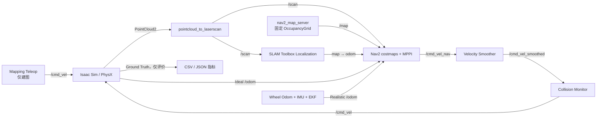

# 仓库使用手册

本文面向第一次接触本项目的使用者，目标是让你从一个干净的 clone 开始，依次完成环境检查、构建、启动仿真、用 RViz 定位/导航、用安全键盘控制完成建图，以及运行自动实验。

日常操作只需要两个终端：终端 A 运行 Isaac Sim，终端 B 运行 ROS 栈。终端 B 默认会自动打开与当前模式匹配的 RViz；Mapping/Incremental Mapping 还会自动打开独立键盘控制窗口。不要把旧教程里的手工 `rviz2`、持续 `ros2 topic pub /cmd_vel` 或 CLI 目标发送当作默认工作流。

如果你想了解“某个文件究竟负责什么”，请配合阅读 [`repository_index.md`](repository_index.md)。如果你要修改算法参数，再阅读 [`interfaces.md`](interfaces.md) 和 [`calibration.md`](calibration.md)。

## 1. 先理解系统如何运行

本项目不是一个单进程程序。正常运行时至少有两个主进程，交互模式还会受管启动 RViz 和可选 Teleop：

1. Isaac Sim 进程负责物理世界、Jackal、传感器、控制、Reset 和 Ground Truth；
2. ROS 2 进程负责点云投影、SLAM、里程计融合、Nav2、RViz 和实验管理；
3. Mapping 专用 Teleop 只在 Mapping/Incremental Mapping 中拥有 `/cmd_vel`，Navigation 中由 Collision Monitor 唯一输出 `/cmd_vel`。

导航数据流如下：



必须始终遵守以下约束：

- ROS 主 TF 树是 `map → odom → base_link`，没有 ROS `world` frame；
- Mapping 和 Localization 不能同时运行，它们都会发布 `map → odom`；
- Ideal 模式由 Isaac 发布 `/odom`；Realistic 模式由 EKF 发布 `/odom`；
- Navigation 中 `/map` 只能由 `map_server` 发布；SLAM 的诊断地图位于 `/slam_toolbox/map`；
- Ground Truth 只能用于评价，不能接入 SLAM、EKF、Nav2 或控制器；
- Isaac 与 ROS 两端必须选择相同的里程计模式和结构 TF 所有者。
- `run_ros.sh` 对每个组件实行单实例管理；不要绕过脚本重复启动 ROS 栈、RViz 或 Teleop。

## 2. 推荐阅读顺序

第一次使用时按这个顺序阅读：

1. 本文：实际怎么运行；
2. [`README.md`](../README.md)：项目状态与常用入口；
3. [`repository_index.md`](repository_index.md)：每个文件的用途；
4. [`interfaces.md`](interfaces.md)：Topic、TF、QoS、Reset 和模式契约；
5. [`calibration.md`](calibration.md)：地图与 USD 坐标如何对齐；
6. [`troubleshooting.md`](troubleshooting.md)：按症状排查启动、QoS、TF、Reset 和性能问题；
7. [`verification.md`](verification.md)：哪些能力已验证、哪些还没有；
8. [`plan.md`](../plan.md)：最完整的设计背景和最终验收目标。

## 3. 环境与目录约定

GitHub canonical 仓库名与项目目录统一使用 `Isaac`。第一次下载时执行：

```bash
git clone git@github.com:AoiOTA/Isaac_Sim_ROS2_Nav.git Isaac_Sim_ROS2_Nav
cd Isaac_Sim_ROS2_Nav
export PROJECT_ROOT="$PWD"
```

如果已经下载了仓库，进入实际仓库根目录后再设置变量；不要直接照抄一个不存在
的绝对路径：

```bash
cd /你的实际路径/Isaac_Sim_ROS2_Nav
export PROJECT_ROOT="$PWD"
```

环境变量只对当前 shell 生效，因此每打开一个新终端都要重新执行上面两行。

`run_isaac.sh` 和 `run_ros.sh` 会自行准备环境；如果终端直接执行 `ros2 topic`、`ros2 action` 或 `ros2 launch robot_experiments`，还要先执行：

```bash
cd /你的实际路径/Isaac_Sim_ROS2_Nav
export PROJECT_ROOT="$PWD"
source /opt/ros/jazzy/setup.bash
source "$PROJECT_ROOT/ros2_ws/install/setup.bash"
```

脚本默认使用：

```text
Isaac Python: /home/lyb/miniconda3/envs/isaacsim/bin/python
Isaac assets: /home/lyb/isaacsim_assets/Assets/Isaac/6.0
ROS setup:    /opt/ros/jazzy/setup.bash
ROS domain:   42
RMW:          rmw_fastrtps_cpp
```

路径不同可以在运行前覆盖：

```bash
export ISAAC_PYTHON=/path/to/isaacsim/bin/python
export ISAAC_ASSET_ROOT=/path/to/Assets/Isaac/6.0
export ROS_SETUP=/opt/ros/jazzy/setup.bash
export ROS_DOMAIN_ID=42
export RMW_IMPLEMENTATION=rmw_fastrtps_cpp
```

所有同时运行的终端必须使用相同的 `ROS_DOMAIN_ID` 和 `RMW_IMPLEMENTATION`。

## 4. 第一次 clone 后的准备

### 4.1 拉取 Git LFS 地图

`warehouse_new.posegraph` 使用 Git LFS。没有拉取它时，文件只是一个很小的指针，启动前完整性检查会失败。

```bash
cd "$PROJECT_ROOT"
git lfs install
git lfs pull
```

### 4.2 环境预检

```bash
./scripts/preflight.sh
```

成功时最后应看到：

```text
map baseline: warehouse_new (integrity verified)
preflight: PASS
```

预检会检查：

- Isaac Sim 版本是否为 `6.0.1.0`；
- 官方 Warehouse/Jackal 资产是否存在；
- ROS Jazzy、Nav2、SLAM Toolbox 等包是否存在；
- NVIDIA GPU 是否可见；
- `warehouse_new` 四个地图文件的大小和 SHA256 是否匹配 manifest；
- Git LFS 文件是否已经真正下载。

### 4.3 导入 Jackal 本地依赖

```bash
./scripts/import_assets.sh
```

该命令从本机 Isaac 资产目录复制项目运行所需的 Jackal 文件，并校验 SHA256。它不会修改官方资产，也不会把 NVIDIA 原始资产提交到 Git。

### 4.4 构建 ROS 工作区

```bash
./scripts/build_ros2.sh
```

成功时应显示 `9 packages finished`。构建产物位于 `ros2_ws/build/`、`install/`、`log/`，这些目录不会进入 Git。

### 4.5 运行测试

```bash
./scripts/test.sh --with-isaac
```

当前基线应通过纯 Python、ROS package 和 Isaac/USD 测试。精确计数记录在 [`verification.md`](verification.md)。

### 4.6 四种操作一眼看懂

| 操作 | Isaac 参数 | ROS 默认界面 | 主要用途 |
| --- | --- | --- | --- |
| `mapping` | `--navigation-mode mapping` | Mapping RViz + 安全 Teleop | 从零建立新地图。 |
| `incremental_mapping` | `--navigation-mode mapping` | Mapping RViz + 安全 Teleop | 加载旧 Pose Graph 后继续更新。 |
| `localization` | `--navigation-mode localization` | Localization RViz | 只验证固定地图定位和 TF。 |
| `navigation` | `--navigation-mode localization` | Navigation RViz + Nav2 面板 | 点击目标并完成规划、控制和避障。 |

Isaac 的 `--mode ideal|realistic` 必须与 ROS 的 `odometry_mode:=ideal|realistic` 相同。Mapping 两种模式绝不能与 Localization/Navigation 同时运行。

## 5. 最快完成一次 Ideal 导航

该酷家乐分支已经包含标定后的 `warehouse_new` OccupancyGrid，因此不需要再建图即可运行普通 Ideal Navigation。

### 5.1 终端 A：启动 Isaac

```bash
cd "$PROJECT_ROOT"
./scripts/run_isaac.sh \
  --environment-usd kujiale_0026_A_to_B_door_open.usd \
  --navigation-mode localization \
  --mode ideal
```

GUI 启动时，主视口会自动切换到
`/World/Robots/Jackal/base_link/third_person_camera`。它位于 Jackal
`base_link` 坐标系后方 `3.2 m`、上方 `2.2 m`，配合 `16 mm` 广角焦距朝
车前方俯视，可同时看到更多道路与周边环境；因为相机是
`base_link` 的子 Prim，所以会自然继承机器人的直行、转弯和 Reset，不需要
手动拖动视角。相机不会被持续强制锁定：运行中仍可从 Isaac 视口的 Camera
菜单切到其他视角，之后选择 `third_person_camera` 即可回来。

如果本次 GUI 运行不需要跟随相机，可以显式关闭：

```bash
./scripts/run_isaac.sh \
  --navigation-mode localization \
  --mode ideal \
  --no-third-person-camera
```

相对距离、高度、注视点和焦距集中配置在
`isaac_sim/configs/project.yaml` 的 `third_person_camera` 段；自定义 USD
场景也默认启用，不再因为使用 `--environment-usd` 而自动关闭。修改后无需改
USD 资产。自定义机器人模板会把同名相机挂到自己的 `base_link` 下。

无显示器或不需要 GUI 时加 `--headless`：

```bash
./scripts/run_isaac.sh --headless \
  --environment-usd kujiale_0026_A_to_B_door_open.usd \
  --navigation-mode localization \
  --mode ideal
```

等待日志出现：

```text
Isaac navigation simulation ready
```

### 5.2 终端 B：启动 ROS 导航栈

```bash
cd "$PROJECT_ROOT"
./scripts/run_ros.sh navigation \
  odometry_mode:=ideal
```

此酷家乐分支默认选择 `warehouse_new`，并自动推导：

```text
data/maps/occupancy/warehouse_new.yaml
```

等待日志出现：

```text
Nav2 lifecycle activation completed
```

启动命令会自动打开 `navigation.rviz`。不要在上述日志出现前发送导航目标；Activation Gate 正在等待 `/map`、`/clock`、`/scan`、`/odom` 和稳定的 `map → odom`。RViz 左侧应能看到静态地图、LaserScan、机器人、全局/局部 Costmap、全局/局部路径、Footprint 和 Collision Monitor 区域，右侧应有官方 **Navigation 2** 面板。

### 5.3 在 RViz 中发送目标

1. 确认 RViz 顶部 Fixed Frame 是 `map`；
2. 确认 **Navigation 2** 面板显示 Nav2 已激活；
3. 点击工具栏中的 Nav2 Goal 工具（绿色箭头）；
4. 在地图可通行区域按住鼠标左键，从目标位置拖出朝向后松开；
5. 观察青色全局路径、粉色局部路径和 Costmap，等待面板显示完成。

该 RViz 配置使用官方 `nav2_rviz_plugins/GoalTool` 和 Navigation 2 面板，目标直接进入 Nav2 Action；没有额外的 `/goal_pose` 转换节点，也不需要第三个终端。

成功标准：面板最终状态成功，机器人停车，局部/全局路径没有持续振荡。Nav2 goal checker 的位置容差是 `0.20 m`，所以机器人不会精确停在数学坐标点。自动实验另用 Ground Truth 检查 `0.25 m` 的成功阈值；这是评价门槛，不是 Nav2 的 goal checker 配置。

CLI 仍可用于自动化或无显示器测试，但不作为日常入口：

```bash
source /opt/ros/jazzy/setup.bash
source "$PROJECT_ROOT/ros2_ws/install/setup.bash"
ros2 action send_goal /navigate_to_pose \
  nav2_msgs/action/NavigateToPose \
  "{pose: {header: {frame_id: map}, pose: {position: {x: 1.0, y: 0.0}, orientation: {w: 1.0}}}}" \
  --feedback
```

### 5.4 自动位姿与 RViz 手动位姿

默认 `initial_pose_source:=auto`：系统从 `spawn_poses.yaml` 读取已标定 Map Pose，等新鲜 `/scan` 和 TF 后自动发布 `/initialpose`。这是固定出生点的推荐方式。

需要人工指定初始位置时，在终端 B 增加：

```bash
./scripts/run_ros.sh navigation \
  odometry_mode:=ideal \
  initial_pose_source:=rviz
```

然后在 RViz 点击 **2D Pose Estimate**，在地图上拖出机器人实际朝向。该模式不会被自动标定位姿覆盖；每次 `/simulation/reset` 后，Activation Gate 会暂停 Nav2，并等待你重新在 RViz 给出位姿后再恢复。

### 5.5 停止系统

先在终端 B 按 `Ctrl+C`。顶层 launch 会关闭 RViz、Nav2 和它管理的子进程；再在终端 A 按 `Ctrl+C` 停 Isaac。不要直接关闭终端窗口。

若终端意外关闭或下次启动提示已有实例，执行：

```bash
./scripts/diagnose.sh
./scripts/clean_runtime.sh --dry-run
./scripts/clean_runtime.sh --dds-shm
```

清理脚本只会停止具有本仓库 PID 元数据且命令身份匹配的进程；`--dds-shm` 只有在确认没有 Fast DDS 使用者时才删除当前用户的残留共享内存。

## 6. 仅启动 Localization

如果只想查看定位、地图和 TF，不需要 Nav2：

```bash
# 终端 A
./scripts/run_isaac.sh --navigation-mode localization --mode ideal

# 终端 B
./scripts/run_ros.sh localization \
  odometry_mode:=ideal \
  posegraph_file:="$PROJECT_ROOT/data/maps/posegraphs/warehouse_v2"
```

`localization.rviz` 会自动打开：`/map` 是 Map Server 的固定地图；`/slam_toolbox/map` 是默认关闭的 Realistic/标定诊断层，普通 Ideal 模式不启动 SLAM Toolbox。默认仍由已标定出生点自动提供初始位姿。

若要练习人工重定位，加入 `initial_pose_source:=rviz`，然后在 RViz 用 **2D Pose Estimate** 在地图上拖出位置和朝向：

```bash
./scripts/run_ros.sh localization \
  odometry_mode:=ideal \
  initial_pose_source:=rviz \
  posegraph_file:="$PROJECT_ROOT/data/maps/posegraphs/warehouse_v2"
```

检查关键接口：

```bash
ros2 topic info /map -v
ros2 topic info /slam_toolbox/map -v
ros2 run tf2_ros tf2_echo map odom
ros2 run tf2_ros tf2_echo odom base_link
```

期望结果：

- `/map` 有且只有一个 `map_server` publisher；
- Realistic 或 `posegraph_calibration:=true` 时，`/slam_toolbox/map` 的 publisher 是 `slam_toolbox`；普通 Ideal 模式允许该诊断 Topic 没有 publisher；
- `map → odom → base_link` 连续可用；
- `/odom` 只有一个 publisher。

Localization 不启动 Nav2，也不会打开 Mapping Teleop；它只用于观察和校验定位结果。

## 7. Realistic 里程计与导航

Realistic 模式不使用 Isaac Ideal Odom。轮关节状态先生成 `/wheel/odom`，再与 IMU 进入 EKF，最终由 `ekf_filter_node` 唯一发布 `/odom` 和 `odom → base_link`。

```bash
# 终端 A
./scripts/run_isaac.sh \
  --navigation-mode localization \
  --mode realistic

# 终端 B
./scripts/run_ros.sh navigation \
  odometry_mode:=realistic \
  posegraph_file:="$PROJECT_ROOT/data/maps/posegraphs/warehouse_v2"
```

检查唯一所有权：

```bash
ros2 topic info /wheel/odom -v
ros2 topic info /odom -v
```

`/odom` 的 publisher 必须只有 `ekf_filter_node`。如果同时看到 Isaac publisher，说明两端模式不一致，应立即停止并重新启动。

### 7.1 可选的 RSP 结构 TF

默认结构 TF 仍由 Isaac 发布。只有 Realistic 模式允许改为 Robot State Publisher：

```bash
# 终端 A
./scripts/run_isaac.sh \
  --navigation-mode localization \
  --mode realistic \
  --structure-tf-source rsp

# 终端 B
./scripts/run_ros.sh navigation \
  odometry_mode:=realistic \
  structure_tf_source:=rsp \
  posegraph_file:="$PROJECT_ROOT/data/maps/posegraphs/warehouse_v2"
```

两端必须同时选择 `rsp`。`ideal + rsp` 会被配置检查拒绝。

### 7.2 交互、无头和自定义 RViz 选项

四个 ROS 操作都接受同一组交互参数：

| 参数 | 默认值 | 作用 |
| --- | --- | --- |
| `interactive` | `true` | 设为 `false` 时同时禁用 RViz 和 Teleop，适合 CI/自动实验。 |
| `use_rviz` | `true` | 只控制 RViz。 |
| `rviz_config` | `auto` | 自动选择当前模式配置，或传入自定义 `.rviz` 绝对路径。 |
| `use_teleop` | `auto` | Mapping 两种模式自动开启，其余模式自动关闭；Navigation 显式设 `true` 也会被拒绝。 |

常见用法：

```bash
# 完全无交互，适合 headless Isaac 与自动实验
./scripts/run_ros.sh navigation \
  interactive:=false \
  odometry_mode:=ideal \
  posegraph_file:="$PROJECT_ROOT/data/maps/posegraphs/warehouse_v2"

# Mapping 保留 RViz，但不打开键盘终端
./scripts/run_ros.sh mapping \
  odometry_mode:=ideal \
  use_teleop:=false

# 使用自己的 RViz 配置
./scripts/run_ros.sh localization \
  odometry_mode:=ideal \
  rviz_config:=/absolute/path/custom.rviz \
  posegraph_file:="$PROJECT_ROOT/data/maps/posegraphs/warehouse_v2"
```

若只想在一个已运行的栈旁重新打开受管 RViz，可执行 `./scripts/run_rviz.sh navigation`（也支持其他三个操作）；已有 RViz 实例存在时脚本会拒绝重复启动。

## 8. 从头建图

只有在你修改了环境、传感器、机器人或想制作新地图时才需要重新建图。

### 8.1 启动 Mapping

```bash
# 终端 A
cd "$PROJECT_ROOT"
./scripts/run_isaac.sh --navigation-mode mapping --mode ideal

# 终端 B
cd "$PROJECT_ROOT"
./scripts/run_ros.sh mapping odometry_mode:=ideal
```

当前选中的酷家乐房间使用下面这组命令：

```bash
# 终端 A：文件名会在主目录场景树中递归查找
cd "$PROJECT_ROOT"
./scripts/run_isaac.sh \
  --environment-usd kujiale_0026_A_to_B_door_open.usd \
  --navigation-mode mapping \
  --mode ideal

# 终端 B：等终端 A 出现 ready 后启动
cd "$PROJECT_ROOT"
./scripts/run_ros.sh mapping odometry_mode:=ideal
```

默认场景根目录是 `/home/lyb/kujiale_usd_rooms_20260717`。可以通过
`--environment-root DIR` 或环境变量 `ISAAC_NAV_ENVIRONMENT_ROOT` 改为其他
目录；`--environment-usd` 支持绝对路径、相对场景根目录的路径或唯一文件名。
若不同子目录内存在同名 USD，程序会拒绝猜测并列出候选路径。

每个自定义场景都必须有出生点 YAML，查找顺序是：

1. `--spawn-poses-file PATH` 显式指定；
2. 与 USD 同目录的 `<USD文件主名>.spawn.yaml`；
3. 仓库 `isaac_sim/configs/environments/` 下的同名文件。

当前房间已经配置
`kujiale_0026_A_to_B_door_open.spawn.yaml`，Jackal 从客厅较开阔位置
`[2.9, -0.2, 0.0635]`、朝向 `180°` 出生。此 Pose 的
`map` Pose 已通过三次 Ideal 冷启动扫描配准标定为 `[0, 0, 0°]`，保守
不确定度为 `0.05 m / 1°`。自定义室内环境还会默认关闭
Warehouse 使用的高位第三人称相机；确需启用时可显式追加
`--third-person-camera`，随后应把相机高度调到低于房间天花板。

运行时只在 `/tmp/isaac_sim_ros2_nav_$UID/stages/` 创建按资产区分的项目
overlay，并在其中补齐 `/World`、Jackal 和 `/PhysicsScene`。源 USD 和主目录
中的材质文件不会被改写。对酷家乐导出器写成 `.../Materials/...` 的可解析
路径错误，overlay 会自动改成有效绝对路径；真正缺失的纹理仍会由 Isaac
日志明确报告。

Mapping 中 SLAM Toolbox 自己发布 `/map`，不会启动 `map_server`。

终端 B 会自动打开 `mapping.rviz` 和一个标题为 **Isaac Nav Mapping Teleop** 的独立终端。RViz 默认显示实时 `/map`、`/scan`、RobotModel、TF 和 `/odom`；原始 PointCloud2 与 Ground Truth 默认关闭，需要时在 Displays 中勾选。

### 8.2 手动控制机器人

先点击 Teleop 终端使其获得键盘焦点：

| 按键 | 动作 |
| --- | --- |
| `W` / `↑` | 前进，`0.30 m/s` |
| `S` / `↓` | 后退，`0.30 m/s` |
| `A` / `←` | 左转，`0.60 rad/s` |
| `D` / `→` | 右转，`0.60 rad/s` |
| `Space` | 立即停车 |
| `Q`、`Ctrl+C`、`Ctrl+D` | 发布最终零速度并退出 Teleop |

这是“按住/重复按键才运动”的 deadman 控制：超过 `0.18 s` 没有新按键就自动发布零速度。它使用稳态墙钟，不会因 `/clock` 暂停或回退而失效。速度还受 `1.0 m/s` 与 `1.5 rad/s` 的硬上限约束。

Teleop 只能在 Mapping/Incremental Mapping 使用。脚本会拒绝在 Localization/Navigation 节点存在时启动它，也会拒绝在 Teleop 尚未退出时启动 Navigation。不要另开 `ros2 topic pub --rate /cmd_vel` 绕过安全门。

建图时应缓慢覆盖走廊、货架两侧和转弯区域，并完成至少一次闭环。观察 RViz 中是否出现墙体重影、撕裂或错误闭环。

### 8.3 保存地图

使用新的版本名，脚本拒绝覆盖已有文件：

```bash
./scripts/save_map.sh warehouse_v3
```

当前房间建议使用清楚的版本名，例如：

```bash
./scripts/save_map.sh kujiale_0026_door_open_v1
```

`save_map.sh` 可以在另一个已 source 工作区的终端执行；如果你刚从仓库根打开新终端，先运行：

```bash
source /opt/ros/jazzy/setup.bash
source "$PROJECT_ROOT/ros2_ws/install/setup.bash"
```

会生成四个不可拆分的文件：

```text
data/maps/occupancy/warehouse_v3.yaml
data/maps/occupancy/warehouse_v3.pgm
data/maps/posegraphs/warehouse_v3.posegraph
data/maps/posegraphs/warehouse_v3.data
```

新地图不能直接沿用旧 Map Pose。请按照 [`calibration.md`](calibration.md) 重新测量 `spawn_poses.yaml` 中的 Map Pose，再把 `calibrated` 设为 `true`。

## 9. 确定性 Reset

Isaac 运行时提供 `/simulation/reset`：

```bash
ros2 param set /isaac_navigation_sim reset_seed 4242
ros2 param set /isaac_navigation_sim reset_pose_name mapping_start
ros2 service call /simulation/reset std_srvs/srv/Trigger '{}'
```

Reset 是一个异步事务，但 Trigger 只有在物理复位以及所有已排队的 Wheel Odom、EKF、Costmap 清理请求完成后才返回 `success: true`。事务会清零控制和轮速、恢复 USD Pose、重置里程计/GT/碰撞/动态障碍，最后发布带代次语义的 `/simulation/reset_event`；重叠 Reset 请求会被拒绝。

Trigger 成功表示“复位事务已提交完成”，仍不表示定位已经重新稳定。Localization 模式下还要等待：

1. Reset 后的新 `/scan`；
2. `/initialpose` 已发布，并收到 Reset 后的 `/simulation/localization_seeded` 事件；
3. Reset 后的新鲜 `/odom`；
4. 更新且稳定的 `map → odom`；
5. Navigation 的 Lifecycle Gate 按 `PAUSE → clear costmaps → reseed/wait RViz pose → readiness → RESUME` 完成恢复。

默认 `initial_pose_source:=auto` 会在 Reset 后自动重播标定位姿；`rviz` 模式会保留人工所有权并等待新的 **2D Pose Estimate**。Lifecycle 操作由唯一的 Activation Gate 管理，失败会有限退避重试，旧异步回调不能跨 Reset 代次污染新状态。

自动实验 runner 会自动执行这些门控；启用 Ground Truth 的实验还会额外等待 Reset 后的新鲜 GT。普通手工导航默认不启用 GT，不需要等待 GT 话题。手工操作时以 `Nav2 lifecycle recovery completed`（或等价恢复完成日志）为准，不要在 Trigger 返回后立刻发送目标。

## 10. 运行静态自动实验

实验必须显式打开 Ground Truth。

```bash
# 终端 A
ISAAC_NAV__GROUND_TRUTH__ENABLED=true \
  ./scripts/run_isaac.sh --headless \
  --navigation-mode localization \
  --mode ideal

# 终端 B
./scripts/run_ros.sh navigation \
  odometry_mode:=ideal \
  posegraph_file:="$PROJECT_ROOT/data/maps/posegraphs/warehouse_v2"
```

等待 Nav2 激活，然后在终端 C 运行：

```bash
cd /你的实际路径/Isaac_Sim_ROS2_Nav
export PROJECT_ROOT="$PWD"
./scripts/run_experiment.sh \
  ros2_ws/src/robot_experiments/config/static.yaml \
  data/experiment_runs/static_run
```

当前 `static.yaml` 会在同一固定仓库中运行 4 个 seed。它是 Reset/导航 smoke，不是 200 次多布局统计。

结果目录中每轮都有：

- `.json`：完整结构化 manifest、指标、观测状态和失败原因；
- `.csv`：同一结果的表格版本，方便导入 Excel/Pandas。

## 11. 运行动态障碍实验

动态模式必须在 Isaac 端增加 `--dynamic-obstacles`：

```bash
# 终端 A
ISAAC_NAV__GROUND_TRUTH__ENABLED=true \
  ./scripts/run_isaac.sh --headless \
  --navigation-mode localization \
  --mode ideal \
  --dynamic-obstacles

# 终端 B
./scripts/run_ros.sh navigation \
  odometry_mode:=ideal \
  posegraph_file:="$PROJECT_ROOT/data/maps/posegraphs/warehouse_v2"

# 终端 C，等待 Nav2 激活后
cd /你的实际路径/Isaac_Sim_ROS2_Nav
export PROJECT_ROOT="$PWD"
./scripts/run_experiment.sh \
  ros2_ws/src/robot_experiments/config/dynamic.yaml \
  data/experiment_runs/dynamic_run
```

runner 会在第一轮 Reset 前严格比较 Isaac 与 ROS 两侧的：

- enabled 状态、配置 SHA256 和障碍物 ID；
- shape、XY 尺寸；
- USD→Map 变换后的起终点；
- 运动时长和 `repeat`。

任一不一致都会 fail fast。修改动态障碍时，必须同时修改：

```text
isaac_sim/configs/experiments/dynamic.yaml
ros2_ws/src/robot_experiments/config/dynamic.yaml
```

### 11.1 运行 20+20 远距离统计验收

动态批次需让 Isaac 加载专用物理配置：

```bash
ISAAC_NAV__GROUND_TRUTH__ENABLED=true \
ISAAC_NAV__FILES__DYNAMIC_OBSTACLES="$PROJECT_ROOT/isaac_sim/configs/experiments/dynamic_benchmark.yaml" \
  ./scripts/run_isaac.sh --headless \
  --navigation-mode localization \
  --mode realistic \
  --dynamic-obstacles

./scripts/run_experiment.sh \
  ros2_ws/src/robot_experiments/config/dynamic_benchmark.yaml \
  data/experiment_runs/dynamic_benchmark
```

静态批次把场景文件替换为 `static_benchmark.yaml`，Isaac 不加 `--dynamic-obstacles`。两批完成后汇总：

```bash
source /opt/ros/jazzy/setup.bash
source "$PROJECT_ROOT/ros2_ws/install/setup.bash"
ros2 run robot_experiments navigation_benchmark \
  --static-directory "$PROJECT_ROOT/data/experiment_runs/static_benchmark" \
  --dynamic-directory "$PROJECT_ROOT/data/experiment_runs/dynamic_benchmark" \
  --map-file "$PROJECT_ROOT/data/maps/occupancy/warehouse_v2.yaml" \
  --clearance-m 0.34 \
  --output "$PROJECT_ROOT/data/reports/navigation_benchmark.json"
```

工具要求至少 20 次静态和 20 次动态运行，验收静态成功率 `≥95%`、动态成功率 `≥90%`，并要求每次成功静态路线相对理论最短路的偏差 `≤20%`。

### 11.2 Ideal 复杂长路线验收

本轮前进优先验收关闭 MPPI 倒车采样，使用 6 个强制航点和约 50 m
连续路线。静态运行：

```bash
./scripts/run_experiment.sh \
  ros2_ws/src/robot_experiments/config/static_complex_route.yaml \
  data/experiment_runs/static_complex_route
```

动态运行前，Isaac 必须加载对应的四障碍物理配置：

```bash
ISAAC_NAV__GROUND_TRUTH__ENABLED=true \
ISAAC_NAV__FILES__DYNAMIC_OBSTACLES="$PROJECT_ROOT/isaac_sim/configs/experiments/dynamic_complex_route.yaml" \
  ./scripts/run_isaac.sh --headless \
  --navigation-mode localization \
  --mode ideal \
  --dynamic-obstacles

./scripts/run_experiment.sh \
  ros2_ws/src/robot_experiments/config/dynamic_complex_route.yaml \
  data/experiment_runs/dynamic_complex_route
```

2026-07-17 在历史 `warehouse_v1` 上实测静态 `3/3`、动态 `3/3`；每轮 6/6 航点、约
`50.1 m`、0 次恢复、0 碰撞，导航命令倒车距离为 `0`。Ideal
Localization/Navigation 使用新鲜 identity `map→odom`，避免在精确
Isaac `/odom` 上再次叠加 SLAM 定位修正。

## 12. 长距离 smoke

使用与静态实验相同的 Isaac/ROS 启动方式，只替换场景文件：

```bash
ros2 launch robot_experiments experiment.launch.py \
  scenario_file:="$PROJECT_ROOT/ros2_ws/src/robot_experiments/config/static_long_range.yaml" \
  spawn_poses_file:="$PROJECT_ROOT/isaac_sim/configs/spawn_poses.yaml" \
  output_directory:="$PROJECT_ROOT/data/experiment_runs/static_long_run"
```

当前目标为 Map 坐标 `[3.0, 0.0]`，用于覆盖比 1 m smoke 更长的规划和控制链。

## 13. 增量建图与离线比较

### 13.1 加载基线继续建图

```bash
# 终端 A
./scripts/run_isaac.sh --navigation-mode mapping --mode ideal

# 终端 B
./scripts/run_ros.sh incremental_mapping \
  odometry_mode:=ideal \
  posegraph_file:="$PROJECT_ROOT/data/maps/posegraphs/warehouse_v2"
```

该模式同样自动打开 `mapping.rviz` 和安全 Teleop，但会先加载旧 Pose Graph，并且只允许 `initial_pose_source:=auto`。等待旧图和标定位姿就绪后再移动机器人。

遍历真实变化区域后，用新名称保存：

```bash
./scripts/save_map.sh warehouse_v3_incremental
```

还需要在相同变化环境中从零完成一次完整重建，例如 `warehouse_v3_full`。两次计时必须使用相同的开始/结束定义。

### 13.2 比较三张地图

```bash
cp ros2_ws/src/robot_experiments/config/incremental_comparison.example.yaml \
  data/reports/incremental_comparison.yaml
```

编辑副本，填写：

- baseline、full remap、incremental 三个 Map Server YAML；
- 完整建图和增量建图耗时；
- 真实变化区域的 Map 坐标矩形。

然后运行：

```bash
ros2 run robot_experiments incremental_map_compare \
  --spec "$PROJECT_ROOT/data/reports/incremental_comparison.yaml" \
  --output "$PROJECT_ROOT/data/reports/incremental_comparison.json"
```

返回码：

- `0`：保存地图比较通过；
- `2`：输入有效，但一个或多个阈值未通过；
- `1`：配置、路径或地图格式无效。

比较通过也只代表地图和耗时指标通过，仍需使用新地图重新运行 Localization 和 Nav2。

## 14. 自定义机器人迁移

不要直接把占位值改成“看起来合理”的数字。仓库中的 custom profile 故意使用 `null`，缺少真实测量时必须启动失败。

完整步骤见 [`isaac_sim/assets/robots/custom_robot/README.md`](../isaac_sim/assets/robots/custom_robot/README.md)。基本入口是：

```bash
export ISAAC_NAV_PROJECT_CONFIG="$PROJECT_ROOT/isaac_sim/configs/custom_robot.project.yaml"
export CUSTOM_ROBOT_USD=/path/to/custom_robot.usda
export CUSTOM_ROBOT_DEFAULT_PRIM=custom_robot
export CUSTOM_ROBOT_LIDAR_CONFIG=/path/to/custom_lidar.yaml
export CUSTOM_ROBOT_IMU_CONFIG=/path/to/custom_imu.yaml
export CUSTOM_ROBOT_CAMERA_CONFIG=/path/to/custom_camera.yaml

./scripts/run_isaac.sh --validate-only
```

ROS 侧可替换 Xacro、Wheel Odom 和 Nav2 参数：

```bash
./scripts/run_ros.sh navigation \
  odometry_mode:=realistic \
  structure_tf_source:=rsp \
  posegraph_file:=/path/to/custom_map \
  map_file:=/path/to/custom_map.yaml \
  robot_description_file:=/path/to/custom_robot.urdf.xacro \
  wheel_odometry_params_file:=/path/to/custom_wheel_odometry.yaml \
  nav2_params_file:=/path/to/custom_nav2.yaml
```

必须重新测量质量/惯量、轮径、有效轮距、Footprint、传感器外参、出生点和 Map Pose，并重新验证 Ideal、Realistic、GT、Reset、Localization 和 Nav2。

## 15. 数据和结果在哪里

| 路径 | 内容 | 是否提交 Git |
| --- | --- | --- |
| `data/maps/occupancy/` | OccupancyGrid YAML/PGM | 只有精选基线 |
| `data/maps/posegraphs/` | SLAM Toolbox `.posegraph/.data` | 大文件需 Git LFS |
| `data/maps/manifests/` | 地图版本、大小、SHA256、标定记录 | 可以提交 |
| `data/experiment_runs/` | 每轮 CSV/JSON | 默认忽略 |
| `data/bags/` | rosbag | 默认忽略 |
| `data/metrics/` | 聚合指标 | 默认忽略 |
| `data/reports/` | 对比报告和图表 | 默认忽略 |
| `data/trajectories/` | 估计/GT 轨迹 | 默认忽略 |

不要把 `build/`、`install/`、`log/`、Kit 日志、批量实验结果或官方资产直接提交到普通 Git 历史。

## 16. 常用运行检查

优先运行一次统一诊断，它会收集环境、受管 PID、重复节点、关键 Topic/Action、Lifecycle、QoS、TF、时间戳、Fast DDS SHM、CPU governor 和最近日志，不修改运行状态：

```bash
./scripts/diagnose.sh
```

需要单独观察时再使用：

```bash
ros2 topic hz /clock
ros2 topic hz /lidar/points_raw
ros2 topic hz /scan
ros2 topic hz /odom

ros2 topic info /map -v
ros2 topic info /slam_toolbox/map -v
ros2 topic info /odom -v
ros2 topic info /tf -v
ros2 topic info /tf_static -v

ros2 lifecycle get /map_server
ros2 lifecycle get /controller_server
ros2 run tf2_ros tf2_echo map odom
ros2 run tf2_ros tf2_echo odom base_link
ros2 run tf2_tools view_frames
```

正常基线大致为：

- `/clock` 约 60 Hz；
- `/lidar/points_raw` 和 `/scan` 约 10 Hz；
- Realistic `/wheel/odom`、`/odom` 约 45 Hz；
- `/odom`、`/map` 均只有一个模式正确的 publisher。
- Navigation 的 MPPI 控制频率为 `10 Hz`，预测窗保持 `20 × 0.10 s = 2 s`，batch 为 `500`；Velocity Smoother 仍以 `20 Hz` 输出平滑命令。
- 酷家乐窄通道配置保持 Jackal `0.485 × 0.420 m` 的真实矩形 Footprint；Costmap padding 为 `5 mm`，Inflation 半径为 `0.40 m`、衰减系数为 `8.0`。Collision Monitor 紧急停止区宽 `0.46 m`，仍覆盖实体两侧各 `20 mm`，外围 `0.60 m` 减速区只降低速度，不把平行墙误判为正面碰撞。

## 17. 常见问题

本节给出最短处理方式；完整诊断树见 [`troubleshooting.md`](troubleshooting.md)。遇到问题先保存 `./scripts/diagnose.sh` 输出，不要盲目杀死系统中所有 ROS 或 Python 进程。

### 17.1 `Git LFS artifact is not hydrated`

```bash
git lfs pull
./scripts/preflight.sh
```

### 17.2 ROS 看不到 Isaac Topic

在所有终端检查：

```bash
echo "$ROS_DOMAIN_ID"
echo "$RMW_IMPLEMENTATION"
```

它们应分别一致为 `42` 和 `rmw_fastrtps_cpp`。

若日志包含 Fast DDS `open_and_lock_file failed`、`RTPS_TRANSPORT_SHM` 或旧端口锁错误，先正常停止两端，再执行：

```bash
./scripts/clean_runtime.sh --dds-shm
```

脚本会先停止 ROS CLI daemon，并证明没有进程仍映射 Fast DDS 库；条件不满足时它会拒绝删除 SHM。

### 17.3 Navigation 一直不激活

检查：

```bash
ros2 topic echo /clock --once
ros2 topic echo /scan --once
ros2 topic echo /odom --once
ros2 topic echo /map --once --field info
ros2 run tf2_ros tf2_echo map odom
```

Activation Gate 日志会明确写出正在等待的条件。不要通过关闭 gate 绕过问题。

还要检查 `initial_pose_source:=rviz` 时是否已经在 RViz 给出 **2D Pose Estimate**。Gate 会检测重复 Nav2 节点和 Lifecycle 状态，连续失败最多按配置重试三次，之后让顶层栈明确失败而不是无限等待。

### 17.4 `/odom` 有两个 publisher

Ideal/Realistic 模式不一致。停止两端，按同一种模式重新启动。不要让 Isaac Ideal Odom 与 EKF 同时发布。

### 17.5 `/map` 有两个 publisher

Mapping 与 Localization/Navigation 被同时启动，或 SLAM map 未正确重映射。停止重复栈。Navigation 中 `/map` 只能属于 `map_server`。

### 17.6 Reset 成功后目标仍失败

不要只看 Trigger 返回。等待 `/simulation/localization_seeded` 和新的稳定 TF；自动实验 runner 已实现这套门控。

### 17.7 SmacPlanner2D 打印 inflation `ERROR`

Nav2 Jazzy 1.3.12 对当前 2D radius 模式会打印已知误诊。只要版本、Footprint、插件和当前 `0.40 m` inflation 配置未改变，并且随后正常完成规划，可按 [`verification.md`](verification.md#nav2-1312-smac-inflation-diagnostic) 的说明处理。其他 planner 或参数变化后必须重新调查。

### 17.8 机器人不动或持续运动

- 确认 `/cmd_vel` 有新消息；
- 确认左右轮 joint 名称没有变化；
- 检查 Collision Monitor 是否处于 Stop 状态；
- 停止手工 `ros2 topic pub --rate` 进程；
- 发送一次零速度；
- 必要时调用 Reset。

### 17.9 RViz 看不到地图或扫描

- `/map` 显示必须是 Reliable + Transient Local；
- `/scan` 和 `/lidar/points_raw` 必须是 Best Effort + Volatile；
- 确认加载的是当前模式的 `mapping.rviz`、`localization.rviz` 或 `navigation.rviz`；
- 不要把 Localization 的 `/slam_toolbox/map` 诊断层当作静态 `/map`；
- 用 `ros2 topic info /map --verbose` 和 `ros2 topic info /scan --verbose` 检查最终 endpoint QoS。

### 17.10 Mapping 没有弹出 Teleop 窗口

交互 Teleop 需要 `gnome-terminal`、`xterm` 或 `konsole` 中至少一个。可安装其中之一，或以 `use_teleop:=false` 启动，再在独立交互终端运行 `./scripts/run_teleop.sh`。后者同样会执行模式冲突和单实例检查。

## 18. 修改配置时应该改哪里

| 需求 | 优先修改 |
| --- | --- |
| 改 LiDAR 型号/频率/Prim | `isaac_sim/configs/sensors/lidar_3d.yaml` |
| 改点云投影高度和角度 | `ros2_ws/src/robot_perception/config/pointcloud_to_laserscan.yaml` |
| 改轮径/轮距 | Isaac robot YAML 与 `ros2_ws/src/robot_odometry/config/wheel_odometry.yaml` 同步修改 |
| 改 Footprint/速度/代价地图 | `ros2_ws/src/robot_navigation/config/nav2_params.yaml` |
| 改出生点 | `isaac_sim/configs/spawn_poses.yaml`，随后重做标定 |
| 改动态障碍 | Isaac 与 ROS 两个 `dynamic.yaml` 同步修改 |
| 改实验目标和 seed | `ros2_ws/src/robot_experiments/config/*.yaml` |
| 改 SLAM 参数 | `ros2_ws/src/robot_mapping/config/slam_*.yaml` |
| 改 EKF | `ros2_ws/src/robot_localization_config/config/ekf.yaml` |
| 改 RViz 默认显示/QoS | `ros2_ws/src/robot_description/rviz/<mode>.rviz`，并同步 RViz 配置测试 |
| 改 Mapping 键位/速度/deadman | `ros2_ws/src/robot_teleop/config/teleop.yaml` 与 `robot_teleop/safety.py` |
| 改 Nav2 启动/Reset 恢复门 | `robot_bringup/activation_gate.py`、`readiness.py`、`lifecycle_policy.py` 与 `activation_gate.yaml` |
| 改脚本环境或单实例行为 | `scripts/lib/common.sh` 及对应 `scripts/*.sh`，并同步 runtime script 测试 |
| 换机器人 | custom project/robot YAML、Xacro、Wheel Odom、Nav2 参数和地图全部重新标定 |

修改前先通过 [`repository_index.md`](repository_index.md) 确认文件职责，避免在错误层修改同一个概念。

## 19. Git 工作建议

```bash
git status -sb
git log --oneline --decorate --graph
```

建议一个 commit 只表达一个能力，例如：

```text
feat(perception): tune scan projection height
fix(reset): wait for post-reset localization seed
docs: clarify realistic navigation workflow
```

地图、代码和标定之间有版本依赖。修改地图或出生点时，应在同一个变更说明中写清楚：地图版本、Pose Graph、USD Pose、Map Pose 和验证结果。

## 20. 当前能力边界

仓库当前已经完成并运行验证了 Ideal/Realistic 导航、固定地图定位、动态双障碍基线、多轮事务式 Reset、Lifecycle 自动恢复、三套 RViz、Mapping 安全 Teleop 和实验报告。MPPI 在当前工作站实测采用稳定的 10 Hz/2 s 预测窗配置。但下面内容仍需要真实实验或外部资产：

- 计划中的 200 次多起终点/多布局静态统计；
- 多类型动态障碍总体成功率；
- 真实 changed-region 的增量建图 30% 改善证明；
- 长时间 soak；
- 真实自定义机器人 USD 与完整标定。

不要把小规模 smoke 的 4/4 描述成通用 100% 成功率。最新证据和剩余项以 [`verification.md`](verification.md) 为准。
